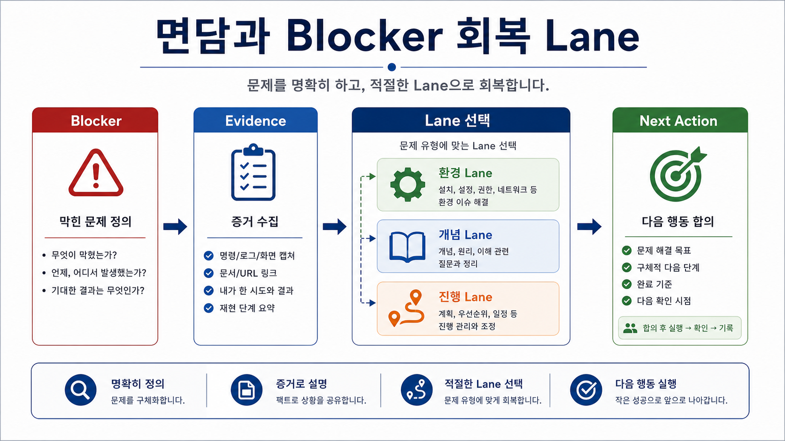
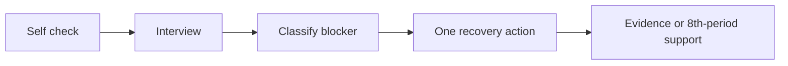

# 7교시: 개인 면담 및 환경 점검

## 수업 목표
- 학생별 blocker를 확인하고 Day4 산출물 완성 계획을 조정한다.
- 환경 문제, 범위 초과, 실행 실패, 문서 누락을 구분한다.
- 새 진도를 나가지 않고 개인 회복 시간을 확보한다.

## 50분 운영
| 시간 | 활동 | 학습 초점 | 학생 산출 |
|---|---|---|---|
| 0-5분 | 면담 방식 안내 | 대기 중 학생은 보충 실습을 진행한다. | 자기 점검표 |
| 5-40분 | 1:1 또는 소그룹 면담 | blocker를 분류하고 다음 행동을 정한다. | interview note |
| 40-48분 | 개인 수정 시간 | 범위 축소와 실행 회복 행동을 선택한다. | 수정 commit 또는 파일 |
| 48-50분 | 종료 체크 | 다음 교시 보충 우선순위를 정한다. | priority list |

## 0-5분 면담 방식 안내

- 진행: 면담 방식 안내

- 초점: 대기 중 학생은 보충 실습을 진행한다.

- 학생 산출: 자기 점검표

- 완료 조건: 아래 자료를 사용해 이 시간 블록의 산출물을 만든다.

### 핵심 설명
7교시는 개인 면담과 보충 실습 시간이다. 이 시간에는 새 개념보다 개인별 산출물 회복에 집중한다. 목표는 "모두 같은 속도"가 아니라 각 학생이 제출 가능한 산출물까지 복구하는 것이다.

### Visual 1: 구조 다이어그램

이 이미지는 7교시 면담을 새 진도 시간이 아니라 blocker를 분류하고 다음 행동을 정하는 회복 시간으로 고정한다. 개인 정보가 아니라 환경, 개념, 진행 evidence만 다룬다.

## 5-40분 1:1 또는 소그룹 면담

- 진행: 1:1 또는 소그룹 면담

- 초점: blocker를 분류하고 다음 행동을 정한다.

- 학생 산출: interview note

- 완료 조건: 아래 자료를 사용해 이 시간 블록의 산출물을 만든다.

### Visual 2: 면담 캡처 항목
| 면담 캡처 항목 | 학생이 적는 내용 | 확인 기준 |
|---|---|---|
| 현재 상태 | 실행됨/실행 안 됨/모름 | 환경 문제와 구현 문제 분리 |
| blocker type | Environment, Scope, Implementation, Evidence, Confidence | 즉시 처방 선택 |
| 다음 행동 | 10분 안에 할 한 가지 | 새 진도가 아니라 회복 행동인지 확인 |
| 이월 여부 | 8교시 지원 필요/불필요 | 우선 지원 순서 |

## 40-48분 개인 수정 시간

- 진행: 개인 수정 시간

- 초점: 범위 축소와 실행 회복 행동을 선택한다.

- 학생 산출: 수정 commit 또는 파일

- 완료 조건: 아래 자료를 사용해 이 시간 블록의 산출물을 만든다.

### Visual 3: blocker 유형별 회복 lane
| Type | 즉시 회복 행동 | evidence |
|---|---|---|
| Environment | command/path/port 재확인 | terminal output |
| Scope | 기능 줄이기 | include/exclude note |
| Evidence | README 표 채우기 | command/status 기록 |

### 면담 질문
| 질문 | 확인하려는 것 |
|---|---|
| 지금 앱은 실행되는가? | 환경/명령 문제 |
| 사용자 흐름은 1개인가? | 범위 초과 |
| `data.json`은 화면에 보이는가? | 구현 연결 |
| README만 보고 다시 실행할 수 있는가? | 재현성 |
| 가장 막힌 지점은 무엇인가? | 보충 실습 우선순위 |

### Blocker 분류
| Type | 예시 | 즉시 처방 |
|---|---|---|
| Environment | Python command 없음, port 충돌 | 다른 port, 설치 상태 확인 |
| Scope | 로그인/API/DB를 넣으려 함 | dummy JSON으로 축소 |
| Implementation | fetch path 오류, DOM 선택자 오류 | 파일 위치와 console 확인 |
| Evidence | 실행은 되지만 기록 없음 | README evidence table 작성 |
| Confidence | 어디부터 해야 할지 모름 | skeleton부터 재작성 |

### 흔한 오해
| 오해 | 교정 |
|---|---|
| 산출물이 있으면 evidence는 나중에 채워도 된다. | evidence는 산출물의 일부다. command, path, status, log, note가 함께 있어야 평가 가능하다. |
| Week1에서 모든 기술을 깊게 익혀야 한다. | Week1은 컴퓨팅 spine과 운영 증거를 만드는 주차이며, 깊은 hands-on은 각 기술 주차에서 진행한다. |
| 막힌 내용을 숨기는 것이 좋다. | blocker를 증상, 시도한 일, 다음 조치로 기록하는 것이 현업식 진행 관리다. |

## 48-50분 종료 체크

- 진행: 종료 체크

- 초점: 다음 교시 보충 우선순위를 정한다.

- 학생 산출: priority list

- 완료 조건: 아래 자료를 사용해 이 시간 블록의 산출물을 만든다.

### 보충 실습 절차
1. 학생은 자기 점검표에 현재 상태를 표시한다.
2. blocker type을 하나로 표시하고 다음 행동을 정한다.
3. 10분 안에 끝낼 수 있는 다음 행동을 정한다.
4. 학생은 바로 수정하고 결과를 evidence로 남긴다.
5. 해결되지 않으면 8교시 우선 지원 대상으로 표시한다.

### 산출물
- 개인 면담 기록
- blocker 분류
- 다음 행동 1개
- 보충 실습 결과 또는 8교시 지원 요청

### 평가 기준
| 기준 | 충족 |
|---|---|
| 모든 학생이 최소 1회 자기 상태를 점검했다. | |
| blocker가 유형별로 분류되었다. | |
| 새 진도 없이 Day4 산출물 회복에 집중했다. | |
| 8교시 보충 대상과 목표가 정해졌다. | |

### 현업 DevOps insight
팀 운영에서 blocker triage는 비난이 아니라 흐름 복구다. 문제를 환경, 범위, 구현, 증거로 나누면 해결 담당자와 다음 행동이 명확해진다.

### 학술 근거
- Formative feedback: 제출 전 개인별 피드백으로 학습 격차를 줄인다.
- Mastery learning: 일정 수준의 산출물 완성 전 다음 개념으로 넘어가지 않는다.
- Self-regulated learning: 학생이 자신의 막힘을 언어화한다.

### 다음 주차 연결
Week2 Docker 진입 전에 로컬 실행과 문서화 blocker를 줄여야 한다. 오늘 해결하지 못한 문제는 Docker 학습에서 더 크게 보인다.

### 다음 연결
다음 8교시도 개인 면담과 보충 실습을 이어가며 Day4 제출물을 닫는다.

### 공식/학술 근거 링크
- CMU Eberly Center: Learning Objectives, https://www.cmu.edu/teaching/designteach/design/learningobjectives.html - 면담 목표를 관찰 가능한 행동과 산출물로 정리하는 기준이다.
- Monash Constructive Alignment, https://www.monash.edu/learning-teaching/teachhq/Teaching-practices/learning-outcomes/how-to/constructive-alignment - 개인 blocker, 보강 활동, 평가 증거를 맞추는 기준이다.
- Google SRE Book: Postmortem Culture, https://sre.google/sre-book/postmortem-culture/ - 문제를 책임 추궁이 아니라 개선 가능한 evidence로 다루는 기준이다.
