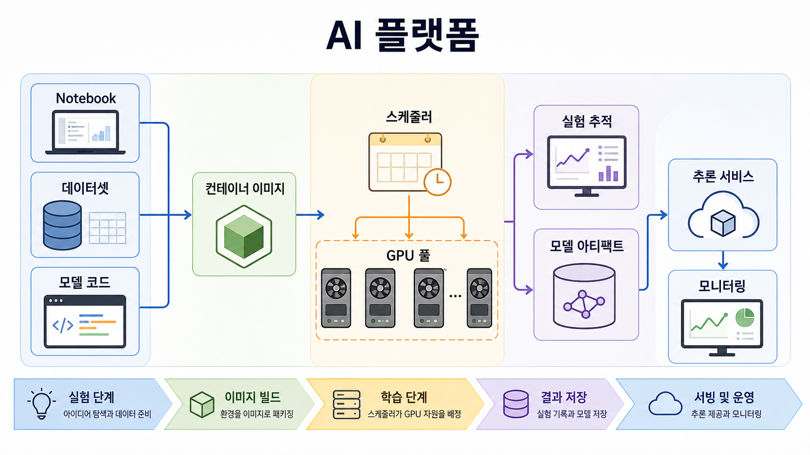
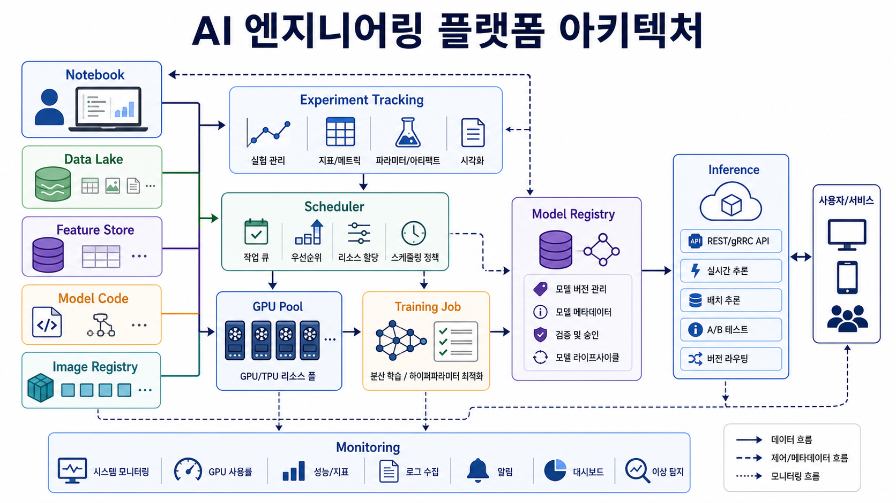
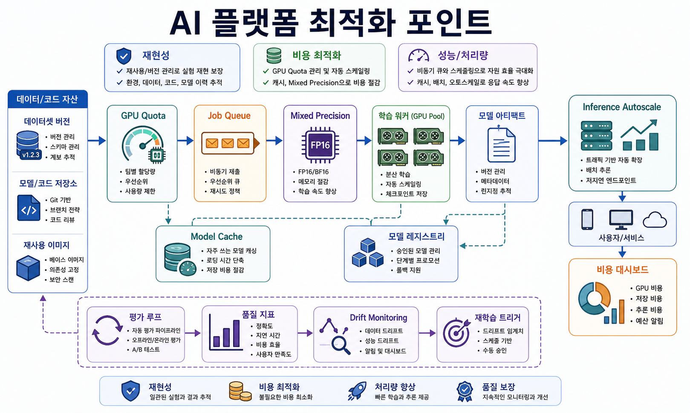

# 8교시: 카카오페이 - AI 플랫폼, GPU, Kubeflow, Docker 준비도

## 수업 목표
- 고성능 컴퓨팅도 애플리케이션 실행 조건의 일부임을 이해한다.
- AI 플랫폼에 표준화, 자원 제어, 오케스트레이션이 필요한 이유를 설명한다.
- Day4 전체를 Docker 준비도로 정리한다.
- Day6 멘토링이 필요한 학생을 수업 흐름을 끊지 않고 표시한다.

## 참고 자료
- 카카오페이 기술블로그: https://tech.kakaopay.com/
- AI 플랫폼 GPU 도입부터 Kubeflow까지 도입기: https://tech.kakaopay.com/post/ai-platform/
- Kakao Pay DevOps tag: https://tech.kakaopay.com/tag/dev-ops/

## 50분 운영
| 시간 | 활동 | 강사 초점 | 학생 산출 |
|---|---|---|---|
| 0-5분 | AI hook | AI는 모델만이 아니라 runtime, data, GPU, workflow이다. | AI condition note |
| 5-15분 | 플랫폼 사례 읽기 | 표준화, 확장성, 통합, GPU 자원 제어 | source note |
| 15-25분 | HPC 구성요소 | CPU, memory, disk, GPU, driver, image, scheduler | compute map |
| 25-35분 | 비용과 희소성 | GPU는 비싸고 공유 자원이다. | cost note |
| 35-45분 | Day4 종합 | 8개 회사 사례를 실행 조건으로 다시 매핑한다. | final component map |
| 45-50분 | Day6/Week2 연결 | 멘토링 태그와 Docker 준비 체크리스트 | 준비 체크리스트 |

## 핵심 설명
AI 시스템은 웹 서비스와 달라 보이지만 운영 패턴은 비슷하다. 코드, 의존성, runtime, data, config, log, resource limit이 필요하다. 차이는 compute가 더 비싸고 특수하다는 점이다. GPU, memory, storage throughput, model file, scheduling이 중요해진다.

## 시각 자료






## 서비스 특장점과 채용 동기 연결
- 카카오페이형 금융 AI 플랫폼의 강점은 여러 팀이 AI 실험과 서비스 적용을 표준 환경에서 반복할 수 있게 만든다는 점이다.
- 학생 입장에서는 AI 엔지니어링이 모델 학습만이 아니라 GPU 자원, dataset, container image, scheduler, experiment tracking, inference 운영까지 포함한다는 것을 볼 수 있다.
- GPU는 비싸고 제한된 자원이므로 표준화와 quota 관리가 곧 비용 관리다.

## AI 엔지니어링 연결
- 최근 AI 엔지니어링의 핵심은 "모델을 한 번 학습했다"가 아니라 "데이터, 실험, 배포, 모니터링을 반복 가능하게 만들었다"에 가깝다.
- LLM/RAG/추천/이상탐지 기능은 모두 runtime, dependency, model artifact, secret, 비용 한도, 로그가 필요하다.
- 그래서 Docker와 Kubernetes는 AI 엔지니어링에서도 모델을 담는 그릇, 실험을 재현하는 단위, GPU 자원을 배치하는 기준으로 이어진다.

## 고성능 컴퓨팅 지도
| 구성요소 | 웹 앱 버전 | AI/HPC 버전 |
|---|---|---|
| Runtime | Node/Python server | Python/ML runtime |
| Dependency | web framework | ML library, CUDA 관련 stack |
| Data | DB 또는 JSON | dataset, model artifact |
| Compute | CPU, memory | GPU, memory, disk throughput |
| Config | API URL, secret | experiment config, resource quota |
| Observability | logs, status | training logs, metrics, GPU usage |
| Lifecycle | start/stop/restart | schedule, train, evaluate, deploy |

## Day4 종합표
| 교시 | 회사 | 구성요소 | Docker 압력 |
|---|---|---|---|
| 1 | 쿠팡 | 전체 앱 지도 | 많은 의존성에 공통 실행 계약이 필요하다. |
| 2 | 토스 | 프론트엔드 플랫폼 | runtime과 build version이 맞아야 한다. |
| 3 | 당근 | 백엔드 경계 | 각 service에 port, config, health check가 필요하다. |
| 4 | 네이버 | DB/storage | DB version, port, data path를 통제해야 한다. |
| 5 | 카카오 | message streaming | broker와 consumer 실행 순서가 중요하다. |
| 6 | 우아한형제들 | 배달 이벤트 | API, queue, worker, log를 함께 실행해야 한다. |
| 7 | 여기어때 | burst traffic | 반복 가능한 disposable test 환경이 필요하다. |
| 8 | 카카오페이 | AI/HPC | 비싼 compute일수록 표준 runtime이 필요하다. |

## 최종 산출물
```text
Week2 Docker 준비 note

1. 내가 가장 잘 이해한 app/component:
2. 이해에 도움이 된 회사 사례:
3. 내가 설명할 수 있는 수동 설치의 고통:
4. 고정해야 할 runtime 또는 version:
5. 고정해야 할 port 또는 network 조건:
6. 보호해야 할 data 또는 file path:
7. hard-code하면 안 되는 config 또는 secret:
8. Docker 주차에 물어보고 싶은 질문:
9. Day6 멘토링 필요 여부: yes/no
```

## Day6 멘토링 태그 기준
- project folder나 repository를 찾지 못한다.
- local app을 실행하거나 command를 설명하지 못한다.
- frontend, backend, database, cache, queue를 구분하지 못한다.
- 환경 오류가 반복되어 자신감이 낮다.
- Docker 설치 전 용어 회복 lane이 필요하다.

## 다음 연결
Day5는 Day4 구성요소 지도를 학생 본인의 앱 지도와 짧은 발표로 바꾼다. Day6는 Week2 Docker 진입 전에 멘토링과 회복을 담당한다.
