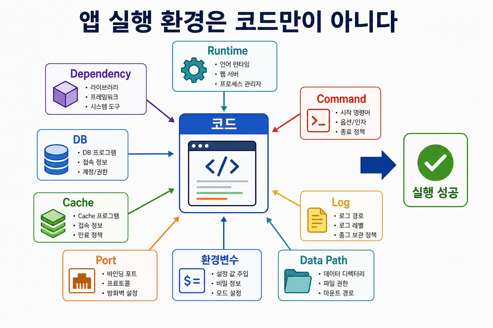

# 1교시: 애플리케이션 실행 환경은 코드만이 아니다

> 운영 메모: 이 교시는 Day4 마지막 시간에 선행 진행한 경우 Day5 본수업에서는 빠르게 회상만 하고, Day5는 `2-1교시: DB 직접 설치해 보기`부터 시작한다.

## 수업 목표
- 애플리케이션이 실행되기 위해 코드 외에 필요한 조건을 말할 수 있다.
- 실행 실패를 "코드가 틀렸다"로만 보지 않고 runtime, dependency, port, config, data path 관점으로 나누어 본다.
- Week2 Docker 수업에서 다룰 image, container, volume, port, env 개념이 왜 필요한지 감을 잡는다.

## 시각 자료


## 도입 시나리오
강사가 이렇게 시작한다.

```text
어제까지는 "내가 만든 페이지가 브라우저에서 뜨는가"를 봤다.
그런데 회사에서 일하면 보통 이런 말을 듣는다.

"이 서비스 로컬에서 한번 띄워 보세요."

코드를 받았다. 그런데 실행이 안 된다.
이때 무엇부터 확인해야 할까?
```

학생들이 흔히 떠올리는 답은 "코드 오류", "설치가 안 됨", "버전 문제" 정도다. 이 답을 인정한 뒤 더 넓게 펼친다. 실제 실행 환경은 다음 조건들의 조합이다.

| 조건 | 질문 | 예시 |
|---|---|---|
| 코드 | 무엇을 실행하는가? | frontend, backend, script |
| Runtime | 어떤 실행기가 필요한가? | Node.js, Python, Java |
| Dependency | 어떤 라이브러리가 필요한가? | npm package, pip package |
| Program | 외부 프로그램이 필요한가? | DB, cache, message broker |
| Network | 어디로 접속하는가? | localhost, port, API URL |
| Configuration | 설정은 어디서 오는가? | `.env`, config file |
| Data | 데이터는 어디에 저장되는가? | database folder, upload folder |
| Command | 어떤 명령으로 시작하는가? | `npm run dev`, `python app.py` |

## 강의 진행 흐름
### 1. "실행된다"의 의미를 분해한다
학생들에게 질문한다.

```text
여러분이 만든 앱이 실행됐다고 말하려면 무엇을 봐야 할까?
```

판서 예시:

```text
명령 실행 성공
브라우저 접속 성공
로그에 에러 없음
DB 연결 성공
데이터 읽기 성공
다른 사람 컴퓨터에서도 재현 가능
```

여기서 핵심은 "내 컴퓨터에서 한 번 켜짐"과 "운영 가능한 실행 환경"은 다르다는 점이다. 개발 수업에서는 전자가 먼저 필요하지만, DevOps와 Cloud Native에서는 후자를 계속 묻는다.

### 2. 실행 조건을 하나씩 제거해 본다
짧은 사고 실험으로 진행한다.

| 제거한 조건 | 예상 증상 |
|---|---|
| Node.js 버전이 다름 | 명령 자체가 실패하거나 문법 오류 발생 |
| 라이브러리 설치가 안 됨 | module not found |
| DB가 꺼져 있음 | connection refused |
| port가 겹침 | already in use |
| `.env` 값이 없음 | undefined config, login failure |
| 데이터 폴더가 없음 | file not found, empty result |

학생들이 따라오기 어렵다면 용어를 줄이고 "앱이 살기 위한 주변 조건"이라고 표현한다.

### 3. AI 엔지니어링과 연결한다
최근 AI 기능이 들어간 앱은 실행 조건이 더 늘어난다.

- LLM API key가 필요하다.
- vector database나 embedding 저장소가 필요할 수 있다.
- 모델 버전, tokenizer, GPU driver가 맞아야 할 수 있다.
- 요청 비용을 줄이기 위한 cache가 필요할 수 있다.
- prompt와 retrieval 설정이 바뀌면 결과가 달라진다.

즉 AI 앱은 "코드만 받으면 실행된다"에서 더 멀어진다. 그래서 환경을 기록하고 재현하는 능력이 더 중요해진다.

## 학생 활동
각자 최근에 실행했던 프로그램 하나를 떠올리고 다음 표를 채운다. 꼭 정답일 필요는 없다.

```text
프로그램 이름:
실행 명령:
필요한 runtime:
필요한 외부 프로그램:
사용한 port:
필요한 설정값:
데이터가 저장되는 위치:
실패했을 때 봐야 할 화면이나 로그:
```

3분 작성, 5분 공유로 운영한다. 공유할 때 강사는 "그건 Docker로 해결됩니다"라고 먼저 말하지 않는다. 대신 "이 조건을 매번 손으로 맞추는 게 힘들다"는 결론까지 데려간다.

## Docker 연결
오늘 1교시의 결론은 다음 한 문장이다.

```text
Docker는 코드를 대신 짜 주는 도구가 아니라, 실행 조건을 포장하고 격리하고 재현하려는 도구다.
```

Week2에서 배울 Docker 용어를 미리 연결한다.

| 오늘의 말 | Week2 표현 |
|---|---|
| 실행에 필요한 프로그램 묶음 | image |
| 실제로 켜진 실행 단위 | container |
| 밖에서 접속할 입구 | port binding |
| 데이터가 남는 위치 | volume |
| 실행 시 주입하는 설정 | environment variable |

## 마무리 체크
학생이 말할 수 있어야 하는 문장:

```text
앱 실행은 코드만의 문제가 아니라 runtime, dependency, network, config, data가 함께 맞아야 하는 문제다.
```
