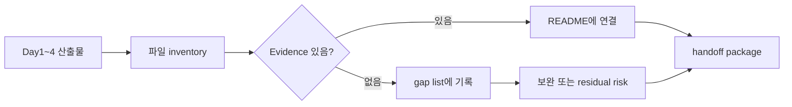

# 1교시: 1주차 산출물 통합

## 수업 목표
- Day1~4 산출물을 하나의 repository 기준으로 정리한다.
- 누락된 evidence를 찾아 보완한다.
- 제출물이 다음 작업자에게 전달 가능한지 판단한다.

## 50분 운영
| 시간 | 활동 | 학습 초점 | 학생 산출 |
|---|---|---|---|
| 0-5분 | Day5 목표 소개 | 통합과 handoff 중심으로 기준을 고정한다. | 목표 확인 |
| 5-15분 | 파일 inventory | 누락 파일과 중복 파일을 찾게 한다. | inventory table |
| 15-30분 | evidence gap 찾기 | command, URL, status, screenshot/notes를 확인한다. | gap list |
| 30-40분 | README 통합 | Day별 기록을 하나의 흐름으로 정리한다. | README 수정 |
| 40-50분 | 제출 상태 표시 | complete/partial/missing으로 표시한다. | readiness note |

## 0-5분 Day5 목표 소개

- 진행: Day5 목표 소개

- 초점: 통합과 handoff 중심으로 기준을 고정한다.

- 학생 산출: 목표 확인

- 완료 조건: 아래 자료를 사용해 이 시간 블록의 산출물을 만든다.

### 핵심 설명
Day5는 새 기능을 많이 추가하는 날이 아니라 1주차 산출물을 묶어 "실행 가능한 handoff package"로 만드는 날이다. 통합의 기준은 파일이 많아 보이는 것이 아니라, 다른 사람이 README를 읽고 앱을 실행하고 위험을 이해할 수 있는가다.

### 시각 자료 1: Evidence Flow

이 이미지는 앱 실행, 확인, 문서화가 따로 떨어진 일이 아니라 하나의 evidence 흐름이라는 점을 보여준다.

## 5-15분 파일 inventory

- 진행: 파일 inventory

- 초점: 누락 파일과 중복 파일을 찾게 한다.

- 학생 산출: inventory table

- 완료 조건: 아래 자료를 사용해 이 시간 블록의 산출물을 만든다.

### 통합 항목
| Artifact | Required Evidence |
|---|---|
| README | start/check/stop/troubleshoot |
| mini app | static files and local URL |
| data | dummy JSON rendered in browser |
| RCA | one failure record |
| mapping | computing spine |
| risk | cost/security/reproducibility |
| interview | Day4 blocker and recovery note |

### Week 1 Integration Inventory
| Item | Path | Status | Evidence |
|---|---|---|---|
| mini app | | complete/partial/missing | |
| README | | complete/partial/missing | |
| RCA | | complete/partial/missing | |
| risk table | | complete/partial/missing | |
| spine mapping | | complete/partial/missing | |

### 시각 자료 2: 통합 판단 흐름

## 15-30분 evidence gap 찾기

- 진행: evidence gap 찾기

- 초점: command, URL, status, screenshot/notes를 확인한다.

- 학생 산출: gap list

- 완료 조건: 아래 자료를 사용해 이 시간 블록의 산출물을 만든다.

### 시각 자료 3: 빠른 캡처 가이드
| 캡처 대상 | 확인 질문 | 제출 기록 예시 |
|---|---|---|
| Repository tree | 핵심 파일이 한 위치에 모였는가? | `Path: mini-app/` |
| Browser screen | 앱 화면이 정상적으로 보이는가? | `URL checked, data visible` |
| README section | 실행/확인/중지 절차가 있는가? | `How to run complete` |
| Risk note | 남은 위험이 숨겨지지 않았는가? | `partial: no backend by scope` |

### 활동 절차
1. repository root와 mini app 폴더 위치를 확인한다.
2. Day1~4에서 만든 산출물을 목록화한다.
3. 각 산출물에 evidence가 붙어 있는지 확인한다.
4. 중복되거나 범위 밖인 내용을 제거한다.
5. README에 최종 실행 경로와 확인 절차를 통합한다.

## 30-40분 README 통합

- 진행: README 통합

- 초점: Day별 기록을 하나의 흐름으로 정리한다.

- 학생 산출: README 수정

- 완료 조건: 아래 자료를 사용해 이 시간 블록의 산출물을 만든다.

### 흔한 오해
| 오해 | 교정 |
|---|---|
| 산출물이 있으면 evidence는 나중에 채워도 된다. | evidence는 산출물의 일부다. command, path, status, log, note가 함께 있어야 평가 가능하다. |
| Week1에서 모든 기술을 깊게 익혀야 한다. | Week1은 컴퓨팅 spine과 운영 증거를 만드는 주차이며, 깊은 hands-on은 각 기술 주차에서 진행한다. |
| 막힌 내용을 숨기는 것이 좋다. | blocker를 증상, 시도한 일, 다음 조치로 기록하는 것이 현업식 진행 관리다. |

## 40-50분 제출 상태 표시

- 진행: 제출 상태 표시

- 초점: complete/partial/missing으로 표시한다.

- 학생 산출: readiness note

- 완료 조건: 아래 자료를 사용해 이 시간 블록의 산출물을 만든다.

### 산출물
아래 양식 또는 표를 사용해 이 시간 블록의 산출물을 작성한다.

### 평가 기준
| 기준 | 충족 |
|---|---|
| Day1~4 산출물이 하나의 목록으로 정리되었다. | |
| evidence 누락이 명시되었다. | |
| README가 최종 실행 기준을 제공한다. | |
| 삭제하거나 제외할 범위 초과 항목을 식별했다. | |

### 현업 DevOps insight
통합은 "마지막에 예쁘게 정리"가 아니라 운영 리스크를 줄이는 작업이다. 산출물이 흩어져 있으면 장애 대응, 리뷰, 배포 준비가 모두 느려진다.

### 학술 근거
- Portfolio assessment: 여러 활동 산출물을 하나의 증거 묶음으로 평가한다.
- Cognitive organization: 분산된 정보를 구조화해 문제 해결 부담을 낮춘다.
- ABET-style communication: 기술 산출물을 실행 가능한 문서로 전달한다.

### 다음 주차 연결
Week2 Docker에서는 통합된 앱 폴더가 container build 대상이 된다. 오늘 통합이 되어야 어떤 파일을 이미지에 넣을지 판단할 수 있다.

### 다음 연결
다음 교시는 computing spine 최종 매핑을 작성한다.

### 공식/학술 근거 링크
- GitHub Docs: About READMEs, https://docs.github.com/en/repositories/managing-your-repositorys-settings-and-features/customizing-your-repository/about-readmes - 통합 산출물이 실행과 도움 경로를 제공해야 하는 기준이다.
- Pro Git: About Version Control, https://git-scm.com/book/en/v2/Getting-Started-About-Version-Control - 통합 과정에서 변경 이력과 협업 증거를 남기는 이유다.
- Monash Constructive Alignment, https://www.monash.edu/learning-teaching/teachhq/Teaching-practices/learning-outcomes/how-to/constructive-alignment - 목표, 활동, 평가 evidence를 하나의 artifact로 맞추는 기준이다.
