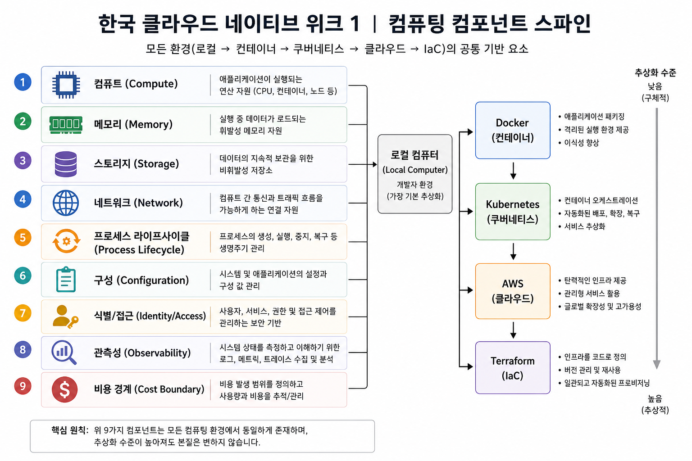
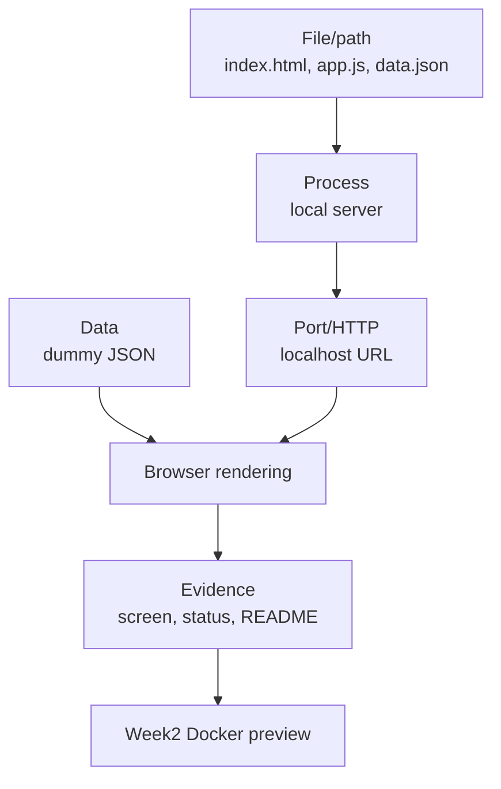

# 2교시: 컴퓨팅 spine 최종 매핑

## 수업 목표
- Week1 활동을 computing spine의 핵심 개념과 연결한다.
- 파일, 프로세스, 네트워크, 데이터, 증거의 관계를 설명한다.
- Week2~6 기술이 어떤 문제를 해결하는지 예고한다.

## 50분 운영
| 시간 | 활동 | 학습 초점 | 학생 산출 |
|---|---|---|---|
| 0-10분 | spine 개념 회상 | Day1~4 활동을 질문으로 끌어낸다. | 개념 목록 |
| 10-25분 | 개인 매핑 작성 | 자기 앱 evidence와 spine을 연결한다. | mapping table |
| 25-35분 | Week2~6 연결 | Docker/CI/CD/cloud/security를 문제 해결 관점으로 예고한다. | 기술 연결 |
| 35-45분 | 짝 설명 | 상대에게 2분 설명한다. | 설명 피드백 |
| 45-50분 | 최종 수정 | 모호한 용어를 evidence로 바꾼다. | final map |

## 0-10분 spine 개념 회상

- 진행: spine 개념 회상

- 초점: Day1~4 활동을 질문으로 끌어낸다.

- 학생 산출: 개념 목록

- 완료 조건: 아래 자료를 사용해 이 시간 블록의 산출물을 만든다.

### 핵심 설명
Spine 매핑은 용어 암기가 아니다. 학생이 만든 미니 앱을 기준으로 "내가 만진 파일이 프로세스로 실행되고, port와 HTTP를 통해 보이며, evidence로 검증된다"는 흐름을 설명하는 것이다.

### 시각 자료 1: Computing Spine

이미지의 순서를 따라가며 자기 앱의 path, process, port, data, evidence를 실제 값으로 바꿔 적는다.

## 10-25분 개인 매핑 작성

- 진행: 개인 매핑 작성

- 초점: 자기 앱 evidence와 spine을 연결한다.

- 학생 산출: mapping table

- 완료 조건: 아래 자료를 사용해 이 시간 블록의 산출물을 만든다.

### 시각 자료 2: 내 앱 spine 연결

## 25-35분 Week2~6 연결

- 진행: Week2~6 연결

- 초점: Docker/CI/CD/cloud/security를 문제 해결 관점으로 예고한다.

- 학생 산출: 기술 연결

- 완료 조건: 아래 자료를 사용해 이 시간 블록의 산출물을 만든다.

### 시각 자료 3: 설명 카드
| Spine 질문 | 학생이 넣을 실제 값 |
|---|---|
| 어떤 파일이 앱의 입구인가? | |
| 어떤 프로세스가 파일을 서비스하는가? | |
| 어떤 URL 또는 port로 확인했는가? | |
| 데이터는 어디에서 와서 어디에 보이는가? | |
| 정상임을 보여주는 evidence는 무엇인가? | |

### Spine Map
| Spine Element | Week1 Evidence | 다음 기술 연결 |
|---|---|---|
| File/path | `index.html`, `app.js`, `data.json` | Docker build context |
| Process | `python3 -m http.server` | container process |
| Port/HTTP | `localhost:8000`, HTTP 200 | port mapping, service exposure |
| Data | dummy JSON | volume, config, API boundary |
| Config/secret | no secret, local config only | env var, secret management |
| Evidence | curl/browser/README | CI logs, deploy evidence |
| Failure/RCA | one failure record | container logs, rollback note |

### 활동 절차
1. 자신의 앱에서 실제 파일 경로를 적는다.
2. 실행 중인 process와 command를 적는다.
3. port와 URL, HTTP 확인 결과를 적는다.
4. 데이터가 어디에서 와서 어디에 보이는지 적는다.
5. 각 항목을 Week2 이후 기술과 연결한다.

## 35-45분 짝 설명

- 진행: 짝 설명

- 초점: 상대에게 2분 설명한다.

- 학생 산출: 설명 피드백

- 완료 조건: 아래 자료를 사용해 이 시간 블록의 산출물을 만든다.

### 흔한 오해
| 오해 | 교정 |
|---|---|
| 산출물이 있으면 evidence는 나중에 채워도 된다. | evidence는 산출물의 일부다. command, path, status, log, note가 함께 있어야 평가 가능하다. |
| Week1에서 모든 기술을 깊게 익혀야 한다. | Week1은 컴퓨팅 spine과 운영 증거를 만드는 주차이며, 깊은 hands-on은 각 기술 주차에서 진행한다. |
| 막힌 내용을 숨기는 것이 좋다. | blocker를 증상, 시도한 일, 다음 조치로 기록하는 것이 현업식 진행 관리다. |

## 45-50분 최종 수정

- 진행: 최종 수정

- 초점: 모호한 용어를 evidence로 바꾼다.

- 학생 산출: final map

- 완료 조건: 아래 자료를 사용해 이 시간 블록의 산출물을 만든다.

### 산출물
- computing spine final mapping
- 2분 구두 설명 메모
- Week2 Docker 연결 문장 1개

### 평가 기준
| 기준 | 충족 |
|---|---|
| spine 요소가 실제 evidence와 연결된다. | |
| 추상 용어만 쓰지 않고 path/command/URL을 포함한다. | |
| Week2 Docker가 해결할 문제를 설명한다. | |
| 짝에게 2분 안에 설명할 수 있다. | |

### 현업 DevOps insight
좋은 엔지니어는 도구 이름보다 시스템 경계를 먼저 본다. Docker, CI, cloud는 각각 파일, 프로세스, 네트워크, 증거의 문제를 더 안정적으로 다루기 위한 수단이다.

### 학술 근거
- Concept mapping: 개념 간 관계를 시각화하거나 표로 정리해 전이를 돕는다.
- Transfer of learning: Week1 로컬 실행 경험을 Week2 컨테이너 개념으로 옮긴다.
- CS2023 systems perspective: software artifact와 execution environment를 연결한다.

### 다음 주차 연결
Week2 첫 Docker 실습은 `python3 -m http.server`를 container process로 바꾸는 활동이다. Spine map은 그 변환의 기준표가 된다.

### 다음 연결
다음 교시는 DevOps handoff package를 작성한다.

### 공식/학술 근거 링크
- MIT Missing Semester, https://missing.csail.mit.edu/ - shell/Git/debugging 산출물을 학습 evidence로 정리하는 기준이다.
- GitHub Docs: About READMEs, https://docs.github.com/en/repositories/managing-your-repositorys-settings-and-features/customizing-your-repository/about-readmes - README checklist가 실행 가능성과 도움 경로를 담아야 하는 기준이다.
- Google SRE Book: Introduction, https://sre.google/sre-book/introduction/ - monitoring과 change management를 산출물 검토에 연결하는 근거다.
