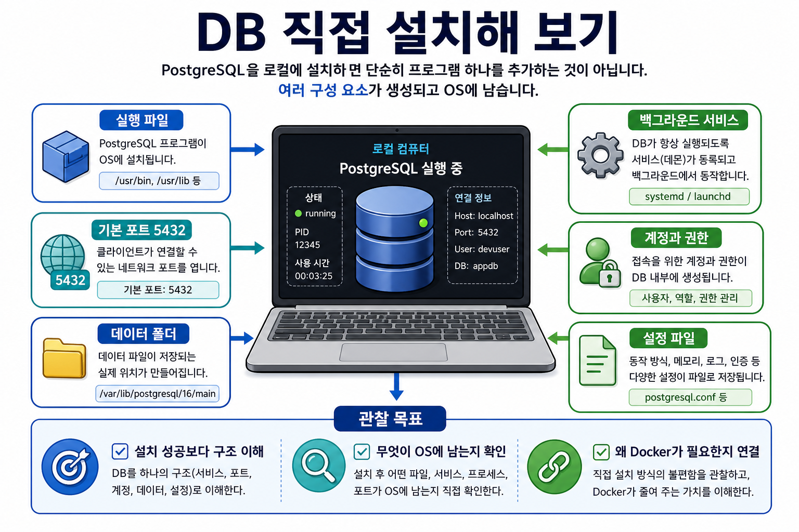

# 2-1교시: DB 직접 설치해 보기

## 수업 목표
- DB 설치가 실행 파일 하나를 추가하는 일이 아니라는 점을 이해한다.
- PostgreSQL을 Linux/WSL 또는 macOS 환경에 직접 설치하고 service, port, account, password, data path를 관찰한다.
- 수업용 DB 계정과 DB를 만든 뒤, 비밀번호로 접속 가능한지 command로 검증한다.
- Docker를 배우기 전에 로컬 직접 설치 방식의 장점과 부담을 말할 수 있다.

## 시각 자료


## 도입 시나리오
강사가 이렇게 시작한다.

```text
어제까지는 앱이 여러 구성요소로 돌아간다는 이야기를 했다.
그중 DB는 코드 옆에 있는 파일 하나가 아니다.

오늘은 Docker 없이 DB를 직접 설치해 보면서,
"설치했다"라는 말이 실제로 무엇을 남기는지 관찰한다.
```

오늘의 핵심은 DB를 잘 다루는 것이 아니다. 학생들이 다음 문장을 이해하는 것이다.

```text
DB 설치 = 실행 파일 + 백그라운드 서비스 + 포트 + 계정 + 데이터 폴더 + 설정 파일
```

## 운영 기준
이 실습은 성공/실패를 성적처럼 다루지 않는다. 목적은 설치 완주보다 관찰이다.

| 구분 | 오늘의 기준 |
|---|---|
| 필수 | DB가 OS에 어떤 흔적을 남기는지 설명한다. |
| 권장 | PostgreSQL service를 시작하고 상태를 확인한다. |
| 권장 | 수업용 계정과 DB를 만든 뒤 비밀번호 접속을 확인한다. |
| 선택 | `psql`로 접속해 간단한 DB 목록과 현재 접속 정보를 확인한다. |
| 실패 시 | 오류 메시지를 캡처하고 어떤 단계에서 막혔는지 분류한다. |

설치가 막힌 학생도 수업에서 빠지지 않게 한다. 막힌 지점 자체가 Week2 Docker의 좋은 질문이 된다.

## 실습 전 확인
학생 환경이 대부분 WSL 또는 macOS라면 Windows GUI 설치는 피한다. 기준은 terminal에서 관찰 가능한 절차로 둔다.

```text
내 환경:
- WSL Ubuntu / Linux
- macOS
- 기타

확인할 것:
- terminal 실행 가능
- package manager 사용 가능
- 관리자 권한 또는 설치 권한
- 디스크 여유 공간
```

## Linux / WSL 기준 실습
Ubuntu 계열을 기준으로 한다.

```bash
sudo apt update
sudo apt install postgresql postgresql-contrib
sudo service postgresql start
sudo service postgresql status
```

상태 확인에서 봐야 할 것은 "초록색 성공"만이 아니다.

```text
이름이 무엇인가?
service로 등록되었는가?
실행 중인가?
중지할 수 있는가?
다시 시작할 수 있는가?
```

가능하면 다음도 확인한다.

```bash
sudo -u postgres psql
```

`psql`에 들어갔다면 다음 명령만 확인하고 나온다.

```sql
\l
\q
```

### Linux / WSL: 수업용 계정과 DB 만들기
설치가 끝났다면 "DB 서버가 켜졌다"에서 멈추지 않고, 실제 앱이 접속할 수 있는 계정과 DB를 만든다.

수업용 예시는 다음 값으로 통일한다. 실제 프로젝트에서는 이런 단순 비밀번호를 쓰면 안 된다.

```text
DB_HOST=localhost
DB_PORT=5432
DB_USER=devuser
DB_PASSWORD=devpass
DB_NAME=appdb
```

PostgreSQL 관리자 계정으로 수업용 사용자와 DB를 만든다.

```bash
sudo -u postgres psql -c "CREATE USER devuser WITH PASSWORD 'devpass';"
sudo -u postgres psql -c "CREATE DATABASE appdb OWNER devuser;"
```

이미 `devuser`가 있다는 오류가 나면 비밀번호만 다시 맞춘다.

```bash
sudo -u postgres psql -c "ALTER USER devuser WITH PASSWORD 'devpass';"
```

비밀번호 접속을 확인한다. 이 명령은 일부러 `-h localhost`를 붙인다. 그래야 OS 사용자 인증이 아니라 TCP 접속과 비밀번호 인증 흐름을 확인할 수 있다.

```bash
psql -h localhost -p 5432 -U devuser -d appdb
```

비밀번호를 물어보면 다음을 입력한다.

```text
devpass
```

접속에 성공하면 `psql` 안에서 다음을 실행한다.

```sql
SELECT current_user;
SELECT current_database();
CREATE TABLE health_check (id serial PRIMARY KEY, message text);
INSERT INTO health_check (message) VALUES ('db connection ok');
SELECT * FROM health_check;
\q
```

한 줄로 연결 확인만 하고 싶다면 다음 명령을 사용한다.

```bash
psql -h localhost -p 5432 -U devuser -d appdb -c "SELECT current_user, current_database();"
```

## macOS 기준 실습
Homebrew가 설치되어 있다는 전제로 진행한다.

```bash
brew install postgresql@16
brew services start postgresql@16
brew services list
```

macOS에서는 `brew services`가 service 관찰 포인트다.

```text
서비스 이름은 무엇인가?
상태가 started인가?
로그 위치가 표시되는가?
중지 명령은 무엇인가?
```

필요하면 다음처럼 접속을 확인한다.

```bash
psql postgres
```

### macOS: 수업용 계정과 DB 만들기
Homebrew PostgreSQL은 설치 상태에 따라 기본 관리자 계정이 OS 사용자 이름일 수 있다. 먼저 `psql postgres`로 접속해 보고, 접속되면 같은 방식으로 수업용 계정과 DB를 만든다.

```bash
psql postgres -c "CREATE USER devuser WITH PASSWORD 'devpass';"
psql postgres -c "CREATE DATABASE appdb OWNER devuser;"
```

이미 `devuser`가 있다는 오류가 나면 비밀번호만 다시 맞춘다.

```bash
psql postgres -c "ALTER USER devuser WITH PASSWORD 'devpass';"
```

비밀번호 접속을 확인한다.

```bash
psql -h localhost -p 5432 -U devuser -d appdb
```

비밀번호를 물어보면 다음을 입력한다.

```text
devpass
```

접속에 성공하면 다음을 실행한다.

```sql
SELECT current_user;
SELECT current_database();
CREATE TABLE health_check (id serial PRIMARY KEY, message text);
INSERT INTO health_check (message) VALUES ('db connection ok');
SELECT * FROM health_check;
\q
```

한 줄 연결 확인:

```bash
psql -h localhost -p 5432 -U devuser -d appdb -c "SELECT current_user, current_database();"
```

## 연결 정보와 앱 설정 연결
이제 DB 접속 정보는 앱의 `.env` 값으로 바꿔 말할 수 있다.

```text
DB_HOST=localhost
DB_PORT=5432
DB_USER=devuser
DB_PASSWORD=devpass
DB_NAME=appdb
```

강사는 여기서 다음을 강조한다.

```text
DB가 설치되어 있어도 계정, 비밀번호, DB 이름, port가 맞지 않으면 앱은 연결되지 않는다.
```

대표 연결 오류를 미리 분류한다.

| 증상 | 가능한 원인 | 확인할 것 |
|---|---|---|
| `connection refused` | DB service가 꺼져 있음 | service 상태 |
| `password authentication failed` | 비밀번호가 다름 | `DB_PASSWORD`, 계정 비밀번호 |
| `database "appdb" does not exist` | DB를 만들지 않음 | DB 목록 |
| `role "devuser" does not exist` | 사용자를 만들지 않음 | 사용자 생성 |
| 명령이 멈춘 것처럼 보임 | 비밀번호 입력 대기 중 | 터미널 prompt |

## 관찰 포인트
학생들이 명령어를 따라 치는 동안 강사는 칠판에 다음 표를 채운다.

| 관찰 항목 | 질문 | 예시 |
|---|---|---|
| 실행 파일 | DB 프로그램은 어디에 설치되었는가? | `/usr/bin`, Homebrew 경로 |
| service | DB가 백그라운드에서 실행되는가? | `postgresql`, `postgresql@16` |
| port | 클라이언트가 어디로 접속하는가? | `5432` |
| account | 어떤 계정으로 접속하는가? | `postgres`, `devuser` |
| password | 비밀번호 인증이 되는가? | `devpass` |
| data path | 데이터는 어디에 저장되는가? | `/var/lib/postgresql/...` |
| config | 설정 파일은 어디에 있는가? | `postgresql.conf` |

학생에게 다음 질문을 던진다.

```text
내가 프로젝트 폴더를 삭제하면 DB 데이터도 같이 삭제될까?
DB 프로그램을 삭제하면 DB 데이터도 항상 같이 삭제될까?
다른 프로젝트가 같은 port를 쓰면 어떻게 될까?
비밀번호가 맞지 않으면 앱에서는 어떤 오류가 날까?
```

## 직접 설치 방식의 장점도 말한다
Docker로 넘어가기 위한 수업이라고 해서 직접 설치를 나쁘게만 말하지 않는다.

| 장점 | 설명 |
|---|---|
| OS와 직접 통합 | service, log, client 도구를 그대로 쓸 수 있다. |
| 성능과 경로 확인이 쉽다 | 실제 로컬 디스크와 프로세스를 직접 본다. |
| 기초 개념을 배운다 | port, process, account, data path를 몸으로 익힌다. |

다만 협업과 반복 실습에서는 부담이 커진다.

```text
모두가 같은 버전으로 설치했는가?
모두가 같은 port를 쓰는가?
데이터 폴더가 섞이지 않았는가?
삭제할 때 무엇을 지워야 하는가?
```

## 학생 활동
각자 자기 컴퓨터에서 관찰한 내용을 적는다.

```text
내 OS:
설치한 DB:
service 이름:
상태 확인 명령:
기본 port:
접속 계정:
접속 비밀번호 확인 여부:
접속 확인 명령:
접속한 DB 이름:
데이터가 남는 위치:
막힌 단계:
오류 메시지:
```

설치가 실패한 학생은 실패 기록을 완성하면 된다. 실패 기록도 좋은 산출물이다.

## Docker 연결
오늘의 결론은 다음이다.

```text
DB를 직접 설치해 보니 DB는 OS에 service, port, account, data, config를 남긴다.
앱이 DB에 연결되려면 host, port, user, password, database가 모두 맞아야 한다.
Docker는 이 조건들을 container, port binding, volume, env로 더 명시적으로 다루게 해 준다.
```

## 마무리 체크
학생이 말할 수 있어야 하는 문장:

```text
DB 설치는 프로그램 하나를 추가하는 일이 아니라 실행 서비스, 포트, 계정, 비밀번호, 데이터 폴더, 설정 파일을 로컬 환경에 만드는 일이다.
DB 연결 확인은 실제 계정과 비밀번호로 `psql -h localhost -p 5432 -U devuser -d appdb`에 접속해 검증한다.
```
