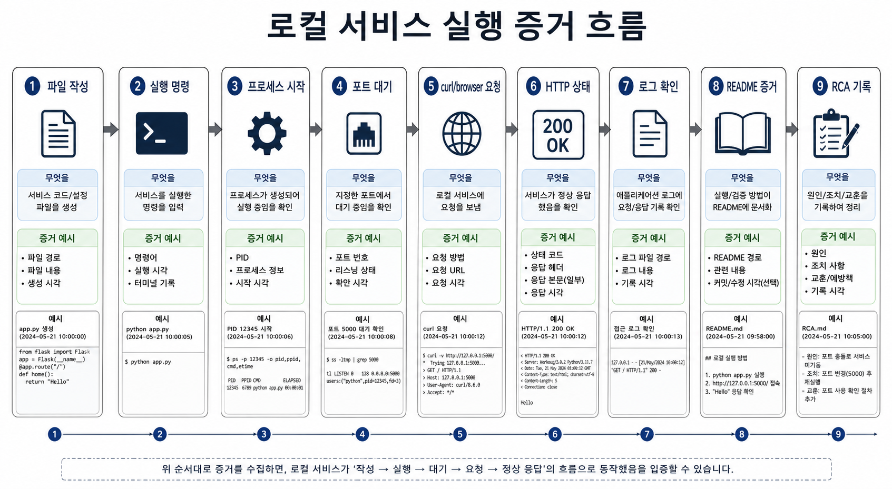
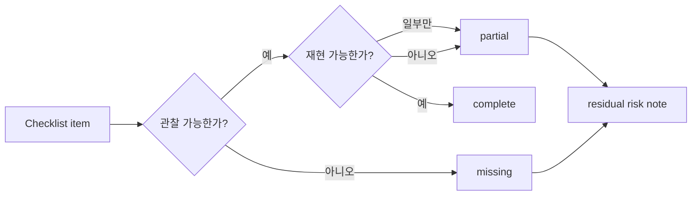

# 5교시: 통합 체크리스트, 평가 증거, 2~6주차 기술 매핑

## 수업 목표
- Week1 최종 제출물을 평가 가능한 증거 기준으로 점검한다.
- 2~6주차 기술이 Week1 산출물의 어떤 한계를 해결하는지 매핑한다.
- 제출 전 남은 위험을 명시한다.

## 50분 운영
| 시간 | 활동 | 학습 초점 | 학생 산출 |
|---|---|---|---|
| 0-10분 | 평가 증거 설명 | 점수 기준을 evidence와 연결한다. | 평가 기준 이해 |
| 10-25분 | 자기 체크 | 체크리스트 status를 채운다. | self assessment |
| 25-35분 | 주차 매핑 | Week2~6 연결 문장을 작성한다. | technology map |
| 35-45분 | 남은 위험 작성 | 제출 전 residual risk를 직접 적는다. | risk note |
| 45-50분 | 발표 준비 연결 | 발표에서 보여줄 evidence를 고른다. | 발표 evidence |

## 0-10분 평가 증거 설명

- 진행: 평가 증거 설명

- 초점: 점수 기준을 evidence와 연결한다.

- 학생 산출: 평가 기준 이해

- 완료 조건: 아래 자료를 사용해 이 시간 블록의 산출물을 만든다.

### 핵심 설명
평가는 "열심히 했다"가 아니라 관찰 가능한 evidence로 판단한다. Week1의 evidence는 실행 명령, HTTP 확인, 화면 결과, 위험 분류, RCA, handoff 문서다.

### 시각 자료 1: Evidence Coverage Map

평가자는 앱 자체보다 "실행했다", "확인했다", "위험을 알고 있다"는 증거 묶음을 본다.

## 10-25분 자기 체크

- 진행: 자기 체크

- 초점: 체크리스트 status를 채운다.

- 학생 산출: self assessment

- 완료 조건: 아래 자료를 사용해 이 시간 블록의 산출물을 만든다.

### 평가 증거 체크리스트
| Evidence | Required | Status |
|---|---|---|
| App runs locally | start command and URL | |
| HTTP check | status code or browser evidence | |
| Data rendering | dummy JSON visible | |
| Error handling | empty/error state note | |
| README | start/check/stop/troubleshoot | |
| Risk table | cost/security/reproducibility | |
| RCA | one failure lifecycle | |
| Spine map | file/process/port/data/evidence | |
| Handoff | summary, risks, gaps, next step | |

### 2~6주차 기술 매핑
| Week | 기술 | Week1에서 이어지는 문제 |
|---|---|---|
| Week2 | Docker | 로컬 실행 조건을 컨테이너로 고정한다. |
| Week3 | CI/CD | 실행 확인과 문서 검증을 자동화한다. |
| Week4 | Cloud/hosting | localhost 밖에서 접근 가능한 서비스로 확장한다. |
| Week5 | Observability/operations | log, status, failure evidence를 체계화한다. |
| Week6 | Security/reliability review | secret, 접근, 위험 대응을 더 엄격히 평가한다. |

### 시각 자료 2: Evidence 판정 흐름

## 25-35분 주차 매핑

- 진행: 주차 매핑

- 초점: Week2~6 연결 문장을 작성한다.

- 학생 산출: technology map

- 완료 조건: 아래 자료를 사용해 이 시간 블록의 산출물을 만든다.

### 시각 자료 3: 발표 Evidence 선택표
| Evidence 후보 | 보여주면 답하는 질문 | 발표 사용 여부 |
|---|---|---|
| README run/check section | 다음 사람이 실행할 수 있는가? | |
| Browser result | 앱이 실제로 보이는가? | |
| Data rendering | dummy JSON이 연결되었는가? | |
| Risk table | 남은 위험을 알고 있는가? | |
| RCA note | 실패를 숨기지 않고 학습했는가? | |

### 활동 절차
1. 체크리스트의 각 항목에 complete/partial/missing을 표시한다.
2. missing 항목은 보완 가능 여부와 이유를 적는다.
3. Week2~6 기술 매핑을 자신의 앱 기준으로 다시 쓴다.
4. 남은 위험을 숨기지 않고 제출 문서에 남긴다.
5. 발표에서 보여줄 evidence 2개를 고른다.

## 35-45분 남은 위험 작성

- 진행: 남은 위험 작성

- 초점: 제출 전 residual risk를 직접 적는다.

- 학생 산출: risk note

- 완료 조건: 아래 자료를 사용해 이 시간 블록의 산출물을 만든다.

### 흔한 오해
| 오해 | 교정 |
|---|---|
| 산출물이 있으면 evidence는 나중에 채워도 된다. | evidence는 산출물의 일부다. command, path, status, log, note가 함께 있어야 평가 가능하다. |
| Week1에서 모든 기술을 깊게 익혀야 한다. | Week1은 컴퓨팅 spine과 운영 증거를 만드는 주차이며, 깊은 hands-on은 각 기술 주차에서 진행한다. |
| 막힌 내용을 숨기는 것이 좋다. | blocker를 증상, 시도한 일, 다음 조치로 기록하는 것이 현업식 진행 관리다. |

## 45-50분 발표 준비 연결

- 진행: 발표 준비 연결

- 초점: 발표에서 보여줄 evidence를 고른다.

- 학생 산출: 발표 evidence

- 완료 조건: 아래 자료를 사용해 이 시간 블록의 산출물을 만든다.

### 산출물
- final evaluation checklist
- Week2~6 mapping
- residual risk note
- presentation evidence selection

### 평가 기준
| 기준 | 충족 |
|---|---|
| 평가 항목이 evidence 중심으로 채워졌다. | |
| Week2~6 연결이 도구 이름 나열에 그치지 않는다. | |
| 남은 위험이 구체적이다. | |
| 발표에서 보여줄 증거가 선택되었다. | |

### 현업 DevOps insight
좋은 팀은 위험을 숨기지 않는다. 남은 위험을 명시하면 다음 sprint, 다음 배포, 다음 담당자가 우선순위를 잡을 수 있다.

### 학술 근거
- Rubric-based assessment: 학생이 평가 기준을 알고 자기 산출물을 점검한다.
- Transfer: 한 주의 산출물을 다음 주 기술 학습의 출발점으로 사용한다.
- Reflective practice: 남은 위험과 보완 계획을 명시한다.

### 다음 주차 연결
Week2 첫 과제는 이 체크리스트에서 `App runs locally`와 `How to run`을 Docker 기준으로 다시 증명하는 것이다.

### 다음 연결
다음 교시는 미니 발표로 산출물과 evidence를 설명한다.

### 공식/학술 근거 링크
- GitHub Docs: About READMEs, https://docs.github.com/en/repositories/managing-your-repositorys-settings-and-features/customizing-your-repository/about-readmes - 최종 README가 실행, 설명, 도움 경로를 제공해야 하는 기준이다.
- OWASP Secrets Management Cheat Sheet, https://cheatsheetseries.owasp.org/cheatsheets/Secrets_Management_Cheat_Sheet.html - 제출 전 secret과 민감정보를 점검하는 기준이다.
- NIST AI Risk Management Framework, https://www.nist.gov/itl/ai-risk-management-framework - AI 도움을 받은 산출물도 사람이 위험과 검증 기준을 확인해야 하는 근거다.
