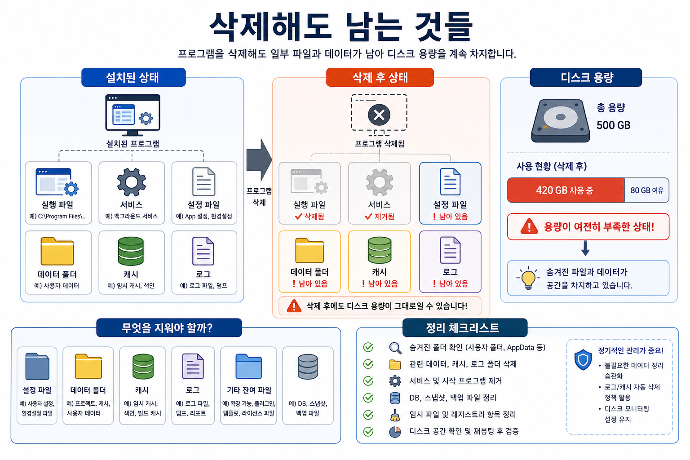

# 5교시: 삭제해도 남는 것들

## 수업 목표
- 프로그램 삭제가 실행 파일 삭제만으로 끝나지 않는 이유를 이해한다.
- 로컬 디스크가 복잡해지는 원인을 service, data, cache, log 관점으로 설명한다.
- Docker cleanup 개념이 왜 필요한지 이해한다.

## 시각 자료


## 도입 시나리오
강사가 학생들이 공감할 만한 장면으로 시작한다.

```text
수업을 따라오려고 이것저것 설치했다.
Node.js, Python, DB, IDE, extension, cache, sample project...

몇 주 뒤 디스크가 꽉 찼다.
무엇을 지워야 할지 모르겠다.
```

이 장면은 Docker의 중요성을 말하기 전에 반드시 짚어야 한다. 초보자는 설치보다 삭제가 더 무섭다.

## 핵심 개념
프로그램은 여러 흔적을 남긴다.

| 흔적 | 설명 |
|---|---|
| 실행 파일 | 실제 프로그램 binary |
| package cache | 설치 속도를 위해 남겨 둔 파일 |
| service 등록 | 백그라운드 자동 실행 항목 |
| data folder | DB 데이터, 업로드 파일 |
| config file | 설정값, 계정 정보, 경로 |
| log file | 실행 기록과 에러 기록 |
| plugin/extension | IDE나 tool에 붙은 추가 기능 |

삭제가 어려운 이유는 "지워도 되는 것"과 "지우면 복구가 어려운 것"이 섞여 있기 때문이다.

## 강의 진행 흐름
### 1. 삭제의 두 종류
삭제에는 최소 두 종류가 있다.

```text
프로그램 삭제: 실행 파일과 등록 정보 제거
데이터 삭제: 내가 만든 데이터와 상태 제거
```

DB를 예로 들면 프로그램을 지워도 데이터 폴더는 남을 수 있다. 반대로 데이터 폴더를 지우면 프로그램은 남아 있어도 이전 데이터는 사라진다.

### 2. "정리"가 위험한 이유
학생들이 흔히 하는 실수:

```text
용량이 큰 폴더를 검색해서 그냥 삭제한다.
캐시인지 데이터인지 구분하지 않는다.
프로젝트 폴더 안의 generated file과 source file을 구분하지 않는다.
DB data folder를 백업 없이 지운다.
환경변수나 service 등록은 남겨 둔다.
```

강사는 "지우지 마라"가 아니라 "무엇인지 알고 지우라"로 안내한다.

### 3. 디스크 용량 문제를 DevOps 관점으로 본다
로컬 디스크가 꽉 차는 문제도 운영 문제의 작은 버전이다.

| 로컬 문제 | 운영 환경의 대응 개념 |
|---|---|
| 로그가 계속 쌓임 | log rotation |
| 캐시가 커짐 | cache eviction |
| 빌드 산출물이 쌓임 | artifact retention |
| DB 데이터가 커짐 | backup, archive, retention |
| 쓰지 않는 프로그램이 남음 | lifecycle management |

학생들이 "내 컴퓨터 정리"를 운영 관리의 첫 경험으로 이해하게 한다.

### 4. AI 엔지니어링과 연결한다
AI 개발은 특히 디스크를 많이 쓴다.

- 모델 파일
- embedding cache
- vector index
- dataset
- experiment output
- log와 trace
- 이미지/음성 생성 결과

실험을 많이 할수록 "어떤 결과물이 남았는가"를 관리하지 않으면 금방 공간이 부족해진다.

## 학생 활동
다음 목록을 보고 지워도 되는지, 확인이 필요한지 분류한다.

```text
node_modules
.venv
dist
build
logs
uploads
db-data
.cache
.env
generated-images
```

질문:

```text
1. 다시 만들 수 있는 것은 무엇인가?
2. 지우기 전에 백업해야 할 것은 무엇인가?
3. secret이 들어 있을 수 있는 것은 무엇인가?
4. README에 정리 방법을 적는다면 어떤 순서가 좋을까?
```

## Docker 연결
Docker에서도 정리가 필요하다. 다만 정리 대상이 더 명확해진다.

| 로컬 설치 방식 | Docker 방식 |
|---|---|
| 어디에 깔렸는지 찾기 어려움 | image/container/volume으로 구분 |
| 서비스가 OS에 남을 수 있음 | container stop/remove |
| 데이터 폴더 위치가 흩어짐 | volume 이름으로 관리 |
| 캐시와 산출물이 섞임 | build cache, image layer로 관리 |

오늘 기억할 문장:

```text
Docker는 정리를 자동으로 대신해 주는 마법이 아니라, 무엇을 정리해야 하는지 경계를 더 분명하게 만드는 도구다.
```

## 마무리 체크
학생이 말할 수 있어야 하는 문장:

```text
프로그램 삭제는 실행 파일 삭제만이 아니라 service, config, data, cache, log를 구분해서 보는 문제다.
```
