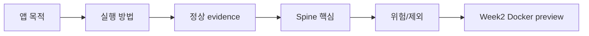

# 6교시: 미니 발표

## 수업 목표
- 자신의 Week1 산출물을 3분 안에 설명한다.
- 앱 기능보다 실행 증거, 위험, handoff를 중심으로 발표한다.
- 동료의 발표에서 재현 가능성과 위험 인식을 평가한다.

## 50분 운영
| 시간 | 활동 | 학습 초점 | 학생 산출 |
|---|---|---|---|
| 0-5분 | 발표 기준 안내 | 기능 자랑보다 evidence 중심을 강조한다. | 발표 기준 |
| 5-10분 | 발표 카드 작성 | 5개 항목으로 제한한다. | presentation card |
| 10-40분 | 학생 발표 | 시간 관리와 질문을 진행한다. | 발표 |
| 40-48분 | 동료 평가 | evidence와 handoff 기준으로 피드백한다. | feedback note |
| 48-50분 | 다음 교시 연결 | Q&A에서 다룰 공통 이슈를 모은다. | issue list |

## 0-5분 발표 기준 안내

- 진행: 발표 기준 안내

- 초점: 기능 자랑보다 evidence 중심을 강조한다.

- 학생 산출: 발표 기준

- 완료 조건: 아래 자료를 사용해 이 시간 블록의 산출물을 만든다.

### 핵심 설명
발표는 데모 쇼가 아니라 technical handoff 연습이다. 학생은 "무엇을 만들었는가", "어떻게 실행하는가", "정상임을 어떻게 확인했는가", "무엇이 남은 위험인가"를 짧게 말해야 한다.

### 시각 자료 1: 3분 발표 흐름

## 5-10분 발표 카드 작성

- 진행: 발표 카드 작성

- 초점: 5개 항목으로 제한한다.

- 학생 산출: presentation card

- 완료 조건: 아래 자료를 사용해 이 시간 블록의 산출물을 만든다.

### 발표 구조
| 순서 | 내용 | 시간 |
|---|---|---|
| 1 | 앱 목적과 사용자 흐름 | 30초 |
| 2 | 실행 방법과 evidence | 60초 |
| 3 | spine mapping 핵심 1개 | 30초 |
| 4 | 위험/제외 항목 | 30초 |
| 5 | Week2 Docker 연결 | 30초 |

### 시각 자료 2: 발표 화면 선택 가이드
| 보여줄 자료 | 발표에서 말할 문장 |
|---|---|
| README | "이 절차만 따라 실행과 확인이 가능합니다." |
| Browser 화면 | "이 화면이 정상 상태의 기준입니다." |
| Spine map | "이 파일이 이 프로세스로 서비스되고 이 port에서 확인됩니다." |
| Risk/gap note | "이 항목은 범위 밖이라 의도적으로 제외했습니다." |

## 10-40분 학생 발표

- 진행: 학생 발표

- 초점: 시간 관리와 질문을 진행한다.

- 학생 산출: 발표

- 완료 조건: 아래 자료를 사용해 이 시간 블록의 산출물을 만든다.

### 시각 자료 3: Docker Preview 연결

Docker는 오늘 실행하지 않고, 발표 마지막 30초에서 Week1 실행 조건이 Week2 container 개념으로 어떻게 옮겨지는지만 말한다.

### 활동 절차
1. 발표 카드를 작성한다.
2. README 또는 browser 화면 중 보여줄 evidence를 고른다.
3. 발표 중 범위 밖 기능을 변명하지 말고 의도적 제외로 설명한다.
4. 동료는 "내가 이 앱을 실행할 수 있는가" 기준으로 질문한다.
5. 받은 질문을 README 보완 후보로 기록한다.

## 40-48분 동료 평가

- 진행: 동료 평가

- 초점: evidence와 handoff 기준으로 피드백한다.

- 학생 산출: feedback note

- 완료 조건: 아래 자료를 사용해 이 시간 블록의 산출물을 만든다.

### 흔한 오해
| 오해 | 교정 |
|---|---|
| 산출물이 있으면 evidence는 나중에 채워도 된다. | evidence는 산출물의 일부다. command, path, status, log, note가 함께 있어야 평가 가능하다. |
| Week1에서 모든 기술을 깊게 익혀야 한다. | Week1은 컴퓨팅 spine과 운영 증거를 만드는 주차이며, 깊은 hands-on은 각 기술 주차에서 진행한다. |
| 막힌 내용을 숨기는 것이 좋다. | blocker를 증상, 시도한 일, 다음 조치로 기록하는 것이 현업식 진행 관리다. |

## 48-50분 다음 교시 연결

- 진행: 다음 교시 연결

- 초점: Q&A에서 다룰 공통 이슈를 모은다.

- 학생 산출: issue list

- 완료 조건: 아래 자료를 사용해 이 시간 블록의 산출물을 만든다.

### 산출물
- presentation card
- peer feedback note
- README 보완 후보

### 평가 기준
| 기준 | 충족 |
|---|---|
| 3분 안에 핵심을 전달했다. | |
| 실행 evidence를 보여주거나 설명했다. | |
| 위험과 제외 항목을 숨기지 않았다. | |
| Week2 Docker 연결을 말했다. | |

### 현업 DevOps insight
현업 발표에서 중요한 것은 "멋진 기능"보다 다음 결정에 필요한 정보다. 실행 증거와 위험을 짧게 전달할 수 있어야 리뷰와 handoff가 빨라진다.

### 학술 근거
- Oral communication assessment: 기술 내용을 제한 시간 안에 구조화해 전달한다.
- Peer assessment: 동료가 실제 독자 관점에서 발표를 평가한다.
- Retrieval practice: 산출물의 핵심 개념을 말로 재구성한다.

### 다음 주차 연결
Week2 발표에서는 같은 구조에 Docker image, container run, port mapping evidence가 추가된다.

### 다음 연결
다음 교시는 발표 피드백과 live Q&A로 공통 문제를 보완한다.

### 공식/학술 근거 링크
- CMU Eberly Center: Learning Objectives, https://www.cmu.edu/teaching/designteach/design/learningobjectives.html - 발표 내용을 관찰 가능한 성과와 evidence로 연결하는 기준이다.
- Google SRE Book: Introduction, https://sre.google/sre-book/introduction/ - 발표에서 availability, monitoring, change evidence를 운영 관점으로 설명하는 근거다.
- GitHub Docs: About READMEs, https://docs.github.com/en/repositories/managing-your-repositorys-settings-and-features/customizing-your-repository/about-readmes - 발표 대상 repository가 다음 사람이 실행할 수 있는 정보를 가져야 하는 기준이다.
