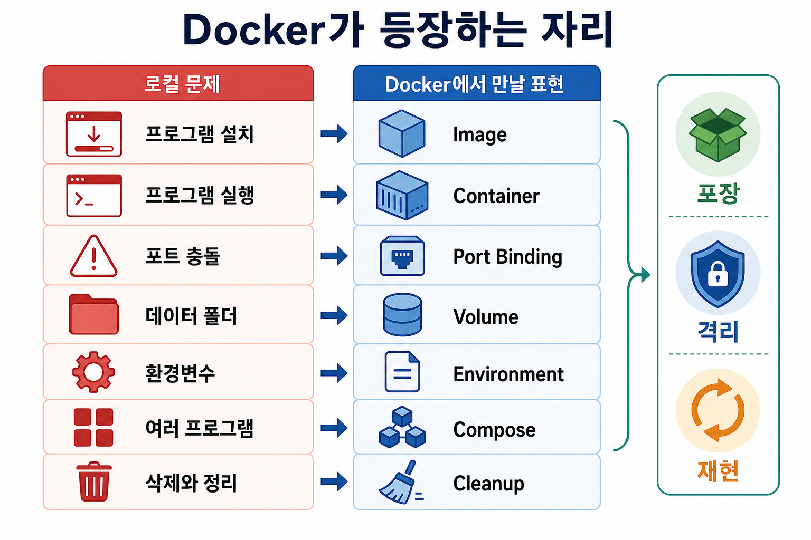

# 7교시: Docker가 등장하는 자리

## 수업 목표
- 앞선 1~6교시 시나리오를 Docker의 핵심 개념과 연결한다.
- Docker를 "중요하니까 배운다"가 아니라 "반복되는 로컬 환경 문제를 줄이기 위해 배운다"로 이해한다.
- Week2에서 배울 명령어의 의미를 미리 준비한다.

## 시각 자료


## 도입 시나리오
강사는 1~6교시의 문제를 다시 모은다.

```text
앱 실행에는 코드 외 조건이 많다.
DB를 여러 버전으로 설치해야 할 수 있다.
port가 충돌한다.
환경변수와 설정이 꼬인다.
삭제해도 흔적이 남는다.
새 컴퓨터에서 같은 환경을 다시 만들기 어렵다.

이 문제들을 매번 손으로 해결할 것인가?
```

여기서 Docker를 소개한다. 단, 명령어부터 시작하지 않는다.

## 핵심 개념
Docker는 실행 환경을 다루는 도구다. 오늘은 네 가지 동사로만 설명한다.

| 동사 | 의미 |
|---|---|
| 포장한다 | 필요한 실행 조건을 image로 묶는다 |
| 격리한다 | 내 OS 전체에 섞지 않고 container로 실행한다 |
| 연결한다 | port, volume, env를 명시적으로 연결한다 |
| 재현한다 | 같은 image와 설정으로 다시 실행한다 |

학생들이 Docker를 "가상머신 같은 것"으로만 이해하지 않도록 한다. 핵심은 로컬 OS에 직접 설치하던 부담을 실행 단위로 옮기는 것이다.

## 강의 진행 흐름
### 1. 오늘의 문제를 Docker 단어로 바꾼다
판서:

| Day5 문제 | Docker 단어 |
|---|---|
| 프로그램 설치가 번거롭다 | image |
| 실행 중인 프로그램을 구분하고 싶다 | container |
| port가 겹친다 | port binding |
| 데이터는 남겨야 한다 | volume |
| 설정값이 필요하다 | environment variable |
| 여러 프로그램을 함께 켜야 한다 | compose |
| 정리하고 싶다 | stop, remove, prune |

이 표가 Week2의 목차가 된다.

### 2. Docker가 해결하지 않는 것도 말한다
과장하지 않는다.

```text
Docker가 코드를 고쳐 주지는 않는다.
Docker가 DB 설계를 대신하지 않는다.
Docker가 secret 관리를 자동으로 안전하게 해 주지는 않는다.
Docker를 잘못 쓰면 image와 volume이 쌓여 디스크를 많이 쓸 수 있다.
Docker도 network, storage, permission 문제를 만든다.
```

이 말을 해 두면 학생들이 Docker를 마법처럼 기대하지 않는다.

### 3. 로컬 설치 방식과 Docker 방식 비교
| 관점 | 로컬 직접 설치 | Docker 방식 |
|---|---|---|
| 설치 | OS에 프로그램을 등록 | image를 받아 실행 |
| 실행 단위 | service/process | container |
| 버전 변경 | 재설치 또는 별도 설치 | image tag 변경 |
| port | OS port 직접 사용 | host와 container port 연결 |
| data | 임의의 로컬 폴더 | volume으로 명시 |
| 삭제 | 흔적 확인 필요 | container/image/volume 구분 |
| 재현 | 문서 의존 | Dockerfile/Compose로 절차화 |

### 4. AI 엔지니어링과 연결한다
최근 AI 엔지니어링에서도 Docker는 자주 등장한다.

- vector DB를 빠르게 띄워 RAG 실험을 한다.
- model serving 서버를 격리된 환경에서 실행한다.
- GPU driver와 library version 문제를 줄인다.
- prompt evaluation 도구, monitoring 도구를 함께 실행한다.
- 실험 환경을 다른 사람에게 전달한다.

AI 기능은 dependency와 설정이 많기 때문에 Docker의 장점이 더 빨리 체감된다.

## 학생 활동
다음 표를 개인별로 채운다.

```text
내가 불편했던 로컬 환경 문제:
그 문제가 속한 범주: 설치 / 버전 / port / 설정 / 데이터 / 삭제 / 재현
Docker가 줄여 줄 것 같은 부분:
Docker가 대신 해결하지 못할 것 같은 부분:
Week2에서 가장 확인하고 싶은 명령:
```

공유는 짧게 진행한다. 공식 산출물을 만들기보다 "내가 겪은 문제를 Docker 용어로 바꾸는 것"이 목표다.

## Week2 예고
Week2에서는 오늘의 문제를 실제 명령으로 바꾼다.

```text
image 받기
container 실행하기
port 연결하기
volume 붙이기
environment variable 주입하기
여러 service를 compose로 함께 실행하기
사용한 자원 정리하기
```

## 마무리 체크
학생이 말할 수 있어야 하는 문장:

```text
Docker는 로컬 실행 환경의 설치, 격리, 연결, 재현, 정리 문제를 다루기 위해 등장한다.
```
