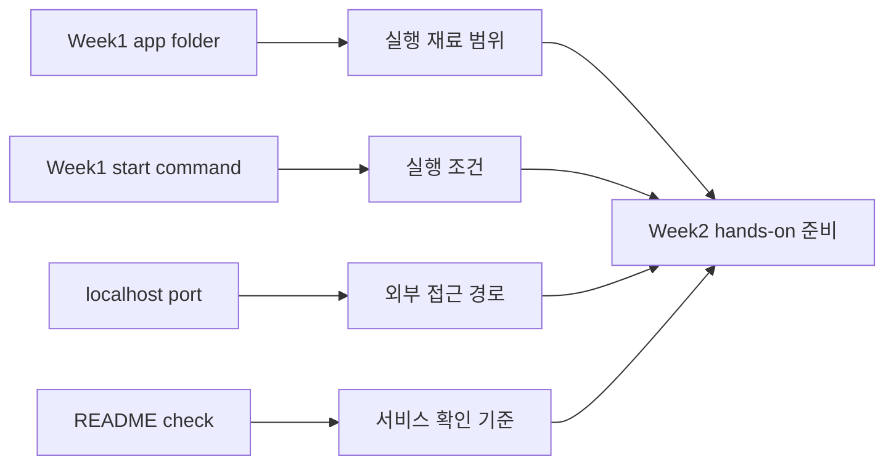

# 8교시: 2주차 실행 환경 표준화 preview

## 수업 목표
- 실행 환경 표준화가 Week1 미니 앱의 어떤 문제를 해결하는지 설명한다.
- 실행 단위, 실행 조건, 외부 접근 경로를 미리 연결한다.
- Week2 실습을 위한 readiness note를 작성한다.

## 50분 운영
| 시간 | 활동 | 학습 초점 | 학생 산출 |
|---|---|---|---|
| 0-10분 | Docker 필요성 질문 | "왜 내 컴퓨터에서는 되는데?" 문제를 확인한다. | 문제 인식 |
| 10-20분 | 개념 preview | 실행 단위, 실행 조건, 외부 접근 경로를 Week1 용어로 설명한다. | 용어 매핑 |
| 20-35분 | 실행 조건 카드 읽기 | 완성 문법을 외우지 않고 필요한 입력 정보의 역할을 읽는다. | concept notes |
| 35-45분 | readiness note | 자기 앱이 표준 실행 환경으로 옮겨질 준비가 되었는지 점검한다. | readiness note |
| 45-50분 | Week1 마감 | 제출물과 남은 위험을 확정한다. | final risk |

## 0-10분 Docker 필요성 질문

- 진행: Docker 필요성 질문

- 초점: "왜 내 컴퓨터에서는 되는데?" 문제를 확인한다.

- 학생 산출: 문제 인식

- 완료 조건: 아래 자료를 사용해 이 시간 블록의 산출물을 만든다.

### 핵심 설명
이 preview는 독립 진도 완성이 아니라 Week2를 이해하기 위한 짧은 예고다. 오늘의 목표는 명령이나 파일 문법을 배우는 것이 아니라 "로컬에서 실행되던 앱을 같은 조건으로 다시 실행하게 만드는 도구가 왜 필요한가"라는 관점을 잡는 것이다.

### 시각 자료 1: Docker Preview Mapping

이 이미지는 Week1의 app folder, start command, port, evidence가 Week2의 container 개념으로 옮겨지는 관계만 보여준다.

## 10-20분 개념 preview

- 진행: 개념 preview

- 초점: 실행 단위, 실행 조건, 외부 접근 경로를 Week1 용어로 설명한다.

- 학생 산출: 용어 매핑

- 완료 조건: 아래 자료를 사용해 이 시간 블록의 산출물을 만든다.

### 실행 환경 표준화 Preview Map
| Week1 개념 | Week2에서 다시 볼 표현 |
|---|---|
| app folder | 실행 재료 범위 |
| start command | 표준 실행 조건 |
| localhost port | 외부 접근 경로 |
| README run step | 재현 가능한 실행 절차 |
| curl evidence | 서비스 확인 기준 |
| runbook | 관찰, 중지, 재확인 절차 |

### Preview 실행 조건 카드
| 구성 요소 | 오늘 이해할 역할 | Week1 evidence 연결 |
|---|---|---|
| 실행 재료 | 어떤 파일이 실행에 필요한가 | file path/data path |
| 실행 조건 | 어떤 명령과 환경이 필요한가 | runtime note |
| 접근 경로 | 외부 요청이 어디로 들어오는가 | localhost/port note |

### Preview 실행 개념
오늘은 다음 주차에 등장할 표준 실행 환경의 질문을 로컬 실행 evidence와 연결해 읽는다. 실제 container 실행은 Week2의 단계별 실습에서 다룬다.

| Week2에서 다룰 질문 | 오늘 이해할 질문 |
|---|---|
| 실행 재료 정의 | 어떤 파일 묶음을 실행에 필요한 재료로 볼 것인가? |
| 실행 조건 고정 | 어떤 command와 port로 process를 실행할 것인가? |
| 서비스 확인 | 표준 환경에서 실행한 서비스가 HTTP로 응답하는지 어떻게 확인할 것인가? |

### Standard Runtime Readiness Note
- App folder ready:
- README run command clear:
- Port currently used:
- Files required for execution:
- Risks before standard runtime:
- Question for Week2:

### 시각 자료 2: Preview 개념 흐름

## 20-35분 실행 조건 카드 읽기

- 진행: 실행 조건 카드 읽기

- 초점: 완성 문법을 외우지 않고 필요한 입력 정보의 역할을 읽는다.

- 학생 산출: concept notes

- 완료 조건: 아래 자료를 사용해 이 시간 블록의 산출물을 만든다.

### 시각 자료 3: Readiness Capture Guide
| Week1에서 확인할 것 | Week2에서 연결할 말 | 오늘 할 일 |
|---|---|---|
| app folder 위치 | 실행 재료 범위 | path를 적는다 |
| 현재 실행 방식 | 실행 조건 | command 의미만 설명한다 |
| 현재 port/URL | 외부 접근 경로 | port 번호를 기록한다 |
| 확인 evidence | 서비스 확인 기준 | 정상 기준을 적는다 |

### 활동 절차
1. Week1 앱의 start command와 URL을 다시 확인한다.
2. preview map에 자기 앱 정보를 대입한다.
3. 실행 조건 카드의 각 구성 요소가 무엇을 하는지 적는다.
4. 아직 Week2 명령을 외우려 하지 말고 필요한 입력 파일을 확인한다.
5. Week2 전에 보완할 readiness 항목을 적는다.

## 35-45분 readiness note

- 진행: readiness note

- 초점: 자기 앱이 표준 실행 환경으로 옮겨질 준비가 되었는지 점검한다.

- 학생 산출: readiness note

- 완료 조건: 아래 자료를 사용해 이 시간 블록의 산출물을 만든다.

### 흔한 오해
| 오해 | 교정 |
|---|---|
| Week1 마지막에 다음 주차 명령을 실행해야 한다. | Week1은 readiness와 개념 preview만 한다. 실제 hands-on은 Week2에서 시작한다. |
| 실행 환경이 표준화되면 README가 필요 없다. | 표준 환경도 실행/확인/정리 절차가 필요하므로 README와 runbook이 더 중요해진다. |
| 표준 실행 환경은 모든 환경 차이를 없앤다. | host OS, network, permission, runtime 차이는 여전히 확인해야 한다. |

## 45-50분 Week1 마감

- 진행: Week1 마감

- 초점: 제출물과 남은 위험을 확정한다.

- 학생 산출: final risk

- 완료 조건: 아래 자료를 사용해 이 시간 블록의 산출물을 만든다.

### 산출물
아래 양식 또는 표를 사용해 이 시간 블록의 산출물을 작성한다.

### 평가 기준
| 기준 | 충족 |
|---|---|
| 실행 환경 표준화를 독립 이론이 아니라 Week1 문제 해결과 연결했다. | |
| 실행 재료, 실행 조건, 접근 경로를 예시로 설명한다. | |
| 자기 앱의 Week2 readiness를 점검했다. | |
| Week2 질문을 1개 이상 남겼다. | |

### 현업 DevOps insight
표준 실행 환경은 마법이 아니라 실행 조건을 더 명시적으로 포장하는 방식이다. README가 불명확하면 다음 주차의 실행 표준화도 불명확해진다. 그래서 Week1의 실행 계약이 Week2의 핵심 선행 조건이다.

### 학술 근거
- Advance organizer: 다음 주차 개념을 기존 경험과 연결해 미리 구조화한다.
- Transfer readiness: 로컬 실행 지식을 컨테이너 실행으로 옮길 준비를 한다.
- Systems thinking: 파일, 프로세스, port, HTTP 확인을 하나의 실행 시스템으로 본다.

### 다음 주차 연결
Week2는 이 preview를 실제 hands-on으로 확장한다. 학생은 자신의 Week1 앱을 표준 실행 환경으로 옮기고, 실행 결과와 HTTP evidence를 남긴다.

### 다음 연결
Week1은 여기서 마감한다. 다음 주차는 실행 환경 표준화와 service evidence로 시작한다.

### 공식/학술 근거 링크
- MIT Missing Semester, https://missing.csail.mit.edu/ - Week1에서 정리한 shell, Git, debugging 기초가 Week2 실습의 선행 역량인 근거다.
- Docker Docs: What is a container?, https://docs.docker.com/get-started/docker-concepts/the-basics/what-is-a-container/ - Week2에서 실행 환경 표준화를 다룰 때 연결할 공식 기준이다.
- Google Cloud DevOps guidance, https://docs.cloud.google.com/architecture/devops - Week1 evidence habit이 이후 delivery/operations 개선과 연결되는 근거다.
