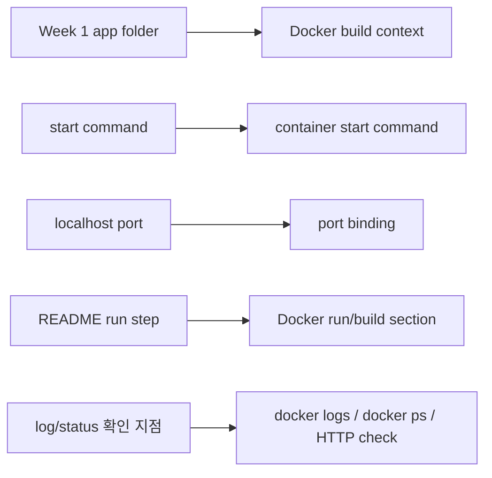
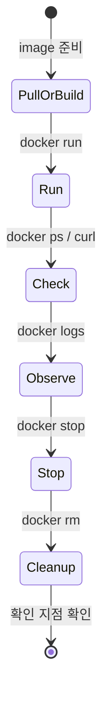

# 1교시: Week 1 실행 환경 문제와 Docker가 등장한 이유

## 수업 목표
- Week 1에서 만든 로컬 실행 확인 지점을 Docker 학습의 출발점으로 연결한다.
- Docker가 해결하려는 문제를 "명령어 도구"가 아니라 실행 환경 표준화 문제로 설명한다.
- Multi PC 수동 설치, VM, Docker로 이어지는 흐름을 역사적 맥락과 운영 문제로 정리한다.
- 오늘 남길 Docker readiness 확인 지점의 기준을 이해한다.

## 선행 지식
| 이미 알고 있어야 할 것 | 오늘 다시 연결할 것 |
|---|---|
| local folder, start command, port, browser/curl 확인 | Docker image, container, port binding의 필요성 |
| README run step | Docker run/build/cleanup section |
| log/status 확인 지점 | `docker logs`, `docker ps`, HTTP response |
| blocker/RCA note | Docker 설치/실행 실패 확인 |

## 강의 전개

이 교시는 Docker 명령어를 바로 치기 전에 왜 Docker가 필요한지 감각을 맞추는 시간이다. 학생들은 이미 Week 1에서 local folder를 만들고, 실행 command를 찾고, browser 또는 `curl`로 결과를 확인했다. 이 경험을 먼저 꺼내야 Docker가 낯선 도구가 아니라 "이미 하던 실행 절차를 더 명시적인 단위로 포장하는 방법"으로 보인다.

강의의 첫 방향은 Week 1 확인 지점에서 시작한다. 어떤 학생은 앱 실행에 성공했지만, 다른 장비에서 같은 결과를 만들 수 있는지는 아직 별개의 문제다. runtime version, package 설치 여부, port 사용 상태, environment variable, OS permission이 달라지면 같은 소스코드도 다른 결과를 낸다. 이 차이를 충분히 인정한 뒤 Docker의 image와 container가 등장해야 한다.

두 번째 방향은 역사적 흐름이다. 여러 PC에 직접 설치하던 방식은 가장 직관적이지만, 장비 수가 늘어날수록 version drift가 생긴다. VM은 OS 단위 격리를 제공해 이 문제를 크게 줄였지만, 앱 하나를 실행하기 위해 Guest OS 전체를 함께 운영하는 비용이 생긴다. Docker는 VM을 단순히 "가볍게 만든 것"이 아니라, 애플리케이션 실행 단위를 image와 container로 다시 자른 접근이다.

세 번째 방향은 오해를 미리 차단하는 것이다. Docker는 "내 컴퓨터에서는 되는데" 문제를 줄이는 도구지만, 모든 문제를 없애는 도구는 아니다. Dockerfile에 잘못된 실행 조건을 넣으면 잘못된 조건도 재현 가능해진다. secret을 image에 넣으면 secret도 같이 포장된다. port와 volume을 정리하지 않으면 로컬 환경은 오히려 더 지저분해질 수 있다.

마지막으로 오늘의 확인 지점 기준을 세운다. Docker 설치 성공 여부만 묻지 않고, 어떤 OS에서 어떤 문서를 봤는지, `docker version`에서 Client와 Server가 어떻게 보였는지, 첫 container를 실행하고 어떻게 확인했는지, cleanup까지 했는지를 남기게 한다. 이 기준이 잡혀야 후반 PostgreSQL 16/18 실습에서 "됐다/안 됐다"가 아니라 "어느 port, 어느 container, 어느 log가 어떤 상태인가"로 대화할 수 있다.

## Week 1 산출물 빠른 확인

Week 1에서 만든 미니 앱은 Docker 실습의 배경 자료다. 오늘 당장 개인 앱을 모두 container로 바꾸지는 않는다. 먼저 그 앱이 실행되기 위해 어떤 조건이 필요했는지 확인한다.

현업에서 "실행됩니다"라는 말은 충분하지 않다. 어느 directory에서 어떤 command를 실행했고, 어떤 port로 접근했고, 어떤 상태값이나 로그로 정상임을 확인했는지 같이 남아야 한다. Docker는 이 조건을 image와 container로 포장하지만, 원래 조건이 불명확하면 Dockerfile도 불명확해진다.

### Visual 1: Week 1 확인 지점에서 Docker 실행 조건으로

이 이미지는 Week 1의 app folder, start command, port, log가 Docker의 build context, CMD, port binding, `docker logs`로 옮겨지는 관계를 보여준다. 왼쪽에서 오른쪽으로 읽으며 Docker가 기존 실행 조건을 새로 만드는 것이 아니라, 이미 확인한 실행 조건을 표준 실행 단위로 포장한다는 점을 확인한다.

### Visual 2: Docker 실행 조건 Mermaid map

읽는 순서: 왼쪽의 Week 1 확인 지점을 오른쪽 Docker 표현으로 연결한다. 이 visual은 Docker가 새로운 마법을 추가하는 것이 아니라, 기존 실행 조건을 더 명시적인 실행 단위로 옮긴다는 점을 보여준다.

## Multi PC -> VM -> Docker 흐름

Docker를 "갑자기 나온 편한 명령어"로 설명하면 학생이 VM과 container를 계속 헷갈린다. 흐름은 더 단순하다. 처음에는 PC마다 OS, runtime, DB를 직접 설치했다. 이 방식은 장비가 늘어나면 버전 차이와 삭제/재설치 문제가 커진다. 그 다음 VM은 하나의 물리 서버 위에 Guest OS를 포함한 여러 실행 환경을 만들며 격리를 강화했다. 하지만 앱 하나를 띄우기 위해 OS 전체를 함께 다루는 비용이 생긴다.

Docker는 이 문제를 "애플리케이션 실행 단위" 쪽에서 더 작게 자른다. image는 실행에 필요한 파일, binary, library, 설정을 담는 패키지고, container는 그 image에서 시작된 격리된 process다. Docker 공식 문서는 container를 image의 runnable instance로 설명하고, 여러 container가 host kernel을 공유할 수 있다는 점을 VM과 구분한다. macOS와 Windows에서는 Docker Desktop이 Linux container 실행을 위해 내부 Linux VM 또는 WSL 2 같은 기반을 사용할 수 있으므로, "Docker는 VM이 전혀 없다"가 아니라 "container 모델과 VM 모델은 계층과 목적이 다르다"로 이해한다.

### Visual 3: PC 여러 대 -> VM -> Docker

이 이미지는 imagegen으로 만든 강의용 재구성 인포그래픽이다. 공식 Docker 다이어그램은 아니므로, 세부 용어는 3교시의 Docker 공식 아키텍처 이미지와 Docker overview 본문으로 다시 확인한다. 핵심은 Docker가 VM을 완전히 대체한다는 주장이 아니라, 애플리케이션 실행 단위를 image/container로 더 작고 재현 가능하게 만든다는 점이다.

### 역사 흐름 정리
| 단계 | 해결한 문제 | 새로 생긴 비용/오해 |
|---|---|---|
| Multi PC / 수동 설치 | 각 PC에 필요한 프로그램을 직접 설치해 실행 | PC마다 OS/runtime/DB version 차이, 삭제와 재설치 어려움 |
| VM / 가상 머신 | Guest OS 단위로 강한 격리와 재현성 확보 | OS 전체를 포함해 무겁고, 앱 하나에도 VM 운영 비용 발생 |
| Docker / 컨테이너 | image로 실행 패키지화, container로 격리된 process 실행 | host kernel/daemon/port/volume/secret 관리 책임 필요 |

## "내 컴퓨터에서는 되는데" 문제 분석

Docker를 배우는 첫 이유는 개발자가 만든 코드를 운영 환경에서 재현 가능하게 실행하기 위해서다. 같은 소스코드라도 runtime version, package, path, port, environment variable, permission이 달라지면 결과가 달라진다.

Docker image는 실행에 필요한 파일, binary, library, configuration default를 하나의 표준 패키지로 만든다. container는 그 image에서 시작된 실행 중인 process다. 따라서 Week 1의 process, filesystem, network 개념은 사라지지 않는다. Docker 안에서 이름과 경계가 달라질 뿐이다.

### Visual 4: 환경 차이 문제 분류
| 문제 증상 | Week 1 표현 | Docker에서 다룰 표현 | 확인 확인 지점 |
|---|---|---|---|
| 내 PC에서는 되지만 다른 PC에서는 실행 실패 | runtime/package 차이 | base image, image layer | Dockerfile, build log |
| browser 접속이 안 됨 | localhost, port, HTTP status | host port, container port | `docker ps`, `curl` |
| 데이터가 사라짐 | file path, persistence | bind mount, named volume | volume list, app log |
| 설정이 바뀌지 않음 | config file, env var | `-e`, `.env`, Compose environment | container env, README |
| 원인을 모르겠음 | log/status 부족 | `docker logs`, status, exit code | RCA note |

이 표를 볼 때 "Docker가 있으면 문제가 없어지는가"가 아니라 "어떤 종류의 문제를 더 관찰 가능하게 만들 수 있는가"를 질문한다.

## Docker가 표준화하는 것과 표준화하지 않는 것

Docker는 실행 환경 표준화에 강하지만, 모든 운영 책임을 자동으로 해결하지 않는다. image에 secret을 넣으면 secret은 더 넓게 복제될 수 있고, container를 많이 실행하면 host disk와 memory를 사용한다. `latest` tag만 사용하면 시간이 지난 뒤 같은 명령이 다른 image를 가져올 수 있다.

따라서 Docker 학습은 비용 절감, 개발/배포 효율, 관리 효율을 동시에 다룬다. 비용 절감은 로컬에서 빠르게 재현하고 불필요한 cloud resource 생성을 미루는 데서 시작한다. 개발/배포 효율은 실행 조건을 image로 고정해 handoff 시간을 줄이는 데서 나온다. 관리 효율은 run/check/stop/cleanup 흐름을 README에 남길 때 생긴다.

### 판단 표: Docker를 쓰기 전 확인할 질문
| 질문 | Docker가 도움이 되는 경우 | 주의해야 할 경우 |
|---|---|---|
| 실행 조건이 반복되는가? | 같은 앱을 여러 장비에서 실행해야 함 | 일회성 script라 포장 비용이 더 큼 |
| 의존성이 복잡한가? | runtime/package 차이가 자주 발생 | image가 커져 build/pull 시간이 늘어남 |
| 외부 설정이 필요한가? | env var로 설정을 주입할 수 있음 | secret을 image에 넣는 실수를 할 수 있음 |
| 데이터가 남아야 하는가? | volume으로 lifecycle을 분리할 수 있음 | volume 초기화/삭제 실수로 데이터 손실 가능 |
| 누가 이어받는가? | README와 Dockerfile로 handoff 가능 | Dockerfile이 불명확하면 문제도 포장됨 |

## Docker lifecycle preview

오늘 반복할 기본 사이클은 실행, 확인, 관찰, 중지, 정리다. 컨테이너를 실행만 하고 정리하지 않으면 port가 계속 점유되거나 disk가 불필요하게 쌓인다. 운영에서는 "시작했다"만큼 "어떻게 멈추고 원상복구하는가"도 중요하다.

### Visual 5: 기본 lifecycle

읽는 순서: 컨테이너 실습은 `run`에서 끝나지 않는다. 정상 확인과 로그 확인, 중지, 삭제, 확인까지 끝나야 하나의 운영 사이클이 닫힌다.

## Day 1 주의할 점

- Docker 설치 성공 여부는 GUI가 열렸는지만으로 판단하지 않는다. `docker version`, `docker compose version`, `docker run --rm hello-world` 중 어디까지 되는지 확인한다.
- 설치가 막히면 OS, CPU architecture, 권한, daemon 상태를 먼저 구분한다. 같은 Docker 오류라도 macOS Desktop, Linux Engine, Windows WSL 2에서 원인이 다르다.
- 첫 container 실행 후에는 반드시 stop/remove까지 확인한다. container를 남겨두면 같은 name이나 port 때문에 다음 실습이 실패할 수 있다.
- Screenshot이나 README에 token, password, MFA code, 개인 경로가 노출되지 않게 한다.
- 실패를 숨기지 말고 어느 단계에서 막혔는지 확인한다. 이것이 후속 실습의 대체 경로를 정하는 기준이 된다.

### 흔한 오해
| 오해 | 바로잡기 |
|---|---|
| Docker는 VM과 같다. | container는 보통 host kernel 위에서 격리된 process로 실행된다. VM과 같은 방식으로 OS 전체를 매번 부팅하는 모델이 아니다. 다만 macOS/Windows Docker Desktop은 Linux container 실행 기반으로 내부 VM/WSL 2 계층을 사용할 수 있다. |
| image와 container는 같은 말이다. | image는 실행 패키지이고 container는 image에서 시작된 실행 상태다. |
| 설치가 안 되면 수업을 따라갈 수 없다. | 설치 실패도 OS, 권한, error 확인 지점가 있으면 해결 가능한 blocker가 된다. |
| Docker를 쓰면 README가 덜 중요하다. | Docker 명령과 cleanup 절차를 README에 남겨야 다른 사람이 같은 결과를 만든다. |

## 다음 교시 설치 준비

다음 교시는 Docker 설치와 계정 상태 확인이다. macOS 학생은 Mac 설치 문서에서 Apple silicon/Intel 구분, system requirement, 권한 조건을 확인한다. Linux 학생은 Docker Engine 설치 경로를 기본으로 확인하고, Docker Desktop for Linux는 이미 사용 중이거나 조직 정책상 필요한 경우의 예외 경로로만 확인한다. Windows 장비를 쓰는 학생은 별도 예외 경로로 Windows 설치 문서의 WSL 2와 virtualization 조건을 확인한다.

### 확인 기준
| 기준 | 확인 지점 |
|---|---|
| Week 1 연결 | app folder, command, port, log 중 최소 2개를 Docker 학습 목표와 연결했다. |
| 문제 분류 | 환경 차이, port, 설정, log 중 하나 이상을 구체 증상으로 분류했다. |
| lifecycle 이해 | run/check/logs/stop/rm 순서를 설명했다. |
| 보안 책임 | Docker Hub credential, token, MFA code를 확인하지 않는다고 명시했다. |
| 다음 준비 | OS별 설치 공식 문서와 blocker 확인 양식을 준비했다. |

### 공식/학술 근거 링크
- Docker Docs: Docker overview, https://docs.docker.com/get-started/docker-overview/ - image, container, registry, Docker Engine의 공식 개념 기준이다.
- Docker Docs: What is a container?, https://docs.docker.com/get-started/docker-concepts/the-basics/what-is-a-container/ - container와 VM의 차이, isolated process 개념을 확인하는 기준이다.
- Docker Docs: What is an image?, https://docs.docker.com/get-started/docker-concepts/the-basics/what-is-an-image/ - image가 실행 파일, library, configuration을 포함하는 표준 패키지라는 기준이다.
- Google SRE Book: Postmortem Culture, https://sre.google/sre-book/postmortem-culture/ - 실패를 숨기지 않고 확인 지점과 follow-up으로 바꾸는 운영 문화의 근거다.

### 다음 연결
다음 교시에는 Docker 설치 상태를 확인한다. 성공한 학생은 `docker version`, `docker compose version`, `hello-world` 준비로 넘어가고, 막힌 학생은 macOS 권한/실행 상태, Linux daemon/context, Windows WSL 2/가상화 조건, error message를 blocker로 구분한다.
