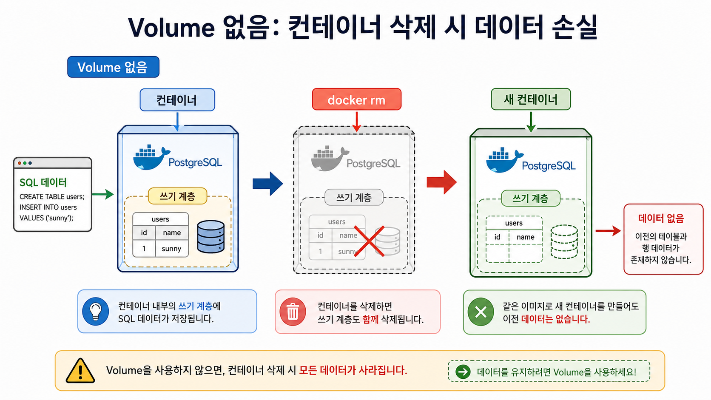
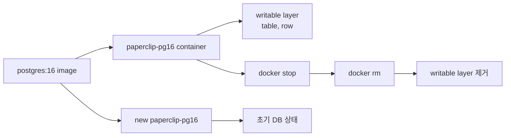
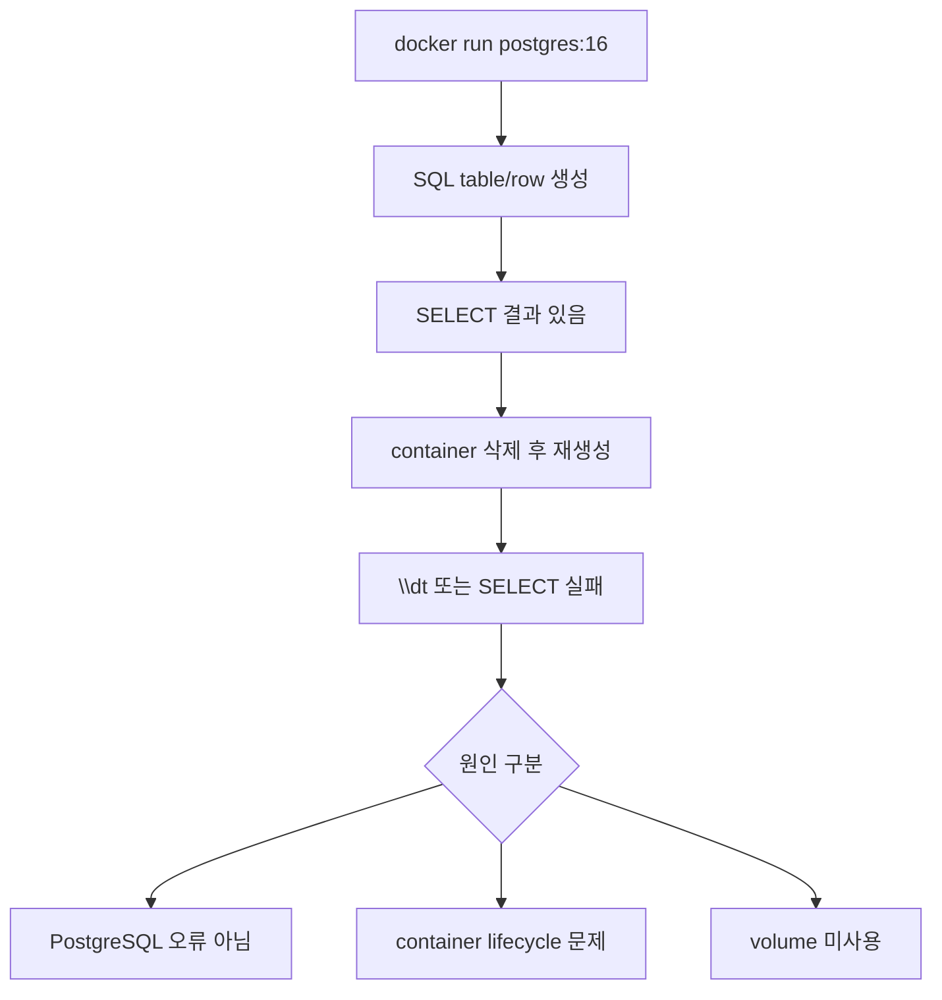

# 1교시: Day 1 DB container 재생성과 데이터 소실 확인


## 수업 목표
- Day 1에서 volume 없이 만든 PostgreSQL data가 container lifecycle에 묶였는지 확인한다.
- container 삭제와 database data 삭제의 관계를 실험으로 설명한다.
- 데이터 소실을 Day 2 volume 학습의 출발점으로 삼는다.

## 강의 전개
Day 1에서 SQL로 user, database, table, row를 만들었다면 학생은 그것이 Docker 어딘가에 안전하게 저장되었다고 착각하기 쉽다. 이 교시는 그 착각을 의도적으로 깨는 시간이다. volume 없이 만든 database container를 삭제하고 같은 image로 다시 만들면, 이전에 만든 table과 row가 보이지 않는 상황을 확인한다. 핵심은 PostgreSQL이 나쁜 것이 아니라 container writable layer와 data lifecycle을 분리하지 않았다는 점이다.

이 교시는 설명만 듣고 지나가지 않는다. 명령은 반드시 code block으로 실행하고, 바로 이어서 검증 명령을 실행한다. 정상 출력이 다를 수 있는 부분은 전체 문자열을 외우지 않고 성공 패턴을 확인한다. 실패는 원인을 좁히는 단서다. 실패한 명령, 에러 요약, 가설, 다시 실행할 명령을 순서대로 다룬다.

## Imagegen 인포그래픽: volume 없는 데이터 소실


이 이미지는 SQL data가 container의 writable layer에 머물다가 `docker rm`과 함께 사라지는 흐름을 보여준다. 왼쪽의 SQL 입력, 가운데 삭제된 container, 오른쪽의 새 container를 순서대로 보면 "같은 image로 다시 만들었다"와 "이전 data가 남아 있다"가 다른 말이라는 점이 드러난다.

## 시각 자료 1: writable layer와 container 삭제


읽는 순서는 image, 첫 container, writable layer, 삭제, 새 container다. 이 그림은 volume 없이 만든 DB row가 image에 저장되는 것이 아니라 실행 중 container layer에만 남는다는 점을 보여준다.

## 시각 자료 2: no-volume failure 관찰 위치


위 도식은 실패를 "DB가 이상하다"로 보지 않고 storage 경계 문제로 좁히는 흐름이다. 먼저 같은 image로 새 container를 만들었다는 조건을 확인하고, 그 다음 volume 연결 여부를 본다.

## 실습 명령
```bash
docker ps -a --filter name=paperclip-pg16
docker stop paperclip-pg16 || true
docker rm paperclip-pg16 || true
docker run -d --name paperclip-pg16 -e POSTGRES_PASSWORD=postgres -e POSTGRES_DB=paperclip -p 15432:5432 postgres:16
```

## 검증 명령
```bash
docker logs paperclip-pg16 --tail 30
docker exec paperclip-pg16 psql -U postgres -d paperclip -c "\dt"
```

## 실습 확장 흐름
| 단계 | 할 일 | 기대되는 관찰 |
|---|---|---|
| 준비 | 기존 `paperclip-pg16`을 stop/rm한다. | 이름 충돌이 사라진다. |
| 실행 | volume 없이 PostgreSQL을 새로 띄운다. | `docker ps`에 container가 보인다. |
| 관찰 | `\dt`로 table 목록을 본다. | 이전 table이 보이지 않는다. |
| 실패 재현 | 같은 이름의 container를 다시 만들기 전에 기존 container를 지우지 않는다. | 이름 충돌 에러가 난다. |
| 복구 | `docker rm` 후 다시 실행한다. | 같은 image로 새 container가 뜬다. |
| 확인 | table 없음과 container 정상 실행을 함께 본다. | data 소실과 process 정상 상태를 구분한다. |

## 실패 드릴과 오해 교정
| 상황 | 해석 |
|---|---|
| table이 없다 | volume 없이 새 container를 만들었으므로 이전 writable layer data가 사라진 상태다. |
| container가 실행되지 않는다 | 이름 충돌, port 충돌, POSTGRES_PASSWORD 누락을 먼저 확인한다. |
| 5432 접속이 안 된다 | host port 15432와 container port 5432를 구분한다. |

## Cleanup
```bash
docker stop paperclip-pg16 || true
docker rm paperclip-pg16 || true
```

Cleanup은 비용과 데이터 안전을 동시에 다룬다. container를 지우는 명령과 volume/network/image를 지우는 명령은 의미가 다르다. 특히 volume 삭제는 database data 삭제일 수 있으므로 실습 volume인지 확인한 뒤 실행한다.

## 주의할 점
- Container를 삭제해도 named volume의 데이터는 남을 수 있다. 데이터를 초기화하려는 것이 아니라면 `docker volume rm`이나 `down -v`를 실행하지 않는다.
- Host port publish(`-p`)와 container 간 통신은 다른 문제다. 브라우저나 host `psql`로 접근할 때만 host port가 필요하고, 같은 Docker network 안에서는 container name과 container port를 사용한다.
- Volume target path는 image가 실제로 데이터를 쓰는 경로와 맞아야 한다. PostgreSQL은 `/var/lib/postgresql/data`와 `PGDATA` 설정을 확인하지 않으면 데이터가 남지 않거나 엉뚱한 위치에 쌓인다.
- bind mount는 host 경로를 그대로 노출한다. 개인 경로, 권한 문제, 실수로 수정한 host 파일이 container 동작에 영향을 줄 수 있다.
- Cleanup 전에는 지금 지우는 대상이 container인지, volume인지, network인지 먼저 구분한다.

## 핵심 포인트
이 실습의 핵심은 명령어 자체가 아니라 경계다. container는 실행 단위이고, volume은 data lifecycle이며, network는 통신 경계다. 학생이 `docker run` 한 줄을 볼 때 `-v`, `--network`, `-p`를 옵션 목록으로 외우면 뒤에서 Compose와 Kubernetes로 넘어갈 때 같은 혼란이 반복된다. 그래서 각 옵션을 "무엇을 container 밖으로 분리하는가"라는 질문으로 읽게 한다.

강의 중에는 성공 출력보다 실패 출력의 의미를 더 오래 다룬다. port가 열리지 않은 것은 web server 문제가 아닐 수 있고, DB 접속 실패는 password 문제가 아니라 network boundary 문제일 수 있다. host terminal, container 내부, 같은 Docker network의 client container는 모두 서로 다른 관찰 위치다. 학생이 어디에서 명령을 실행하는지 말로 먼저 설명한 뒤 CLI를 실행하게 한다.

## 운영 해석
실무에서 database container를 다룰 때 가장 위험한 실수는 cleanup을 단순 파일 정돈처럼 보는 것이다. container 삭제는 process와 container writable layer를 없애는 것이고, volume 삭제는 data를 삭제하는 것이다. network 삭제는 통신 경로를 없애는 것이다. 이 세 가지를 구분하지 않으면 실습은 성공해도 운영 사고를 배운 셈이 된다.

운영에서는 "실행됐다"보다 어떤 data가 남고 무엇이 삭제되는지가 더 중요하다. Day 2의 storage/network 판단은 Day 5 Compose에서 `volumes`와 `networks`를 읽는 기준이 된다. Compose의 YAML 항목은 갑자기 생긴 문법이 아니라 Day 2에서 손으로 실행한 storage/network 결정을 파일로 옮긴 것이다.

## 혼자 다시 따라오기
최소 성공 경로는 `docker rm`, `docker run`, `docker exec ... \dt` 세 단계다. table이 없으면 성공적으로 실패를 관찰한 것이다. container가 뜨지 않으면 `docker logs paperclip-pg16 --tail 30`으로 password 누락, port 충돌, 이름 충돌을 먼저 확인한다.

## 다음 연결
다음 교시는 named volume을 만들어 같은 실험을 반복한다. 목표는 container를 교체해도 data가 남는 구조를 만드는 것이다.
