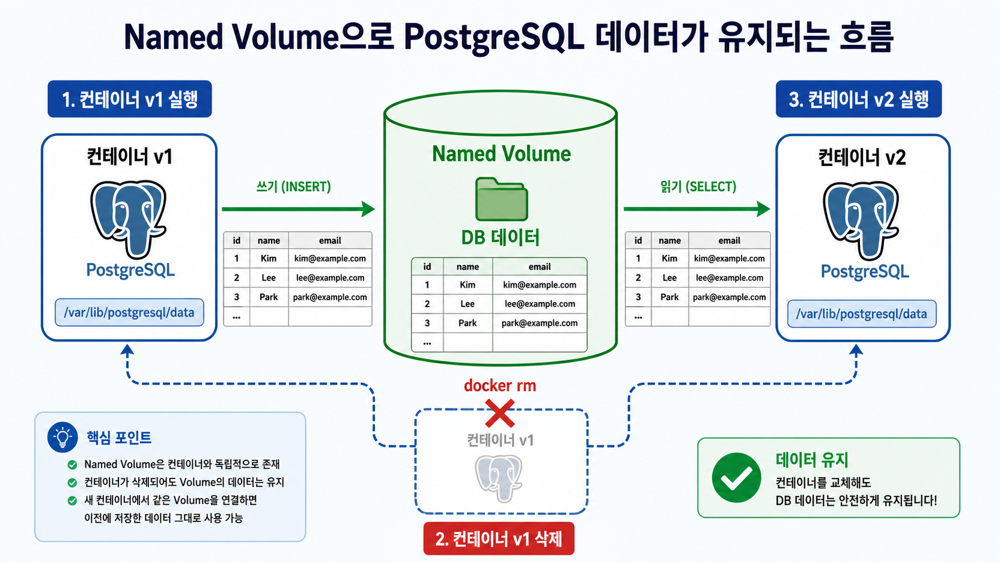
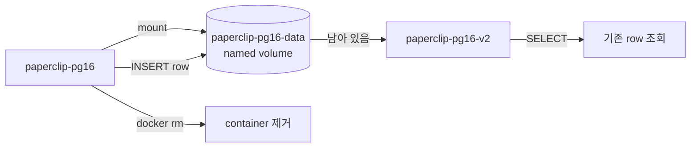
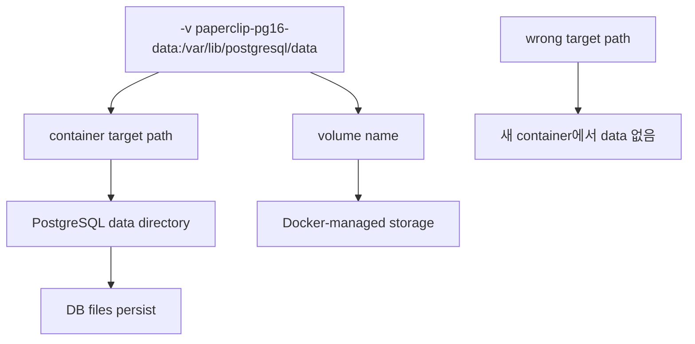

# 2교시: named volume과 database persistence

## 수업 목표
- database용 named volume을 생성한다.
- PostgreSQL container에 volume을 mount한다.
- container 교체 후에도 SQL data가 유지되는지 확인한다.

## 강의 전개
named volume은 Docker가 관리하는 persistent storage다. 학생이 직접 host path를 기억하지 않아도 Docker가 volume lifecycle을 관리한다. database container에서는 container lifecycle과 data lifecycle을 분리하는 것이 핵심이다. 이 교시는 user, database, table, row를 다시 만든 뒤 container를 삭제하고 같은 volume을 새 container에 연결해 data가 유지되는지 확인한다.

이 교시는 설명만 듣고 지나가지 않는다. 명령은 반드시 code block으로 실행하고, 바로 이어서 검증 명령을 실행한다. 정상 출력이 다를 수 있는 부분은 전체 문자열을 외우지 않고 성공 패턴을 확인한다. 실패는 원인을 좁히는 단서다. 실패한 명령, 에러 요약, 가설, 다시 실행할 명령을 순서대로 다룬다.

## Imagegen 인포그래픽: named volume persistence


이 이미지는 container v1과 v2가 같은 named volume을 공유할 때 data lifecycle이 container lifecycle과 분리되는 구조를 보여준다. 가운데 volume을 기준으로 보면 container 삭제가 곧 DB data 삭제가 아니라는 점을 확인할 수 있다.

## 시각 자료 1: named volume lifecycle


읽는 순서는 container가 아니라 volume을 중심으로 본다. container는 사라질 수 있지만 named volume은 같은 이름으로 다시 mount될 때 DB data를 이어준다.

## 시각 자료 2: mount path 판단


이 visual은 `-v` 옵션을 한 덩어리로 외우지 않고 왼쪽의 volume name과 오른쪽의 target path로 나누어 읽게 한다. PostgreSQL image가 실제로 쓰는 data directory와 target path가 맞아야 persistence가 성립한다.

## 실습 명령
```bash
docker volume create paperclip-pg16-data
docker run -d --name paperclip-pg16 -e POSTGRES_PASSWORD=postgres -e POSTGRES_DB=paperclip -p 15432:5432 -v paperclip-pg16-data:/var/lib/postgresql/data postgres:16
```

```bash
docker exec paperclip-pg16 psql -U postgres -d paperclip -c "CREATE TABLE IF NOT EXISTS notes(id serial PRIMARY KEY, body text); INSERT INTO notes(body) VALUES ('volume keeps data'); SELECT * FROM notes;"
```

## 검증 명령
```bash
docker volume ls | grep paperclip-pg16-data
docker exec paperclip-pg16 psql -U postgres -d paperclip -c "SELECT * FROM notes;"
```

```bash
docker stop paperclip-pg16
docker rm paperclip-pg16
docker run -d --name paperclip-pg16-v2 -e POSTGRES_PASSWORD=postgres -e POSTGRES_DB=paperclip -p 15432:5432 -v paperclip-pg16-data:/var/lib/postgresql/data postgres:16
docker exec paperclip-pg16-v2 psql -U postgres -d paperclip -c "SELECT * FROM notes;"
```

## 실습 확장 흐름
| 단계 | 할 일 | 기대되는 관찰 |
|---|---|---|
| 준비 | `paperclip-pg16-data` volume을 만든다. | `docker volume ls`에 이름이 보인다. |
| 실행 | PostgreSQL container에 volume을 mount한다. | container가 정상 실행된다. |
| 변경 | `notes` table과 row를 만든다. | `SELECT * FROM notes`에 row가 보인다. |
| 실패 재현 | 같은 volume 없이 새 container를 띄워 본다. | row가 보이지 않는 차이를 설명할 수 있다. |
| 복구 | 같은 volume을 `paperclip-pg16-v2`에 다시 붙인다. | 기존 row가 다시 보인다. |
| 확인 | volume 삭제 명령은 실행하지 않는다. | 다음 실습에서 같은 data를 재사용할 수 있다. |

## 실패 드릴과 오해 교정
| 상황 | 해석 |
|---|---|
| 새 container에서 row가 보인다 | volume이 data lifecycle을 보존한 것이다. |
| 새 container에서 초기화 에러 | 기존 PGDATA와 image major version 또는 mount path를 확인한다. |
| volume을 지우면 복구 안 됨 | volume rm은 data 삭제 명령이다. |

## Cleanup
```bash
docker stop paperclip-pg16-v2 || true
docker rm paperclip-pg16-v2 || true
# 실습 데이터를 완전히 지울 때만 실행
# docker volume rm paperclip-pg16-data
```

Cleanup은 비용과 데이터 안전을 동시에 다룬다. container를 지우는 명령과 volume/network/image를 지우는 명령은 의미가 다르다. 특히 volume 삭제는 database data 삭제일 수 있으므로 실습 volume인지 확인한 뒤 실행한다.

## 주의할 점
- Container를 삭제해도 named volume의 데이터는 남을 수 있다. 데이터를 초기화하려는 것이 아니라면 `docker volume rm`이나 `down -v`를 실행하지 않는다.
- Host port publish(`-p`)와 container 간 통신은 다른 문제다. 브라우저나 host `psql`로 접근할 때만 host port가 필요하고, 같은 Docker network 안에서는 container name과 container port를 사용한다.
- Volume target path는 image가 실제로 데이터를 쓰는 경로와 맞아야 한다. PostgreSQL은 `/var/lib/postgresql/data`와 `PGDATA` 설정을 확인하지 않으면 데이터가 남지 않거나 엉뚱한 위치에 쌓인다.
- bind mount는 host 경로를 그대로 노출한다. 개인 경로, 권한 문제, 실수로 수정한 host 파일이 container 동작에 영향을 줄 수 있다.
- Cleanup 전에는 지금 지우는 대상이 container인지, volume인지, network인지 먼저 구분한다.

## 핵심 포인트
이 실습의 핵심은 명령어 자체가 아니라 경계다. container는 실행 단위이고, volume은 data lifecycle이며, network는 통신 경계다. 학생이 `docker run` 한 줄을 볼 때 `-v`, `--network`, `-p`를 옵션 목록으로 외우면 뒤에서 Compose와 Kubernetes로 넘어갈 때 같은 혼란이 반복된다. 그래서 각 옵션을 "무엇을 container 밖으로 분리하는가"라는 질문으로 읽게 한다.

강의 중에는 성공 출력보다 실패 출력의 의미를 더 오래 다룬다. port가 열리지 않은 것은 web server 문제가 아닐 수 있고, DB 접속 실패는 password 문제가 아니라 network boundary 문제일 수 있다. host terminal, container 내부, 같은 Docker network의 client container는 모두 서로 다른 관찰 위치다. 학생이 어디에서 명령을 실행하는지 말로 먼저 설명한 뒤 CLI를 실행하게 한다.

## 운영 해석
실무에서 database container를 다룰 때 가장 위험한 실수는 cleanup을 단순 파일 정돈처럼 보는 것이다. container 삭제는 process와 container writable layer를 없애는 것이고, volume 삭제는 data를 삭제하는 것이다. network 삭제는 통신 경로를 없애는 것이다. 이 세 가지를 구분하지 않으면 실습은 성공해도 운영 사고를 배운 셈이 된다.

운영에서는 "실행됐다"보다 어떤 data가 남고 무엇이 삭제되는지가 더 중요하다. Day 2의 storage/network 판단은 Day 5 Compose에서 `volumes`와 `networks`를 읽는 기준이 된다. Compose의 YAML 항목은 갑자기 생긴 문법이 아니라 Day 2에서 손으로 실행한 storage/network 결정을 파일로 옮긴 것이다.

## 혼자 다시 따라오기
최소 성공 경로는 volume 생성, container 실행, row insert, container 교체, row 재조회다. row가 보이지 않으면 volume name이 같은지와 target path가 `/var/lib/postgresql/data`인지 먼저 확인한다. container가 초기화 에러를 내면 기존 volume의 PostgreSQL major version과 image tag가 맞는지도 본다.

## 다음 연결
다음 교시는 volume 명령을 더 자세히 읽고, bind mount와 named volume의 차이를 비교한다.
