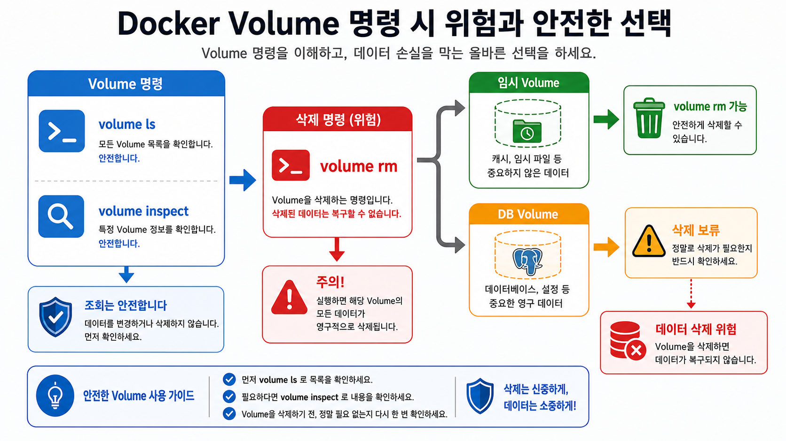
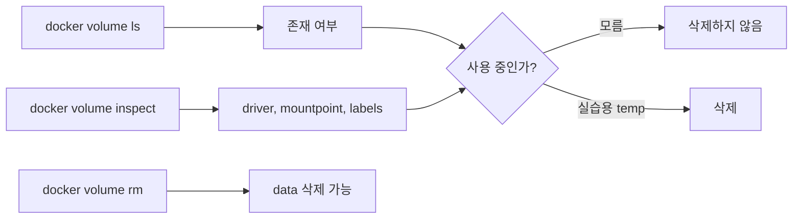
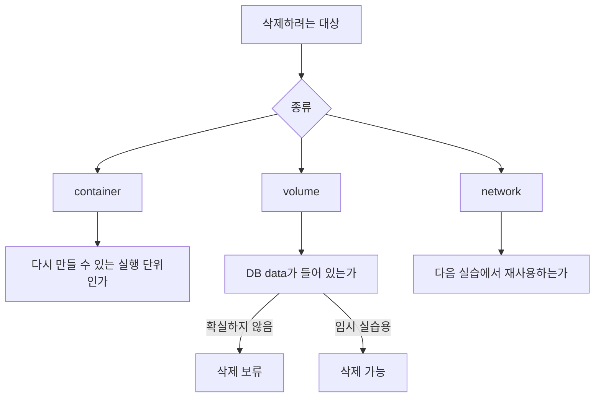

# 3교시: volume 명령과 cleanup 위험

## 수업 목표
- docker volume 명령의 목적을 설명한다.
- inspect 출력에서 공개 가능한 정보만 선별한다.
- volume cleanup이 data 삭제임을 설명한다.

## 강의 전개
volume은 보이지 않는 저장소처럼 느껴지기 때문에 cleanup 때 사고가 자주 난다. `docker volume ls`는 존재 여부를, `docker volume inspect`는 Docker가 관리하는 mountpoint와 metadata를 보여준다. 이 교시의 목적은 JSON을 통째로 붙이는 것이 아니라 운영자가 판단해야 할 최소 정보를 고르는 것이다.

이 교시는 설명만 듣고 지나가지 않는다. 명령은 반드시 code block으로 실행하고, 바로 이어서 검증 명령을 실행한다. 정상 출력이 다를 수 있는 부분은 전체 문자열을 외우지 않고 성공 패턴을 확인한다. 실패는 원인을 좁히는 단서다. 실패한 명령, 에러 요약, 가설, 다시 실행할 명령을 순서대로 다룬다.

## Imagegen 인포그래픽: volume cleanup risk


이 이미지는 `volume ls`, `volume inspect`, `volume rm`을 같은 성격의 명령으로 보지 않게 만든다. 조회 명령과 삭제 명령을 분리해서 보고, 임시 volume과 DB volume의 삭제 판단이 달라야 한다는 점을 확인한다.

## 시각 자료 1: volume 명령의 역할


이 그림은 `ls`, `inspect`, `rm`을 같은 수준의 조회 명령으로 보지 않게 만든다. `rm`은 상태 확인이 아니라 data 삭제로 이어질 수 있는 변경 명령이다.

## 시각 자료 2: cleanup 판단 흐름


이 visual은 cleanup을 단순히 "깔끔하게 지우기"가 아니라 대상의 성격을 나누는 판단으로 보여준다. volume은 container보다 위험도가 높다.

## 실습 명령
```bash
docker volume ls
docker volume inspect paperclip-pg16-data
```

```bash
docker volume create paperclip-temp-data
docker volume ls | grep paperclip-temp-data
```

## 검증 명령
```bash
docker volume inspect paperclip-pg16-data --format "{{ .Name }} {{ .Mountpoint }}"
docker volume inspect paperclip-temp-data --format "{{ .Name }}"
```

## 실습 확장 흐름
| 단계 | 할 일 | 기대되는 관찰 |
|---|---|---|
| 준비 | 기존 DB volume과 임시 volume을 구분한다. | `paperclip-pg16-data`와 `paperclip-temp-data`의 용도가 다르다. |
| 실행 | `volume ls`와 `volume inspect`를 실행한다. | 이름, driver, mountpoint가 보인다. |
| 관찰 | mountpoint에 개인 경로가 포함될 수 있음을 확인한다. | 공개 문서에 그대로 옮기지 않아야 함을 안다. |
| 실패 재현 | 사용 중인 volume 삭제를 시도한다. | container가 붙어 있으면 삭제 실패가 날 수 있다. |
| 복구 | 임시 volume만 삭제한다. | DB volume은 다음 실습을 위해 남는다. |
| 확인 | 남길 volume과 지울 volume을 구분한다. | data 삭제 위험을 명령 전에 판단한다. |

## 실패 드릴과 오해 교정
| 상황 | 해석 |
|---|---|
| Mountpoint를 그대로 공유 | 개인 경로가 포함될 수 있으므로 공개 문서에는 필요한 정보만 남긴다. |
| dangling volume이 많다 | 실습 흔적일 수 있지만 실제 data인지 확인 전 삭제하지 않는다. |
| volume rm 실패 | 사용 중인 container가 있으면 먼저 container 연결을 끊어야 한다. |

## Cleanup
```bash
docker volume rm paperclip-temp-data || true
# paperclip-pg16-data는 다음 실습에서 재사용하므로 지우지 않는다.
```

Cleanup은 비용과 데이터 안전을 동시에 다룬다. container를 지우는 명령과 volume/network/image를 지우는 명령은 의미가 다르다. 특히 volume 삭제는 database data 삭제일 수 있으므로 실습 volume인지 확인한 뒤 실행한다.

## 주의할 점
- Container를 삭제해도 named volume의 데이터는 남을 수 있다. 데이터를 초기화하려는 것이 아니라면 `docker volume rm`이나 `down -v`를 실행하지 않는다.
- Host port publish(`-p`)와 container 간 통신은 다른 문제다. 브라우저나 host `psql`로 접근할 때만 host port가 필요하고, 같은 Docker network 안에서는 container name과 container port를 사용한다.
- Volume target path는 image가 실제로 데이터를 쓰는 경로와 맞아야 한다. PostgreSQL은 `/var/lib/postgresql/data`와 `PGDATA` 설정을 확인하지 않으면 데이터가 남지 않거나 엉뚱한 위치에 쌓인다.
- bind mount는 host 경로를 그대로 노출한다. 개인 경로, 권한 문제, 실수로 수정한 host 파일이 container 동작에 영향을 줄 수 있다.
- Cleanup 전에는 지금 지우는 대상이 container인지, volume인지, network인지 먼저 구분한다.

## 핵심 포인트
이 실습의 핵심은 명령어 자체가 아니라 경계다. container는 실행 단위이고, volume은 data lifecycle이며, network는 통신 경계다. 학생이 `docker run` 한 줄을 볼 때 `-v`, `--network`, `-p`를 옵션 목록으로 외우면 뒤에서 Compose와 Kubernetes로 넘어갈 때 같은 혼란이 반복된다. 그래서 각 옵션을 "무엇을 container 밖으로 분리하는가"라는 질문으로 읽게 한다.

강의 중에는 성공 출력보다 실패 출력의 의미를 더 오래 다룬다. port가 열리지 않은 것은 web server 문제가 아닐 수 있고, DB 접속 실패는 password 문제가 아니라 network boundary 문제일 수 있다. host terminal, container 내부, 같은 Docker network의 client container는 모두 서로 다른 관찰 위치다. 학생이 어디에서 명령을 실행하는지 말로 먼저 설명한 뒤 CLI를 실행하게 한다.

## 운영 해석
실무에서 database container를 다룰 때 가장 위험한 실수는 cleanup을 단순 파일 정돈처럼 보는 것이다. container 삭제는 process와 container writable layer를 없애는 것이고, volume 삭제는 data를 삭제하는 것이다. network 삭제는 통신 경로를 없애는 것이다. 이 세 가지를 구분하지 않으면 실습은 성공해도 운영 사고를 배운 셈이 된다.

운영에서는 "실행됐다"보다 어떤 data가 남고 무엇이 삭제되는지가 더 중요하다. Day 2의 storage/network 판단은 Day 5 Compose에서 `volumes`와 `networks`를 읽는 기준이 된다. Compose의 YAML 항목은 갑자기 생긴 문법이 아니라 Day 2에서 손으로 실행한 storage/network 결정을 파일로 옮긴 것이다.

## 혼자 다시 따라오기
최소 성공 경로는 `docker volume ls`, `docker volume inspect paperclip-pg16-data`, 임시 volume 생성과 삭제다. 삭제가 실패하면 어떤 container가 그 volume을 쓰고 있는지 `docker ps -a`와 `docker inspect`로 먼저 확인한다. DB volume은 다음 실습에서 필요하므로 기본값은 삭제 보류다.

## 다음 연결
다음 교시는 bind mount로 host path를 직접 container에 연결한다. named volume과 달리 host path 의존이 생긴다.
