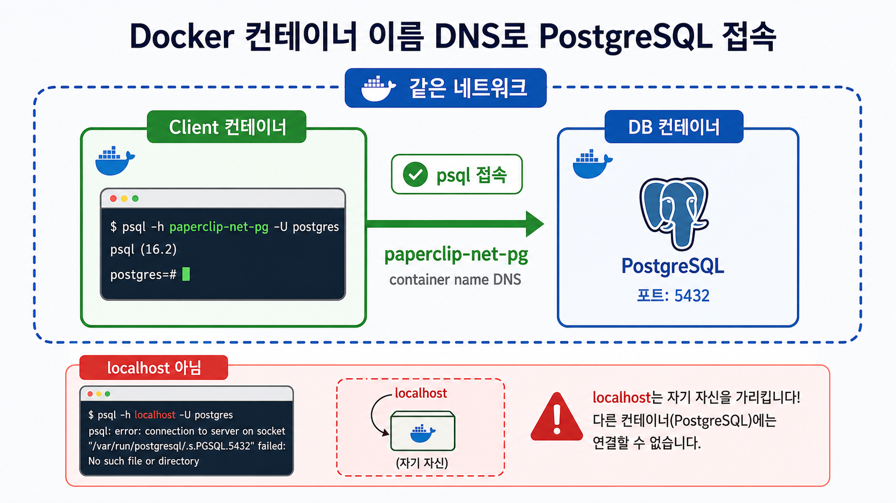
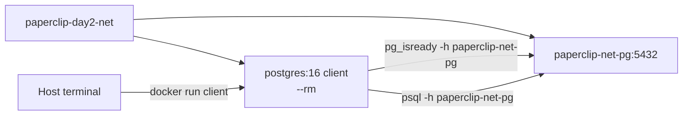
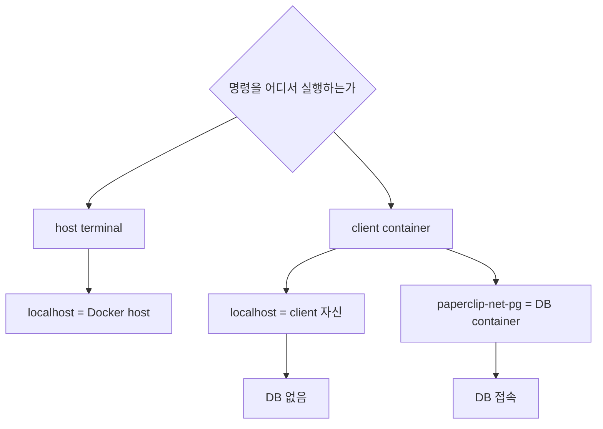

# 6교시: container name DNS와 DB client container

## 수업 목표
- host port publish 없이 container 간 DB 접속을 확인한다.
- container name DNS를 설명한다.
- DB client container를 일회성 도구로 사용한다.

## 강의 전개
운영에서 모든 service를 host port로 공개하지 않는다. 내부 service끼리는 같은 network 안에서 service name 또는 container name으로 접근한다. 이 교시는 `paperclip-net-pg`라는 이름을 DNS처럼 사용해 DB client container가 접속하는지 확인한다.

이 교시는 설명만 듣고 지나가지 않는다. 명령은 반드시 code block으로 실행하고, 바로 이어서 검증 명령을 실행한다. 정상 출력이 다를 수 있는 부분은 전체 문자열을 외우지 않고 성공 패턴을 확인한다. 실패는 원인을 좁히는 단서다. 실패한 명령, 에러 요약, 가설, 다시 실행할 명령을 순서대로 다룬다.

## Imagegen 인포그래픽: container name DNS


이 이미지는 client container가 DB container를 `paperclip-net-pg` 이름으로 찾는 구조를 보여준다. 특히 container 안의 `localhost`는 DB가 아니라 client 자신을 가리킨다는 경고를 함께 읽는다.

## 시각 자료 1: client container에서 DB 이름으로 접속


이 그림은 host terminal이 직접 DB에 붙는 것이 아니라, 같은 Docker network에 일회성 client container를 띄워 DB 이름으로 접근하는 구조를 보여준다.

## 시각 자료 2: localhost 오해


`localhost`는 항상 내 앞의 노트북을 뜻하지 않는다. container 안에서 `localhost`는 그 container 자신이므로 DB container 이름을 사용한다.

## 실습 명령
```bash
docker run -d --name paperclip-net-pg --network paperclip-day2-net -e POSTGRES_PASSWORD=postgres -v paperclip-pg16-data:/var/lib/postgresql/data postgres:16
```

```bash
docker run --rm --network paperclip-day2-net postgres:16 pg_isready -h paperclip-net-pg -U postgres
```

## 검증 명령
```bash
docker run --rm --network paperclip-day2-net -e PGPASSWORD=postgres postgres:16 psql -h paperclip-net-pg -U postgres -d paperclip -c "SELECT current_database();"
```

## 실습 확장 흐름
| 단계 | 할 일 | 기대되는 관찰 |
|---|---|---|
| 준비 | DB container가 `paperclip-day2-net`에 있는지 확인한다. | inspect 결과에 DB container가 보인다. |
| 실행 | 일회성 `postgres:16` client container를 띄운다. | 실행 후 client container는 남지 않는다. |
| 관찰 | `pg_isready`로 DB readiness를 본다. | accepting connections 또는 성공 패턴이 보인다. |
| 실패 재현 | client에서 `-h localhost`를 사용한다. | client 자신을 가리켜 접속이 실패한다. |
| 복구 | `-h paperclip-net-pg`로 바꾼다. | DB 이름으로 접속된다. |
| 확인 | host port publish 없이도 SQL이 실행되는지 본다. | 내부 network 통신이 성립한다. |

## 실패 드릴과 오해 교정
| 상황 | 해석 |
|---|---|
| localhost로 접속 시도 | client container 안의 localhost는 client 자신이다. |
| host port publish가 없음 | 같은 network 내부 접속에는 host port가 필요 없다. |
| container name 오타 | DNS lookup 실패 또는 connection failure가 난다. |

## Cleanup
```bash
docker stop paperclip-net-pg || true
docker rm paperclip-net-pg || true
```

Cleanup은 비용과 데이터 안전을 동시에 다룬다. container를 지우는 명령과 volume/network/image를 지우는 명령은 의미가 다르다. 특히 volume 삭제는 database data 삭제일 수 있으므로 실습 volume인지 확인한 뒤 실행한다.

## 주의할 점
- Container를 삭제해도 named volume의 데이터는 남을 수 있다. 데이터를 초기화하려는 것이 아니라면 `docker volume rm`이나 `down -v`를 실행하지 않는다.
- Host port publish(`-p`)와 container 간 통신은 다른 문제다. 브라우저나 host `psql`로 접근할 때만 host port가 필요하고, 같은 Docker network 안에서는 container name과 container port를 사용한다.
- Volume target path는 image가 실제로 데이터를 쓰는 경로와 맞아야 한다. PostgreSQL은 `/var/lib/postgresql/data`와 `PGDATA` 설정을 확인하지 않으면 데이터가 남지 않거나 엉뚱한 위치에 쌓인다.
- bind mount는 host 경로를 그대로 노출한다. 개인 경로, 권한 문제, 실수로 수정한 host 파일이 container 동작에 영향을 줄 수 있다.
- Cleanup 전에는 지금 지우는 대상이 container인지, volume인지, network인지 먼저 구분한다.

## 핵심 포인트
이 실습의 핵심은 명령어 자체가 아니라 경계다. container는 실행 단위이고, volume은 data lifecycle이며, network는 통신 경계다. 학생이 `docker run` 한 줄을 볼 때 `-v`, `--network`, `-p`를 옵션 목록으로 외우면 뒤에서 Compose와 Kubernetes로 넘어갈 때 같은 혼란이 반복된다. 그래서 각 옵션을 "무엇을 container 밖으로 분리하는가"라는 질문으로 읽게 한다.

강의 중에는 성공 출력보다 실패 출력의 의미를 더 오래 다룬다. port가 열리지 않은 것은 web server 문제가 아닐 수 있고, DB 접속 실패는 password 문제가 아니라 network boundary 문제일 수 있다. host terminal, container 내부, 같은 Docker network의 client container는 모두 서로 다른 관찰 위치다. 학생이 어디에서 명령을 실행하는지 말로 먼저 설명한 뒤 CLI를 실행하게 한다.

## 운영 해석
실무에서 database container를 다룰 때 가장 위험한 실수는 cleanup을 단순 파일 정돈처럼 보는 것이다. container 삭제는 process와 container writable layer를 없애는 것이고, volume 삭제는 data를 삭제하는 것이다. network 삭제는 통신 경로를 없애는 것이다. 이 세 가지를 구분하지 않으면 실습은 성공해도 운영 사고를 배운 셈이 된다.

운영에서는 "실행됐다"보다 어떤 data가 남고 무엇이 삭제되는지가 더 중요하다. Day 2의 storage/network 판단은 Day 5 Compose에서 `volumes`와 `networks`를 읽는 기준이 된다. Compose의 YAML 항목은 갑자기 생긴 문법이 아니라 Day 2에서 손으로 실행한 storage/network 결정을 파일로 옮긴 것이다.

## 혼자 다시 따라오기
최소 성공 경로는 DB container 실행, `pg_isready`, `psql SELECT current_database()`다. 접속이 실패하면 password보다 먼저 network가 같은지, host 값이 `localhost`가 아닌 container name인지, DB container가 아직 시작 중인지 확인한다.

## 다음 연결
다음 교시는 host port publish와 Docker network 통신을 나란히 비교한다.
