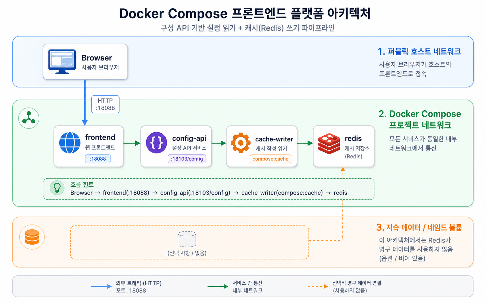

# Week 2 Day 5 Hands-on Lab: 회사형 Compose Architecture Templates

이 lab은 각 교시별 architecture folder를 실행한다. 한 번에 전부 외우는 것이 아니라 같은 루프를 반복하면서 service 관계를 읽는다.

## Common loop
각 architecture directory에서 먼저 실행한다.

```bash
docker compose config
docker compose up -d
docker compose ps
```

`docker compose config`에서 `networks`를 먼저 확인한다. Day 5 template은 default network 하나로 뭉치지 않고, 역할에 따라 다음 영역을 나눈다.

| Network 이름 | 의미 | 대표 service |
|---|---|---|
| `public_net` | browser/curl이 들어오는 외부 진입 영역 | `frontend`, `gateway`, `proxy`, `api` |
| `app_net` | gateway/frontend 뒤의 application 통신 영역 | `catalog-api`, `identity-api`, `payment-api` |
| `cache_net` | Redis cache 접근 영역 | `redis`, `cache-writer` |
| `queue_net` | producer/queue/worker 통신 영역 | `message-api`, `queue`, `worker` |
| `data_net` | DB와 volume이 있는 stateful 영역 | `db`, `db-checker` |

각 template을 실행할 때 다음 질문도 같이 기록한다.

| 질문 | 기록 예시 |
|---|---|
| 외부 traffic은 어디로 들어오는가 | `gateway:18091`, `proxy:18089`, `frontend:18085` |
| 내부 traffic은 어디로 흐르는가 | `gateway -> api -> db`, `message-api -> queue -> worker` |
| CPU가 무거워질 가능성이 큰 service는 무엇인가 | `worker`, `api`, `payment-api` |
| memory/state pressure가 큰 service는 무엇인가 | `db`, `redis`, `queue` |
| traffic이 늘면 제일 먼저 볼 증거는 무엇인가 | `logs`, API latency, queue length, DB query |

이 표는 정답 맞히기용이 아니다. 아키텍처 그림을 보고 “어디가 입구이고, 어디가 계산하고, 어디가 상태를 들고 있는지”를 말하기 위한 기록표다.

확인 후 정리한다.

```bash
docker compose down
# DB/cache data reset이 필요한 경우에만
# docker compose down -v
```

## 2교시: 커머스 카탈로그


```bash
cd week2/day5/labs/compose-architectures/01-web-postgres
docker compose config
docker compose up -d
curl -I http://localhost:18085
curl -s http://localhost:18101/products
docker compose exec db psql -U postgres -d app -c "SELECT current_database();"
docker compose logs db-checker --tail 30
docker compose down
```

Expected:

```text
HTTP/1.1 200 OK
"name":"local-market-starter-kit"
```

## 3교시: 백엔드 서비스 경계


```bash
cd week2/day5/labs/compose-architectures/02-web-postgres-admin
docker compose config
docker compose up -d
curl -I http://localhost:18086
curl -I http://localhost:18087
curl -s http://localhost:18086/identity/users
curl -s http://localhost:18086/payment/payments
docker compose logs db-checker --tail 30
docker compose down
```

Adminer login:

| 항목 | 값 |
|---|---|
| System | PostgreSQL |
| Server | `db` |
| Username | `postgres` |
| Password | `postgres` |
| Database | `app` |

## 4교시: 프론트엔드 플랫폼 설정과 cache


```bash
cd week2/day5/labs/compose-architectures/03-web-redis
docker compose config
docker compose up -d
curl -I http://localhost:18088
curl -s http://localhost:18103/config
docker compose logs cache-writer --tail 20
docker compose exec redis redis-cli GET compose:cache
docker compose --profile tool run --rm redis-cli
docker compose down
```

Expected:

```text
hit-from-cache-writer
PONG
```

## 5교시: Nginx reverse proxy


```bash
cd week2/day5/labs/compose-architectures/04-nginx-reverse-proxy
docker compose config
docker compose up -d
curl -s http://localhost:18089/a/
curl -s http://localhost:18089/b/
docker compose logs proxy --tail 40
```

Failure drill:

```bash
docker compose stop web-b
curl -i http://localhost:18089/b/ || true
docker compose logs proxy --tail 20
docker compose up -d web-b
docker compose down
```

## 6교시: 메시징 producer + queue + worker


```bash
cd week2/day5/labs/compose-architectures/05-queue-worker-db
docker compose config
docker compose up -d
curl -s 'http://localhost:18105/publish?job=send-email:42'
docker compose logs worker --tail 40
docker compose exec db psql -U postgres -d jobs -c "SELECT current_database();"
docker compose down
```

## 7교시: API + PostgreSQL


```bash
cd week2/day5/labs/compose-architectures/06-api-postgrest
docker compose config
docker compose up -d
curl -s http://localhost:18090/tasks
docker compose logs api --tail 40
docker compose logs db-checker --tail 20
docker compose down
```

Expected:

```text
"title":"read compose.yaml"
"status":"done"
```

## 8교시: Frontend + gateway + API + DB


```bash
cd week2/day5/labs/compose-architectures/07-frontend-gateway-api-db
docker compose config
docker compose up -d
curl -s http://localhost:18091 | grep week2-day5-msa-preview
curl -s http://localhost:18091/api/services
docker compose logs gateway --tail 40
docker compose logs api --tail 40
docker compose down
```

Expected:

```text
week2-day5-msa-preview
"name":"gateway"
"name":"api"
```

## 9세션 선택 챌린지: Architecture keywords to Compose
Day 5 기본 template을 마친 뒤에는 keyword만 보고 Compose 구조를 직접 만든다.

```bash
cd /mnt/d/paperclip/week2/day5
sed -n '1,260p' session-09-challenge.md
cd labs/compose-architecture-challenge
sed -n '1,220p' NOTES.md
```

진행 기준:

| 항목 | 요구 |
|---|---|
| keyword set | A/B/C/D 중 하나 |
| service 수 | 4개 이상 |
| network | `public_net`과 내부 network 1개 이상 |
| stateful service | PostgreSQL 또는 Redis 1개 이상 |
| evidence | HTTP, logs, DB/Redis/queue 중 3종 이상 |
| load note | traffic/CPU/memory pressure 비교 |
| failure drill | backend/API/DB/Redis/env 중 1개 이상 실패 주입 |

## 기록/정리
| 항목 | 기록 |
|---|---|
| 실행한 template | folder name |
| 외부 진입점 | host port |
| 내부 service name | `db`, `redis`, `api`, `web-a` 등 |
| 연결 증거 | curl result, DB query, Redis result, worker logs |
| traffic 집중 지점 | gateway/API/queue/DB 중 하나 |
| CPU 부하 후보 | worker/API/proxy 중 하나와 이유 |
| memory/state 부하 후보 | DB/Redis/queue/volume 중 하나와 이유 |
| cleanup 선택 | `down` 또는 `down -v` 이유 |
| Week 3 질문 | dependency/failure/scale 관련 질문 |
