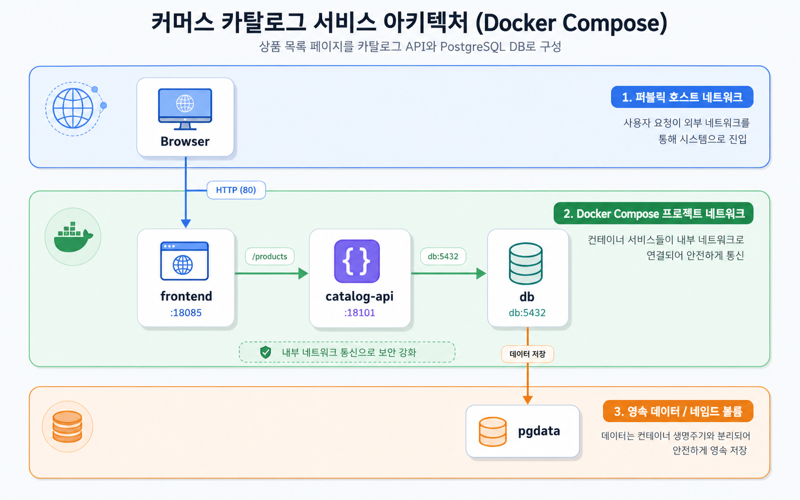

# Architecture 01: Company Commerce Catalog



커머스 카탈로그 template이다. `frontend`는 host port로 공개되고, `catalog-api`는 products table을 REST API로 노출한다. `db`는 Compose network 내부 service name으로만 접근한다.

## Run
```bash
docker compose config
docker compose up -d
docker compose ps
```

## Check
```bash
curl -I http://localhost:18085
curl -s http://localhost:18101/products
docker compose exec db psql -U postgres -d app -c "SELECT current_database();"
docker compose logs db-checker --tail 30
docker compose logs frontend --tail 20
```

Expected:

```text
HTTP/1.1 200 OK
"name":"local-market-starter-kit"
current_database
```

## Cleanup
```bash
docker compose down
# DB data reset이 필요할 때만
# docker compose down -v
```

`down -v`는 `pgdata` volume까지 삭제한다. 실습 DB를 초기화할 때만 사용한다.
