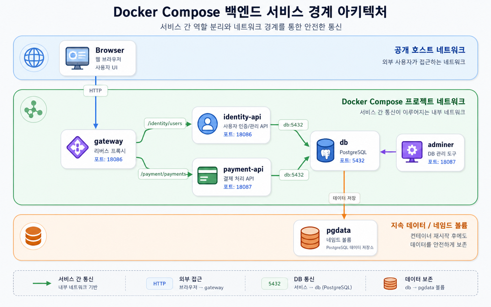

# Architecture 02: Company Backend Boundary + Adminer



백엔드 서비스 경계 template이다. `gateway`는 외부 진입점이고, `identity-api`와 `payment-api`는 내부 service로 분리된다. `adminer`는 host port로 공개되지만 PostgreSQL은 host에 직접 공개하지 않는다.

## Run
```bash
docker compose config
docker compose up -d
docker compose ps
```

## Check
```bash
curl -I http://localhost:18086
curl -I http://localhost:18087
curl -s http://localhost:18086/identity/users
curl -s http://localhost:18086/payment/payments
docker compose logs db-checker --tail 30
docker compose exec db psql -U postgres -d app -c "SELECT current_database();"
```

Adminer login 기준:

| 항목 | 값 |
|---|---|
| System | PostgreSQL |
| Server | `db` |
| Username | `postgres` |
| Password | `postgres` |
| Database | `app` |

## Cleanup
```bash
docker compose down
# DB data reset이 필요할 때만
# docker compose down -v
```

Admin UI는 편하지만 운영에서는 공개 범위가 위험이 된다. 수업에서는 host port 노출이 왜 필요한지, 언제 닫아야 하는지까지 같이 확인한다.
