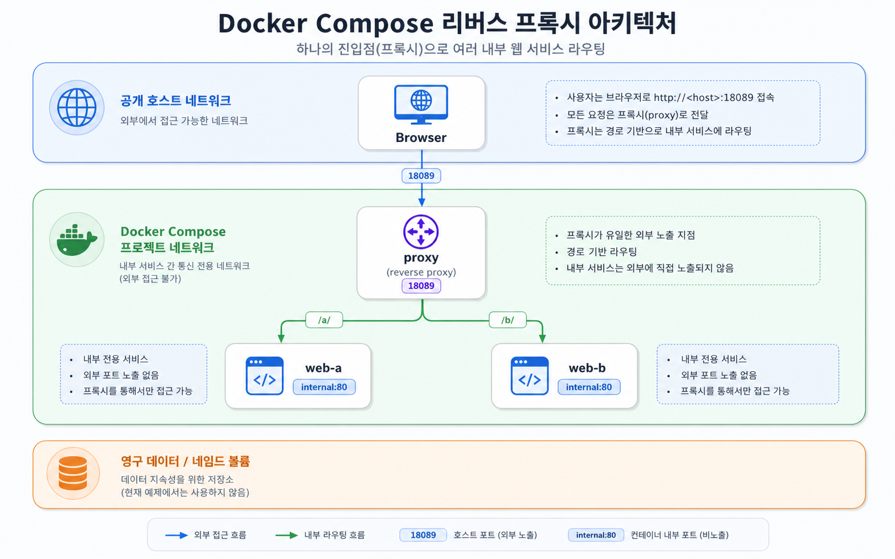

# Architecture 04: Nginx Reverse Proxy + Multiple Web Services



gateway/proxy pattern template이다. `web-a`와 `web-b`는 host port를 직접 공개하지 않고, 외부 traffic은 `proxy`의 `18089`로만 들어온다. proxy 설정은 service name `web-a`, `web-b`를 upstream으로 사용한다.

## Run
```bash
docker compose config
docker compose up -d
docker compose ps
```

## Check
```bash
curl -s http://localhost:18089/a/
curl -s http://localhost:18089/b/
docker compose logs proxy --tail 40
docker compose ps
```

Expected:

```text
Web A
Web B
```

## Failure drill
```bash
docker compose stop web-b
curl -i http://localhost:18089/b/ || true
docker compose logs proxy --tail 20
docker compose up -d web-b
```

upstream 하나가 죽어도 proxy의 로그가 원인 힌트를 준다. Week 3 MSA에서 service 장애 전파를 설명할 때 다시 쓰는 패턴이다.

## Cleanup
```bash
docker compose down
```
