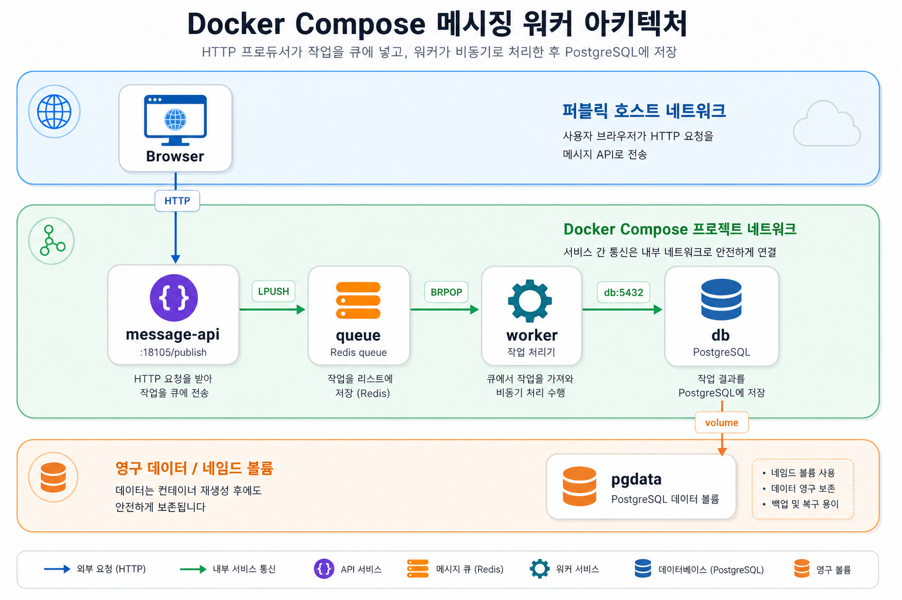

# Architecture 05: Messaging Producer + Queue + Worker + Database



비동기 처리 template이다. `message-api`는 HTTP 요청을 받아 Redis queue에 job을 넣고, `worker`는 queue에서 job을 꺼내 로그로 보여준다. `db`는 처리 결과를 저장할 수 있는 stateful backing service 역할이다.

## Run
```bash
docker compose config
docker compose up -d
docker compose ps
```

## Check
```bash
curl -s 'http://localhost:18105/publish?job=send-email:42'
docker compose logs worker --tail 40
docker compose exec db psql -U postgres -d jobs -c "SELECT current_database();"
```

Expected:

```text
send-email:42
current_database
jobs
```

## Cleanup
```bash
docker compose down
# DB data reset이 필요할 때만
# docker compose down -v
```

실제 업무에서는 worker가 job 처리 결과를 DB에 기록하거나 외부 API를 호출한다. 이 실습에서는 queue와 worker log를 먼저 확인한다.
