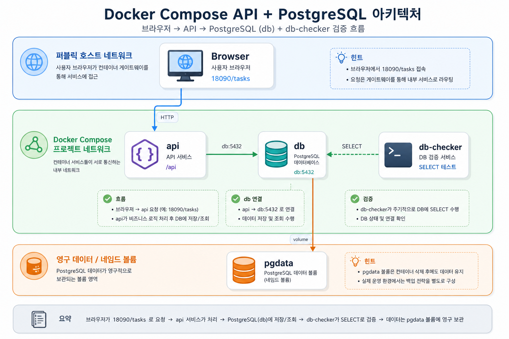

# Architecture 06: PostgREST API + PostgreSQL



PostgreSQL table을 REST API로 노출하는 Compose template이다. 앱 코드를 직접 작성하지 않아도 `api` service가 `db` service name으로 PostgreSQL에 연결해야만 API가 응답한다.

## Run
```bash
docker compose config
docker compose up -d
docker compose ps
```

## Check
```bash
curl -s http://localhost:18090/tasks
docker compose logs api --tail 40
docker compose logs db-checker --tail 20
```

Expected:

```text
"title":"read compose.yaml"
SELECT id, title, status FROM api.tasks
```

## Cleanup
```bash
docker compose down
# data reset이 필요할 때만
# docker compose down -v
```

`down -v`는 `pgdata` volume을 삭제한다.
