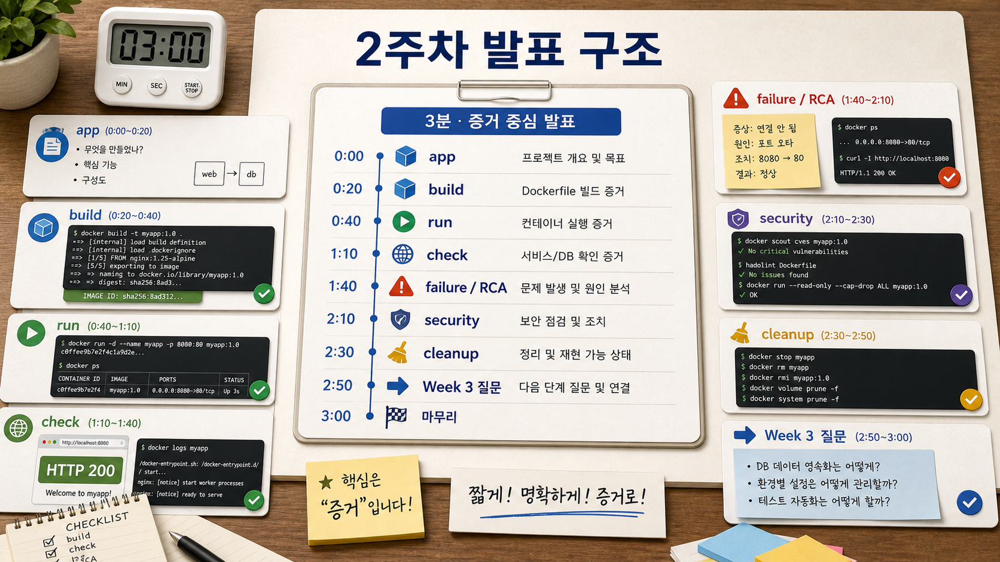

# 6교시: 2주차 Docker 학습 정리 제출

## 수업 목표
- Week 2에서 직접 실행한 Docker 실습을 evidence 중심으로 정리한다.
- 단순 명령어 나열이 아니라, 실습을 통해 이해한 실행 조건, 위험, 개선 아이디어를 자기 말로 기록한다.
- hands-on을 발전시킨 내역이나 Week 3 MSA로 이어질 아키텍처 아이디어를 적절한 깊이로 정리한다.

## 제출물 성격
이 세션은 길게 말하는 평가가 아니라, 학습자가 Docker를 실제로 공부했는지 실행 증거와 판단 근거로 확인하는 제출 정리 시간이다.

제출물은 본인이 실행한 명령, 확인한 결과, 겪은 문제, 바꿔본 부분, 다음 질문을 기준으로 판단한다. 따라서 문장은 화려할 필요가 없고, 실제 evidence와 연결되어야 한다.

## 50분 흐름
| 시간 | 활동 | 비중 | 산출 |
|---|---|---:|---|
| 0-8분 | 제출 기준 안내 | 설명 15% | summary rubric |
| 8-18분 | 학습 정리 카드 작성 | 실행 20% | Docker learning summary |
| 18-35분 | evidence와 인사이트 보강 | 실행 35% | command/result/insight table |
| 35-45분 | 제출 전 자기 점검 | 실행 20% | self-check |
| 45-50분 | 다음 교시 Q&A 연결 | 설명 10% | question list |

### Visual 1: evidence 중심 학습 정리 구조


이 visual은 학습 정리의 구조로 읽는다. problem, run, evidence, failure, risk, next step을 따라가면 Docker를 실제로 이해했는지 확인할 수 있다.

## 핵심 설명
좋은 제출물은 "Docker를 배웠습니다"라고 말하지 않는다. 대신 다음을 보여준다.

1. 무엇을 Docker로 실행했는가?
2. 어떤 명령으로 build/run/check했는가?
3. 정상 상태 evidence는 무엇인가?
4. 어떤 장애나 헷갈림이 있었고 어떻게 재확인했는가?
5. hands-on에서 내가 바꿔본 점은 무엇인가?
6. Week 3에서 service가 늘어나면 어떤 구조나 위험이 생길 것 같은가?

## Docker 학습 정리 카드
```markdown
## Week 2 Docker Learning Summary
- App or lab:
- Build command:
- Run command:
- Compose command:
- HTTP/log/status evidence:
- Failure or confusion:
- Fix or recheck:
- Security/cleanup note:
- Hands-on extension:
- Architecture idea:
- Week 3 question:
```

## 인사이트 작성 가이드
| 유형 | 좋은 예 | 약한 예 |
|---|---|---|
| 실행 인사이트 | host port와 container port를 분리해서 기록해야 재현된다 | Docker 실행함 |
| 장애 인사이트 | port conflict는 `docker ps`와 README port 기준을 같이 봐야 한다 | 에러가 났다 |
| 보안 인사이트 | `.dockerignore`가 없으면 `.env`가 build context에 들어갈 수 있다 | 보안 조심 |
| 구조 인사이트 | Compose service name은 Week 3 MSA의 service discovery와 연결될 것 같다 | MSA가 궁금하다 |
| 확장 인사이트 | hands-on nginx 앱에 health check와 cleanup note를 추가했다 | 조금 수정함 |

## hands-on 발전 내역 예시
아래 중 하나만 있어도 충분하다. 중요한 것은 많이 하는 것이 아니라 왜 바꿨는지 설명하는 것이다.

| 발전 방향 | evidence |
|---|---|
| README 보강 | expected output, cleanup warning, troubleshooting 추가 |
| Dockerfile 개선 | COPY 범위, tag, CMD 설명 추가 |
| Compose 보강 | service name, port, env, volume 설명 추가 |
| 실패 재현 | wrong port, missing env, volume cleanup 위험 기록 |
| 구조 아이디어 | web/db 분리, service dependency, readiness 질문 작성 |

## 제출물 템플릿
```markdown
# Week 2 Docker 학습 정리

## 1. 내가 실행한 것
- lab/app:
- files:
- build:
- run:
- compose:

## 2. 확인 evidence
- image/tag:
- container status:
- HTTP status/body:
- logs:
- cleanup:

## 3. 겪은 문제와 재확인
- symptom:
- likely cause:
- fix:
- recheck:
- prevention:

## 4. hands-on에서 발전시킨 점
- changed:
- why:
- evidence:

## 5. 아키텍처 또는 운영 인사이트
- insight:
- related Week 2 concept:
- Week 3 question:
```

## 자기 점검
| 질문 | 통과 기준 |
|---|---|
| 내가 직접 실행한 명령이 있는가 | build/run/compose/check 중 2개 이상 |
| 결과를 확인했는가 | HTTP/status/log/body marker 중 1개 이상 |
| 실패나 헷갈림을 숨기지 않았는가 | symptom/fix/recheck 중 2개 이상 |
| 보안/cleanup을 언급했는가 | secret, push, volume, cleanup 중 1개 이상 |
| 단순 요약을 넘어 인사이트가 있는가 | 구조/위험/개선/Week3 질문 중 1개 이상 |

## 학술 기준 연결
이 제출물은 글을 잘 쓰는 평가가 아니다. 수행한 작업을 증거와 함께 정리하고, 다음 학습으로 이어지는 질문을 만드는 형성평가다. Bloom의 apply/analyze/evaluate 수준을 짧은 실습 기록으로 확인한다.

## 실무 insight
DevOps 문서에서 중요한 것은 미사여구가 아니라 재현 가능한 증거와 판단 근거다. 좋은 정리는 다음 사람이 바로 실행하거나, 실패 지점을 좁히거나, 다음 구조를 설계할 때 도움이 된다.

## 오해 점검
| 오해 | 교정 |
|---|---|
| 제출물은 길수록 좋다 | 짧아도 command, result, insight가 연결되면 충분하다 |
| 화면 캡처만 있으면 된다 | path, command, expected result가 같이 있어야 한다 |
| 실패는 빼는 게 좋다 | 실패와 recheck가 가장 좋은 학습 evidence일 수 있다 |
| 외부 자료를 잘 정리하면 된다 | 본인이 실행한 evidence와 연결되어야 한다 |

## 평가 기준
| 기준 | 2점 evidence |
|---|---|
| 실행 | build/run/compose/check evidence가 있다 |
| 이해 | image/container/port/volume/config 중 핵심 개념을 자기 사례로 설명했다 |
| 문제 해결 | 실패나 혼동을 recheck까지 기록했다 |
| 책임 | secret/push/cleanup 위험을 언급했다 |
| 전이 | Week 3 MSA 또는 아키텍처 질문을 구체적으로 작성했다 |

## Lesson 6 Exit Ticket
```markdown
## Exit Ticket
- 내 제출물에서 가장 강한 evidence:
- 가장 약한 evidence:
- 내가 직접 바꿔본 부분:
- Week 3로 가져갈 질문:
```

## 제출 마감 기준
제출물은 완벽한 보고서가 아니라 학습 확인 자료다. 다음 네 문장이 evidence와 함께 있으면 충분하다.

- 무엇을 실행했는가.
- 어떻게 확인했는가.
- 무엇이 어려웠고 어떻게 다시 확인했는가.
- 다음 구조에서는 무엇을 더 조심해야 하는가.
