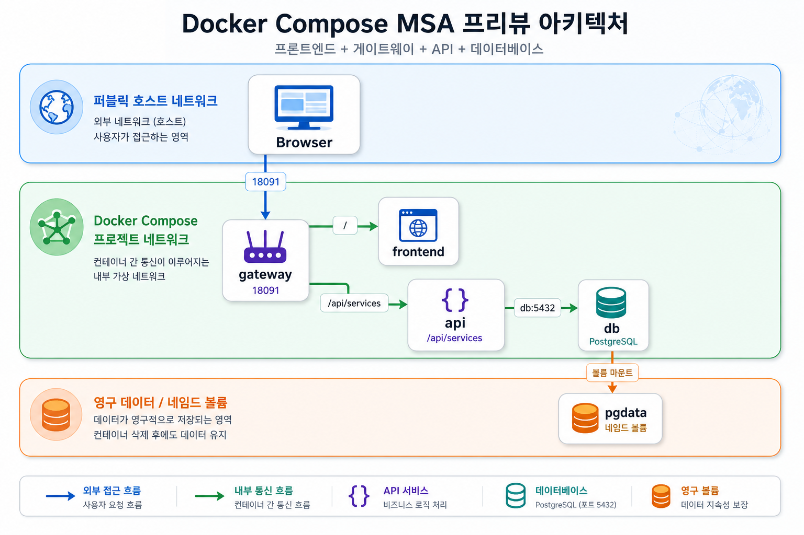

# 8교시: Frontend + gateway + API + DB MSA preview template



## 수업 목표
- browser traffic이 gateway로 들어오고 API/DB로 이어지는 흐름을 확인한다.
- frontend, gateway, API, DB의 service boundary를 구분한다.
- Week 3 MSA에서 다룰 dependency와 failure propagation 질문을 만든다.

## 언제 쓰는가
실제 서비스는 frontend 하나, API 하나, DB 하나로 끝나지 않는 경우가 많다. 그래도 처음에는 gateway가 외부 traffic을 받고, 내부 API와 DB로 연결되는 구조를 읽을 수 있어야 한다.

## Template
```bash
cd week2/day5/labs/compose-architectures/07-frontend-gateway-api-db
docker compose config
docker compose up -d
docker compose ps
```

## compose.yaml 읽기
Week 3 MSA로 넘어가기 전, browser traffic이 gateway를 거쳐 내부 API와 DB로 이어지는 최소 구조를 코드로 읽는다.

```yaml
services:
  gateway:
    image: nginx:1.27-alpine
    ports:
      - "18091:80"                 # browser가 접근하는 유일한 외부 진입점
    volumes:
      - ./nginx/default.conf:/etc/nginx/conf.d/default.conf:ro
      - ./frontend:/usr/share/nginx/html:ro
                                   # 정적 frontend와 /api/ reverse proxy 설정을 함께 제공
    depends_on:
      - api
    networks:
      - public_net                 # browser traffic
      - app_net                    # internal API routing

  api:
    image: postgrest/postgrest:v12.2.8
    environment:
      PGRST_DB_URI: postgres://app_user:app_password@db:5432/app
      PGRST_OPENAPI_SERVER_PROXY_URI: http://localhost:18091/api
                                   # 외부 기준 URL은 gateway path를 사용한다.
    depends_on:
      - db
    networks:
      - app_net
      - data_net

  db:
    image: postgres:16
    volumes:
      - ./db/init.sql:/docker-entrypoint-initdb.d/01-init.sql:ro
      - pgdata:/var/lib/postgresql/data
    networks:
      - data_net

volumes:
  pgdata:

networks:
  public_net:
  app_net:
  data_net:
```

이 코드는 “frontend가 API container에 직접 붙는다”가 아니라 “browser는 gateway로 들어오고 gateway가 내부 API로 넘긴다”는 구조를 보여준다. Kubernetes로 옮기면 gateway는 Ingress/Service, API는 Deployment/Service, DB는 Stateful한 backing service 논의로 이어진다.

구성:

| Service | 역할 | 공개 범위 |
|---|---|---|
| `gateway` | frontend 정적 파일 제공, `/api/` reverse proxy | host `18091` |
| `api` | PostgREST API | Compose network 내부 |
| `db` | PostgreSQL 16, init SQL 실행 | Compose network 내부 |

## Check
```bash
curl -s http://localhost:18091 | grep week2-day5-msa-preview
curl -s http://localhost:18091/api/services
docker compose logs gateway --tail 40
docker compose logs api --tail 40
```

Expected:

```text
week2-day5-msa-preview
"name":"gateway"
"name":"api"
```

## Week 3 연결 질문
| 질문 | 왜 중요한가 |
|---|---|
| gateway가 죽으면 어떤 요청이 실패하는가 | 외부 진입점 장애 |
| API가 죽으면 frontend는 어떻게 보이는가 | dependency failure |
| DB가 준비되기 전에 API가 뜨면 어떻게 되는가 | readiness/health check |
| API service를 2개로 늘리면 routing은 어떻게 바뀌는가 | scale out |
| 이 Compose service를 Kubernetes manifest로 옮기면 무엇이 바뀌는가 | Week 3 bridge |

## Cleanup
```bash
docker compose down
# DB를 초기화할 때만
# docker compose down -v
```

## Day 5 학습 서머리
오늘의 목표는 Compose 문법을 많이 외우는 것이 아니라, 자주 쓰는 회사형 서비스 구조를 `compose.yaml`로 읽고 실행하고 검증하는 감각을 잡는 것이다.

| 오늘 배운 내용 | 내가 설명할 수 있어야 하는 문장 |
|---|---|
| Compose 기본 루프 | `docker compose config`, `up`, `ps`, `logs`, `down`으로 template을 검증한다. |
| Network area | `public_net`, `app_net`, `cache_net`, `queue_net`, `data_net`을 나누면 traffic 경계와 service 역할이 보인다. |
| Service name DNS | container끼리는 `localhost`가 아니라 `db`, `redis`, `api`, `web-a` 같은 service name으로 만난다. |
| Port publish | host에서 접근하는 port와 container 내부 port는 다르다. 외부 진입점만 `ports`로 공개한다. |
| Volume lifecycle | DB data는 container 안이 아니라 named volume에 남을 수 있다. `down`과 `down -v`는 다르다. |
| Gateway/proxy | browser traffic은 gateway/proxy로 들어오고, 내부 service는 직접 공개하지 않는다. |
| Cache/queue/worker | Redis는 app 내부 변수가 아니라 별도 backing service이며, worker는 사용자 요청을 직접 받지 않는다. |
| API + DB 검증 | API가 running이어도 DB schema, role, connection string이 틀리면 정상 서비스가 아니다. |

Day 5를 마친 뒤에는 다음 질문에 짧게 답할 수 있어야 한다.

```text
이 template에서 외부 traffic은 어디로 들어오는가?
내부 service끼리는 어떤 service name으로 만나는가?
DB/cache/queue는 어느 network에 있는가?
host에 공개하면 안 되는 service는 무엇인가?
실패하면 curl, logs, exec 중 무엇을 먼저 볼 것인가?
이 구조를 Kubernetes로 옮기면 어떤 object가 필요해질까?
```

## 구름 EXP 배움일기
수업 후 구름 EXP 배움일기에 오늘 공부한 내용을 남긴다. 길게 쓰는 것이 목표가 아니라, 다음 주 MSA/Kubernetes 수업에서 다시 꺼내볼 수 있는 증거와 질문을 남기는 것이 목표다.

| 항목 | 작성 가이드 |
|---|---|
| 오늘 실행한 template | 2~8교시 중 직접 실행한 architecture folder 이름 |
| 가장 이해된 구조 | commerce, backend boundary, frontend platform, reverse proxy, messaging worker, API+DB, MSA preview 중 하나 |
| 연결 증거 | `curl` 결과, `docker compose ps`, `logs`, DB query, Redis result 중 하나 |
| network 정리 | `public_net`, `app_net`, `cache_net`, `queue_net`, `data_net` 중 오늘 가장 의미가 분명했던 것 |
| 헷갈린 지점 | host port/container port, service name DNS, `down`/`down -v`, gateway routing, volume 중 하나 |
| 실패 대응 | 실패했을 때 처음 확인한 명령과 그 이유 |
| Week 3 질문 | 이 Compose service를 MSA/Kubernetes로 옮기면 무엇이 바뀔지 |

작성 예시는 다음과 같다.

```text
오늘은 07-frontend-gateway-api-db template을 실행했다.
browser는 gateway의 18091로 들어오고, gateway가 /api/services를 api:3000으로 넘긴다.
api는 db:5432로 PostgreSQL에 붙고, db data는 pgdata volume에 남는다.
처음에는 gateway와 api가 같은 container처럼 느껴졌지만, app_net을 보고 service boundary를 구분할 수 있었다.
Kubernetes에서는 gateway가 Ingress/Service로, api가 Deployment/Service로, db는 stateful backing service로 바뀔 것 같다.
다음 주에는 readiness와 service discovery가 Compose의 depends_on과 어떻게 다른지 확인하고 싶다.
```

## 핵심 포인트
Day 5의 완료 기준은 Compose template을 실행해본 것이 아니라, architecture 그림과 `compose.yaml`을 같이 보고 traffic, network, volume, failure evidence를 설명할 수 있는 것이다.
