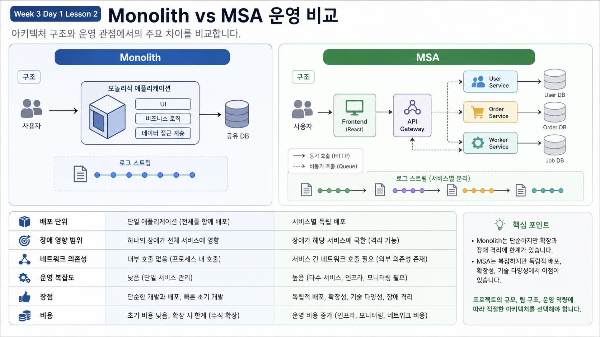

# 2교시: Monolith vs MSA



## 수업 목표
- Monolith와 MSA를 배포 단위, 장애 영향 범위, 데이터 책임, 운영 복잡도 관점으로 비교한다.
- MSA가 무조건 좋은 구조가 아니라 운영 비용을 지불하는 구조임을 설명한다.
- 어떤 팀/서비스에서 MSA가 필요한지 시나리오로 판단한다.

## 시작 질문
MSA를 처음 들으면 “서비스를 작게 나누면 좋은 것”처럼 들리기 쉽다. 하지만 인프라 관점에서는 서비스가 나뉘는 순간 확인할 것이 늘어난다.

```text
하나의 process가 죽었는가?
```

가 아니라

```text
어느 service가 죽었고, 그 영향이 어디까지 전파되었는가?
```

를 봐야 한다.

## Monolith와 MSA 비교
| 관점 | Monolith | MSA |
|---|---|---|
| 배포 단위 | 하나의 애플리케이션 | 여러 service |
| 장애 영향 | 한 process 문제가 전체 장애로 이어지기 쉬움 | 특정 service만 실패할 수 있지만 전파 가능 |
| 통신 방식 | 함수 호출, 같은 process 내부 | HTTP/gRPC/message queue 등 network 호출 |
| 데이터 책임 | 하나의 DB를 함께 쓰는 경우가 많음 | service별 data ownership 고려 |
| 배포 속도 | 전체 배포 필요 | service별 독립 배포 가능 |
| 운영 복잡도 | 상대적으로 낮음 | service discovery, observability, retry, timeout 필요 |
| 테스트 기준 | 전체 앱 기능 확인 | service 계약과 통합 흐름 확인 |

## 시나리오 1: 작은 사내 관리 도구
사용자가 적고 기능도 단순한 사내 관리 도구라면 Monolith가 더 좋은 선택일 수 있다.

이유:

| 이유 | 설명 |
|---|---|
| 장애 범위가 작음 | 사용자가 적고 복구 시간이 짧아도 감당 가능 |
| 팀 규모가 작음 | service별 ownership을 나눌 필요가 적음 |
| 운영 인력이 적음 | MSA 운영 도구를 유지할 비용이 큼 |
| 배포 빈도가 낮음 | 독립 배포의 이점이 작음 |

## 시나리오 2: 커머스 서비스
상품, 주문, 결제, 배송, 알림이 모두 같은 배포 단위라면 한 기능 변경이 전체 배포 위험을 만든다. 이 경우 MSA가 도움이 될 수 있다.

예:

```text
catalog service: 상품 조회
order service: 주문 생성
payment service: 결제 승인
notification worker: 알림 발송
```

하지만 service를 나누면 다음 문제가 생긴다.

| 새 문제 | 인프라가 준비할 것 |
|---|---|
| service 주소 관리 | service name, DNS, gateway |
| 장애 전파 | timeout, retry, circuit breaker 논의 |
| 로그 분산 | request id, correlation id |
| 데이터 일관성 | transaction boundary, eventual consistency |
| 배포 순서 | version compatibility, rollback 기준 |

## 실습 앱에 적용하기
`msa-demo`는 아주 작은 예제지만 MSA 운영 질문을 담고 있다.

| 질문 | `msa-demo`에서 보는 위치 |
|---|---|
| 사용자는 어디로 들어오는가 | `frontend` host port `18083` |
| API는 어디에 있는가 | `api:8080`, debug port `18084` |
| API는 DB를 어떻게 찾는가 | `DB_HOST=db`, `DB_PORT=5432` |
| worker는 누구를 호출하는가 | `API_URL=http://api:8080/api/status` |
| DB data는 어디에 남는가 | `msa-db-data` volume |

## 확인 명령
```bash
cd week3/day1/labs/msa-demo
docker compose config
```

출력에서 다음 줄을 찾아 표시한다.

```text
ports:
  - mode: ingress
    target: 80
    published: "18083"

DB_HOST: db
API_URL: http://api:8080/api/status
```

## 토론 질문
| 질문 | 의도 |
|---|---|
| 이 앱을 Monolith로 만들면 무엇이 단순해지는가 | 운영 비용 이해 |
| MSA로 나누면 무엇을 독립적으로 바꿀 수 있는가 | 독립 배포 이해 |
| DB가 죽으면 어떤 service가 영향받는가 | 장애 전파 이해 |
| worker가 죽으면 사용자는 바로 알 수 있는가 | background 장애 이해 |

## Evidence Note
```markdown
# W3D1S2 Evidence
- Monolith가 더 나은 상황:
- MSA가 필요한 상황:
- msa-demo에서 외부 진입점:
- msa-demo에서 내부 dependency:
```

## 핵심 포인트
MSA는 더 작은 코드를 만드는 기술이 아니라, 여러 service를 독립적으로 배포하고 운영하기 위해 복잡도를 받아들이는 구조다.
