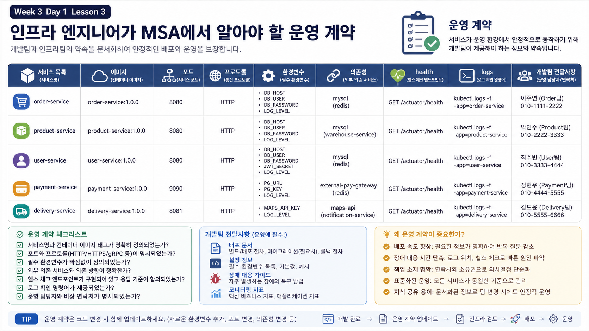

# 3교시: 인프라 엔지니어가 MSA에서 알아야 할 것



## 수업 목표
- MSA에서 인프라/DevOps 엔지니어가 알아야 할 service contract를 정리한다.
- service별 image/build, port, env, dependency, health, log 위치를 표로 작성한다.
- 개발 코드 내부가 아니라 운영 증거를 기준으로 정상/비정상을 구분한다.

## 핵심 질문
MSA 운영자는 모든 비즈니스 로직을 다 알 필요는 없다. 하지만 다음은 반드시 알아야 한다.

```text
이 service는 어떤 image로 실행되는가?
어떤 port를 열고 누구에게 공개하는가?
어떤 environment variable이 없으면 실패하는가?
어떤 service에 의존하는가?
정상 상태는 어떤 endpoint나 log로 확인하는가?
data를 어디에 저장하는가?
```

## Service Contract 표
Day1 실습 앱을 기준으로 service contract를 작성한다.

| Service | 실행 기준 | Port | Env | Dependency | Health/Log |
|---|---|---|---|---|---|
| `frontend` | `nginx:1.27-alpine` | host `18083` -> container `80` | 없음 | `api` | nginx access/error log |
| `api` | `build: ./api` | expose `8080`, host `18084` | `DB_HOST`, `DB_PORT` | `db` | `/health`, api JSON log |
| `worker` | `build: ./worker` | host 공개 없음 | `API_URL`, `WORKER_INTERVAL_SECONDS` | `api` | worker JSON log |
| `db` | `postgres:16-alpine` | host 공개 없음, internal `5432` | `POSTGRES_DB`, `POSTGRES_USER`, `POSTGRES_PASSWORD` | volume | `pg_isready`, db log |

이 표는 문서 장식이 아니다. 장애가 나면 바로 확인 순서가 된다.

## compose.yaml에서 contract 찾기
```yaml
api:
  build: ./api
  environment:
    SERVICE_NAME: api
    DB_HOST: ${DB_HOST:-db}
    DB_PORT: ${DB_PORT:-5432}
  expose:
    - "8080"
  ports:
    - "18084:8080"
  depends_on:
    db:
      condition: service_healthy
  healthcheck:
    test: ["CMD", "python", "-c", "... /health ..."]
```

읽는 법:

| 줄 | 의미 |
|---|---|
| `build: ./api` | API image는 local Dockerfile로 만든다. |
| `DB_HOST: db` | API container는 DB를 service name `db`로 찾는다. |
| `expose: 8080` | Compose network 내부에서 8080을 사용한다. |
| `ports: 18084:8080` | 강의 debug용으로 host에서도 API를 직접 확인한다. |
| `condition: service_healthy` | DB healthcheck가 통과된 뒤 API를 시작하려는 의도다. |
| `healthcheck` | container running이 아니라 API readiness를 확인한다. |

## 운영자가 모르면 생기는 문제
| 모르는 것 | 생기는 문제 |
|---|---|
| host port와 container port | curl 대상이 틀려서 정상 service를 장애로 오판 |
| service name DNS | container 내부에서 `localhost`로 DB를 찾으려다 실패 |
| env default | `.env` 값이 바뀌었는데 compose config를 안 보고 넘어감 |
| healthcheck 의미 | running인데 준비 안 된 service를 정상으로 오판 |
| volume lifecycle | `down -v`로 DB data를 날림 |

## 실습
```bash
cd week3/day1/labs/msa-demo
docker compose config > /tmp/w3d1-compose-config.txt
```

다음 값을 찾아 표에 적는다.

| 찾을 값 | 내 답 |
|---|---|
| frontend published port | |
| api container port | |
| api DB host | |
| worker API URL | |
| db volume name | |
| db healthcheck command | |

## Evidence Note
```markdown
# W3D1S3 Service Contract
| service | image/build | port | env | dependency | health/log |
|---|---|---|---|---|---|
| frontend | | | | | |
| api | | | | | |
| worker | | | | | |
| db | | | | | |
```

## 핵심 포인트
MSA에서 인프라 엔지니어가 먼저 작성해야 하는 문서는 멋진 아키텍처 소개가 아니라 service contract 표다. 이 표가 있어야 장애 상황에서 어디를 먼저 볼지 결정할 수 있다.


## 학습 제어
### 시작 3분 회상
- monolith와 MSA의 장애 범위 차이는 무엇이었나?
- 서비스가 통신하려면 image, port, env, dependency 중 무엇을 계약으로 고정해야 하는가?
### 오늘 반드시 가져갈 것
- service contract는 명령 목록이 아니라 실행 조건·책임·검증 증거의 약속이다.
- health와 logs는 서비스가 살아 있음과 업무 요청이 성공함을 각각 증명한다.
### 최소 복구 경로
- 한 서비스의 image/port/env/dependency/health/log 항목을 채운다 → 실제 설정과 비교한다 → HTTP와 logs를 확인한다.
- 성공 판정은 계약 항목별 확인 증거가 있는 것이다. 첫 실패는 container inspect와 서비스 logs에서 찾는다.
- 다음 lesson 진입 조건은 계약만 보고 실행 전 실패 가능성을 예측하는 것이다.