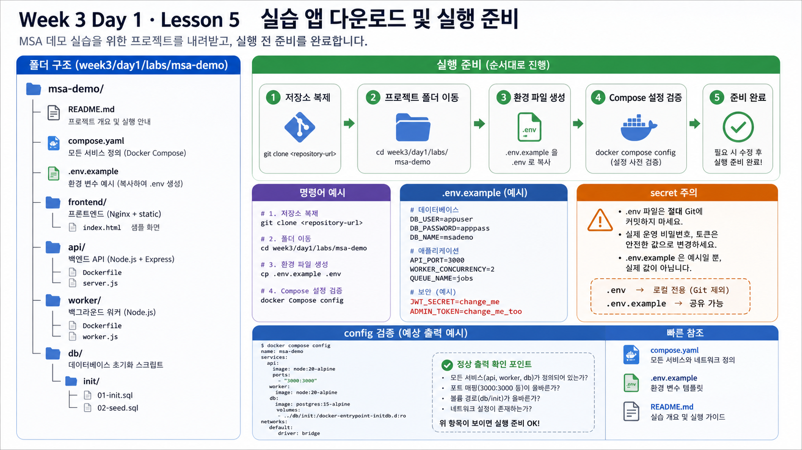

# 5교시: Compose로 전체 서비스 실행



## 수업 목표
- `msa-demo`를 `docker compose up --build -d`로 실행한다.
- 실행 직후 baseline을 수집한다.
- container running, health, HTTP response, logs를 구분한다.

## 수업 순서와 성공 기준

명령을 실행하기 전에 정상의 의미를 네 질문으로 나눈다.

| 질문 | 증거 |
|---|---|
| process가 실행 중인가? | `docker compose ps` |
| dependency가 준비됐는가? | healthcheck |
| 사용자 경로가 응답하는가? | `curl`/HTTP status |
| 내부에 오류가 없는가? | service logs |

`docker compose up`은 준비 단계이며 성공 판정이 아니다. 학생은 위 네 증거를 먼저 예상한 뒤 명령을 실행하고 baseline 표를 채운다.

## 실행 전 준비
```bash
cd week3/day1/labs/msa-demo
cp .env.example .env
```

`.env.example`은 수업에서 어떤 runtime config가 필요한지 보여주는 파일이다. secret을 실제 운영 값으로 넣는 파일이 아니다.

확인:

```bash
cat .env.example
```

확인할 값:

| 값 | 의미 |
|---|---|
| `POSTGRES_PASSWORD` | local practice DB password |
| `DB_HOST` | API가 DB를 찾을 service name |
| `DB_PORT` | DB container internal port |

## 실행
```bash
docker compose up --build -d
docker compose ps
```

예상 형태:

```text
NAME                  SERVICE    STATUS
msa-demo-frontend-1   frontend   Up
msa-demo-api-1        api        Up (health: starting 또는 healthy)
msa-demo-worker-1     worker     Up
msa-demo-db-1         db         Up (healthy)
```

처음에는 API health가 `starting`일 수 있다. healthcheck interval과 DB readiness 때문에 잠깐 기다릴 수 있다.

## 정상 baseline 수집
```bash
curl -s http://localhost:18083/api/status
curl -s http://localhost:18084/health
docker compose logs --tail=40 api
docker compose logs --tail=40 worker
```

`/api/status` 예상 key:

```json
{
  "service": "api",
  "frontend_to_api": "ok",
  "database_reachable": true,
  "db_host": "db",
  "db_port": 5432
}
```

여기서 `database_reachable=true`가 중요하다. 단순히 JSON이 온 것이 아니라 API가 DB까지 연결 가능하다는 증거다.

## 브라우저 확인
브라우저에서 다음 주소를 연다.

```text
http://localhost:18083
```

브라우저 화면이 뜨면 frontend 정적 파일은 정상이다. 하지만 화면만 보고 끝내면 안 된다. 화면에서 API 결과가 표시되는지, 또는 직접 `curl /api/status`를 통해 API와 DB 연결까지 확인해야 한다.

## baseline 표
| 확인 | 명령 | 정상 기준 |
|---|---|---|
| Compose 상태 | `docker compose ps` | frontend/api/worker/db 모두 Up, db healthy |
| frontend 경유 API | `curl localhost:18083/api/status` | JSON 응답, `database_reachable=true` |
| API 직접 health | `curl localhost:18084/health` | 200, `ready=true` |
| API 로그 | `docker compose logs api` | request path와 request id |
| worker 로그 | `docker compose logs worker` | API 호출 status 200 |

## 흔한 실패
| 증상 | 원인 후보 | 첫 확인 |
|---|---|---|
| `port is already allocated` | 18083 또는 18084 사용 중 | `docker ps` |
| API health 503 | DB 미준비 또는 DB_HOST 오류 | `docker compose logs api db` |
| frontend 502 | nginx가 api에 연결 실패 | `docker compose logs frontend api` |
| worker error 반복 | API URL 오류 또는 API 중지 | `docker compose logs worker` |

## Cleanup 기준
실습 도중에는 바로 지우지 않는다. Day2에서도 같은 앱을 쓰기 때문이다.

정리할 때:

```bash
docker compose down
```

DB data까지 초기화할 때만:

```bash
docker compose down -v
```

## Evidence Note
```markdown
# W3D1S5 Baseline
- docker compose ps summary:
- frontend API response:
- api health:
- worker log evidence:
- cleanup decision:
```

## 핵심 포인트
MSA 실습에서 baseline은 선택이 아니다. 정상 baseline이 있어야 Day2에서 장애 전파와 부분 장애를 비교할 수 있다.


## 학습 제어
### 시작 3분 회상
- Compose 토폴로지에서 network와 health는 어떤 책임을 갖는가?
- 컨테이너가 Running인 것과 HTTP 요청이 성공하는 것은 어떻게 다른가?
### 오늘 반드시 가져갈 것
- Running은 프로세스 상태, health는 준비 상태, HTTP는 사용자 경로의 증거다.
- baseline을 먼저 기록해야 장애 뒤 변화를 비교할 수 있다.
### 최소 복구 경로
- 전체 stack을 실행한다 → `ps`에서 Running/health를 확인한다 → HTTP와 logs를 각각 기록한다.
- 성공 판정은 세 증거가 모두 기준값을 갖는 것이다. 첫 실패는 `docker ps`와 해당 container logs에서 확인한다.
- 다음 lesson 진입 조건은 정상 baseline을 재현하고 기록하는 것이다.