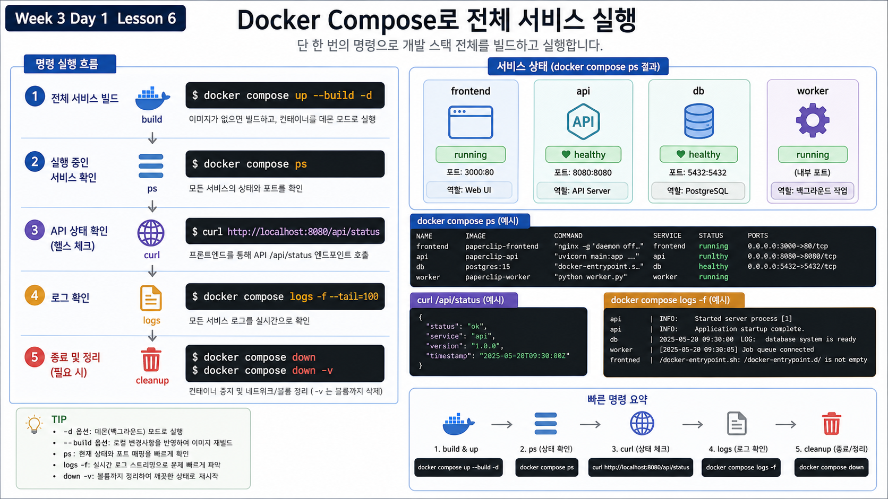

# 6교시: 서비스 간 통신 확인



## 수업 목표
- frontend -> api, api -> db, worker -> api 흐름을 각각 다른 증거로 확인한다.
- request id가 여러 service 로그를 이어주는 이유를 설명한다.
- host 기준 확인과 container 내부 기준 확인을 구분한다.

## 준비
```bash
cd week3/day1/labs/msa-demo
docker compose up --build -d
docker compose ps
```

## 흐름 1: frontend -> api
host에서 frontend를 통해 API를 호출한다.

```bash
curl -s -H 'x-request-id: w3d1-front-001' http://localhost:18083/api/status
```

확인할 것:

| JSON key | 의미 |
|---|---|
| `service` | 실제 응답한 service는 api |
| `request_id` | frontend가 전달한 request id |
| `frontend_to_api` | frontend 경유 요청 성공 표시 |
| `database_reachable` | API가 DB까지 연결 가능한지 |

로그 확인:

```bash
docker compose logs --tail=80 api | grep w3d1-front-001 || true
```

`grep`에 `|| true`를 붙인 이유는 해당 request id가 없을 때도 실습 흐름을 계속하기 위해서다. 하지만 실제 장애 분석에서 무조건 붙이면 실패를 숨길 수 있다.

## 흐름 2: api -> db
API health endpoint를 직접 호출한다.

```bash
curl -i http://localhost:18084/health
```

정상 예:

```text
HTTP/1.0 200 OK
```

본문에는 다음 값이 있어야 한다.

```json
{
  "ready": true,
  "db_host": "db",
  "db_port": 5432,
  "error": null
}
```

여기서 `db_host`가 `localhost`가 아니라 `db`라는 점을 강조한다. API container 입장에서 `localhost`는 API 자기 자신이다.

## 흐름 3: worker -> api
worker는 host port가 없으므로 curl로 직접 호출하지 않는다. log로 확인한다.

```bash
docker compose logs --tail=80 worker
```

정상 worker log 형태:

```json
{
  "service": "worker",
  "request_id": "worker-...",
  "api_url": "http://api:8080/api/status",
  "status": 200
}
```

worker가 `http://localhost:8080`을 쓰면 실패한다. worker container 내부의 localhost는 worker 자신이기 때문이다.

## host 기준과 container 기준
| 관점 | 주소 예시 | 사용하는 상황 |
|---|---|---|
| host -> frontend | `http://localhost:18083` | browser/curl로 사용자 경로 확인 |
| host -> api debug | `http://localhost:18084` | 강의에서 API health 직접 확인 |
| host -> catalog-api | `http://localhost:18120` | 상품 API 직접 확인 |
| host -> order-api | `http://localhost:18121` | 주문 API 직접 확인 |
| frontend -> api | `http://api:8080` | nginx reverse proxy 내부 통신 |
| api -> db | `db:5432` | API container 내부 DB 연결 |
| worker -> api | `http://api:8080/api/status` | background service 통신 |
| order-api -> redis | `redis:6379` | 주문 이벤트 queue 입력 |
| order-worker -> redis/db | `redis:6379`, `db:5432` | 주문 이벤트 처리와 상태 변경 |

## 확장 흐름: catalog/order 서비스
기존 `frontend`, `api`, `worker`, `db` 흐름은 그대로 둔다. 여기에 더 실제 서비스에 가까운 API를 같은 Compose stack에 추가해서 service가 늘어났을 때 통신 증거가 어떻게 달라지는지 본다.

추가 service:

| Service | 역할 | host 확인 | 내부 dependency |
|---|---|---|---|
| `catalog-api` | 상품 목록 API | `localhost:18120` | `db` |
| `order-api` | 주문 생성/조회 API | `localhost:18121` | `db`, `redis` |
| `redis` | 주문 이벤트 queue | host 공개 없음 | `order-api`, `order-worker` |
| `order-worker` | queue에서 주문 이벤트 처리 | host 공개 없음 | `redis`, `db` |

확장 요청 흐름:

```text
host -> catalog-api -> db
host -> order-api -> db
order-api -> redis queue
order-worker -> redis queue -> db
```

상품 조회:

```bash
curl -s -H 'x-request-id: w3d1-catalog-001' \
  http://localhost:18120/api/catalog/products
docker compose logs --tail=60 catalog-api | grep w3d1-catalog-001 || true
```

주문 생성:

```bash
curl -s -X POST -H 'x-request-id: w3d1-order-001' \
  http://localhost:18121/api/orders
docker compose exec redis redis-cli LLEN order-events
docker compose exec redis redis-cli LRANGE order-events 0 -1
docker compose logs --tail=80 order-api | grep w3d1-order-001 || true
docker compose logs --tail=80 order-worker | grep w3d1-order-001 || true
```

`order-worker`는 교육용으로 `ORDER_WORKER_POLL_SECONDS=2`초마다 queue를 확인하고, message를 발견하면 `ORDER_WORKER_MESSAGE_VISIBILITY_SECONDS=10`초 동안 일부러 queue에 남겨둔 뒤 소비한다. 그래서 주문을 넣은 직후에는 Redis list에 message가 잠깐 남아 있어야 한다.

| 명령 | 의미 |
|---|---|
| `LLEN order-events` | 현재 queue에 남아 있는 message 개수 |
| `LRANGE order-events 0 -1` | queue에 남은 message payload 확인 |
| `logs order-worker` | worker가 message를 꺼내 처리했는지 확인 |

`LRANGE` 결과 예시:

```json
{"order_id":12,"request_id":"w3d1-order-001"}
```

약 10초가 지나면 worker가 message를 꺼내므로 `LLEN`은 다시 `0`이 된다. 이 변화가 `queue에 들어감 -> worker가 소비함 -> DB 상태 변경` 흐름의 핵심 evidence다.

주문 상태 확인:

```bash
curl -s http://localhost:18121/api/orders
```

queue가 처리되었는지 다시 확인:

```bash
docker compose exec redis redis-cli LLEN order-events
```

DB audit log 확인:

```bash
docker compose exec db psql -U paperclip -d paperclip \
  -c "select service_name, request_id, event, created_at from audit_logs order by id desc limit 5;"
```

여기서 중요한 점은 `order-api`가 사용자 요청을 받지만, 실제 주문 처리는 `order-worker` 로그와 DB 상태 변경까지 봐야 완료된다는 것이다. W3D2의 장애 전파 수업에서는 `redis` 또는 `order-worker`를 멈춰서 “API 응답과 실제 처리 완료는 다를 수 있다”를 확인할 수 있다.

## 통신 실패를 일부러 만들기 전 질문
장애를 넣기 전에 먼저 정상 경로를 말할 수 있어야 한다.

```text
사용자 요청은 localhost:18083으로 들어온다.
frontend container는 api:8080으로 요청을 넘긴다.
api는 db:5432로 PostgreSQL 연결을 확인한다.
worker는 api:8080/api/status를 주기적으로 호출한다.
order-api는 redis:6379에 주문 이벤트를 넣는다.
order-worker는 redis queue에서 이벤트를 꺼내 db:5432에 처리 결과를 남긴다.
```

이 네 문장을 말하지 못하면 장애 분석은 운에 맡기는 일이 된다.

## Evidence Note
```markdown
# W3D1S6 Communication Evidence
- frontend -> api curl:
- api -> db health:
- worker -> api log:
- catalog-api -> db curl/log:
- order-api -> redis -> order-worker -> db evidence:
- host address vs service name difference:
```

## 핵심 포인트
MSA의 통신 확인은 `curl 한 번 성공`이 아니다. 사용자 경로, service 내부 경로, background 경로를 나눠서 각각의 증거를 잡는 것이다.
