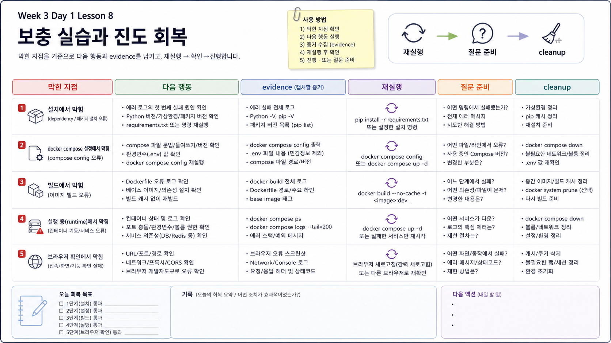

# 8교시: 구름 EXP 배움일기 - MSA 토폴로지와 연결 실패 증거



## 수업 목표
- Day1에서 확인한 MSA 토폴로지와 실행 증거를 정리한다.
- 구름 EXP 배움일기에 단순 감상이 아니라 다음 수업에서 다시 쓸 수 있는 evidence를 남긴다.
- Day2 장애 전파, health, timeout/retry 수업으로 넘어갈 질문을 만든다.

## Day1 학습 서머리
오늘은 MSA를 “서비스를 작게 나누는 개발 방식”이 아니라 “여러 실행 단위를 운영하는 구조”로 봤다.

| 오늘 배운 내용 | 설명할 수 있어야 하는 문장 |
|---|---|
| Monolith vs MSA | MSA는 독립 배포를 가능하게 하지만 network dependency와 운영 비용을 만든다. |
| Service contract | service별 image/build, port, env, dependency, health, logs를 표로 정리해야 한다. |
| frontend 경로 | browser는 `localhost:18083`으로 들어오고 frontend가 `api:8080`으로 넘긴다. |
| API readiness | API process가 살아 있어도 DB 연결이 실패하면 `/health`는 실패할 수 있다. |
| worker 경로 | worker는 host port가 없고 내부에서 `api:8080/api/status`를 호출한다. |
| DB dependency | API는 `DB_HOST=db`, `DB_PORT=5432`로 PostgreSQL에 붙는다. |
| 장애 증거 | API 중지, DB 중지, DB_HOST 오류는 서로 다른 로그와 status를 만든다. |

## 오늘 남겨야 할 Evidence
다음 명령 중 최소 3개는 실제 출력 요약을 남긴다.

```bash
docker compose config
docker compose ps
curl -s http://localhost:18083/api/status
curl -s http://localhost:18084/health
docker compose logs --tail=60 api
docker compose logs --tail=60 worker
```

출력 전체를 붙일 필요는 없다. 핵심 줄만 정리한다.

| 명령 | 남길 핵심 |
|---|---|
| `docker compose ps` | service별 Up/healthy 상태 |
| frontend curl | `frontend_to_api`, `database_reachable` |
| API health | `ready`, `db_host`, `error` |
| API logs | request path, request id |
| worker logs | `api_url`, status 또는 error |

## 구름 EXP 배움일기 작성 가이드
| 항목 | 작성 내용 |
|---|---|
| 오늘의 구조 | `frontend -> api -> db`, `worker -> api -> db` 흐름 |
| 가장 헷갈린 지점 | host port/container port/service name/env/health 중 하나 |
| 실행 증거 | 명령 1개와 핵심 출력 요약 |
| 장애 증거 | API 중지 또는 DB 중지 시 본 증상 |
| 내 판단 | 어떤 service를 먼저 의심했는지와 이유 |
| Day2 질문 | health, readiness, timeout/retry에서 더 확인하고 싶은 것 |

## 작성 예시
```text
오늘은 msa-demo를 실행해서 frontend, api, worker, db의 역할을 확인했다.
사용자는 localhost:18083으로 들어오지만 frontend container는 api:8080으로 요청을 넘긴다.
api는 DB_HOST=db로 PostgreSQL에 연결하고, /health에서 database_reachable 상태를 보여준다.
API를 중지했을 때 frontend 경로와 worker 로그가 모두 실패해서 API 장애가 다른 service로 전파된다는 것을 확인했다.
아직 헷갈리는 것은 container 내부에서 localhost를 쓰면 왜 자기 자신을 가리키는지다.
Day2에서는 DB가 느리게 준비될 때 depends_on과 healthcheck만으로 충분한지 확인하고 싶다.
```

## Day2로 넘길 질문
| 질문 | Day2 연결 |
|---|---|
| API가 running인데 `/health`가 503이면 장애인가 | readiness |
| worker가 실패해도 사용자는 정상일 수 있는가 | 부분 장애 |
| retry를 많이 하면 항상 좋은가 | timeout/retry |
| 여러 service 로그를 어떻게 이어 볼 것인가 | correlation id |
| Compose의 `depends_on`은 Kubernetes에서 무엇으로 바뀌는가 | readiness probe |

## Cleanup
Day2에서 같은 앱을 바로 쓸 수 있으므로 수업 환경에 따라 유지하거나 정리한다.

정리:

```bash
cd week3/day1/labs/msa-demo
docker compose down
```

DB volume까지 초기화:

```bash
docker compose down -v
```

## 핵심 포인트
Day1의 완료 기준은 MSA라는 말을 외우는 것이 아니다. `msa-demo`의 service contract를 보고 사용자 요청과 내부 dependency를 설명하며, 실패했을 때 어느 service의 어떤 증거를 먼저 볼지 말할 수 있어야 한다.


## 학습 제어
### 시작 3분 회상
- 오늘 배운 호출 경로 중 가장 먼저 끊긴 지점과 그 증거는 무엇이었나?
- 다음 날 장애 전파를 이해하기 위해 어떤 질문을 남길 것인가?
### 오늘 반드시 가져갈 것
- 배움일기는 느낀 점보다 호출 경로·증상·증거·해석을 남기는 운영 기록이다.
- 다음 학습 질문은 아직 설명하지 못한 책임 경계에서 출발한다.
### 최소 복구 경로
- 오늘의 baseline과 실패 증거를 표로 적는다 → 첫 실패와 복구 확인을 한 문장으로 쓴다 → 다음 질문을 1개 남긴다.
- 성공 판정은 다른 사람이 기록만 보고 재현 순서를 알 수 있는 것이다. 첫 실패는 기록한 logs/HTTP 결과에서 다시 확인한다.
- 다음 lesson 진입 조건은 증거 2개와 미해결 질문 1개를 작성하는 것이다.