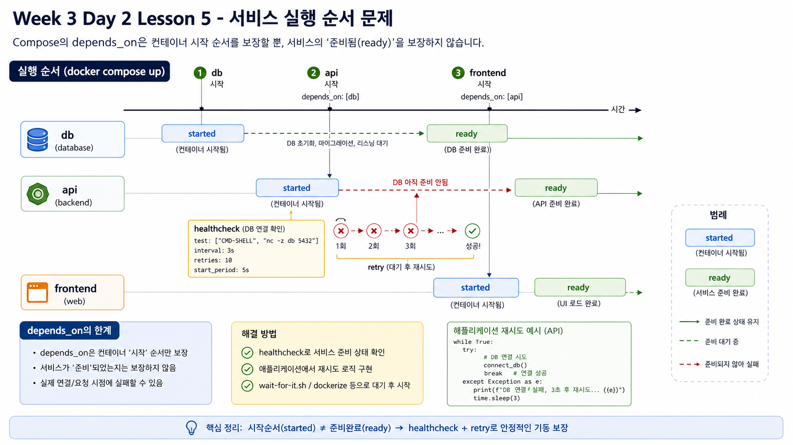

# 5교시: Poison Message와 DLQ 필요성



## 수업 목표
- 잘못된 queue message가 worker에 어떤 영향을 주는지 확인한다.
- message가 소비된 뒤 실패하면 evidence가 어떻게 사라질 수 있는지 이해한다.
- retry, dead-letter queue, schema validation 필요성을 설명한다.
- 단순 worker log 확인을 넘어 실패 message 처리 정책을 논의한다.

## 사고 시나리오
정상 message:

```json
{"order_id": 12, "request_id": "day2-..."}
```

poison message:

```text
not-json-day2-poison
```

worker는 queue에서 message를 꺼내 JSON으로 파싱하려고 한다. 파싱에 실패하면 error log를 남긴다. 그런데 이 교육용 worker에는 DLQ가 없으므로 message가 별도로 보관되지 않는다.

## 실행
```bash
cd week3/day2/labs/incident-scenarios
./03_poison_message.sh
```

## 봐야 할 Evidence
| Evidence | 질문 |
|---|---|
| worker log | `worker_error`가 남았는가 |
| queue length | poison message가 남아 있는가 |
| audit_logs | 업무 event로 기록됐는가 |
| request id | 추적 가능한 id가 있는가 |

## 해석
| 관찰 | 의미 |
|---|---|
| `worker_error` | worker가 message 처리에 실패했다 |
| queue length 0 | message가 소비된 뒤 사라졌을 수 있다 |
| audit row 없음 | 업무 처리 단계까지 가지 못했다 |
| request id 없음 | 추적이 더 어렵다 |

이 시나리오는 현실적이다. 운영에서는 잘못된 payload, schema 변경, 배포 버전 불일치, 수동 queue 주입 실수로 poison message가 발생할 수 있다.

## 왜 위험한가
| 위험 | 설명 |
|---|---|
| silent loss | 실패 message가 사라져 재처리할 수 없다 |
| 반복 실패 | 같은 message가 계속 worker를 실패시킬 수 있다 |
| backlog blockage | queue 종류에 따라 뒤 message 처리가 막힐 수 있다 |
| 원인 추적 어려움 | request id와 payload metadata가 없으면 조사 어렵다 |

## 필요한 설계
| 설계 | 목적 |
|---|---|
| schema validation | worker 처리 전에 message 형태 검증 |
| retry metadata | 몇 번 실패했는지 기록 |
| DLQ | 반복 실패 message를 별도 queue로 격리 |
| error reason | 실패 원인 저장 |
| alert | DLQ 증가나 worker error rate 감지 |

## 실무형 Runbook
| 단계 | 명령/확인 | 판단 |
|---|---|---|
| 1 | worker error rate 확인 | poison message 가능성 |
| 2 | queue depth 확인 | backlog 동반 여부 |
| 3 | 실패 payload 샘플 확인 | schema mismatch 여부 |
| 4 | DLQ 확인 | 격리된 message 수 |
| 5 | 재처리 가능성 판단 | idempotency와 데이터 상태 확인 |

현재 실습에는 DLQ가 없다. 그래서 "없는 것" 자체가 학습 포인트다.

## 운영 리포트 문장
```text
Redis queue에 malformed payload를 주입하자 order-worker가 worker_error를 남겼다.
이후 order-events queue length는 0이 되었고, audit_logs에는 업무 event가 남지 않았다.
현재 worker에는 DLQ가 없어 실패 message를 별도로 추적하거나 재처리하기 어렵다.
```

## 핵심 포인트
queue를 쓴다고 자동으로 안정적인 것이 아니다.

```text
queue + worker
  needs retry policy
  needs DLQ
  needs schema validation
  needs idempotent processing
```

## Evidence Note
```markdown
# W3D2S5 Poison Message
- payload:
- worker error:
- queue length after consume:
- audit row:
- lost evidence:
- required design:
```


## 학습 제어
### 시작 3분 회상
- backlog가 줄어드는 것과 모든 메시지가 정상 처리되는 것은 어떻게 다른가?
- poison message를 일반 retry와 DLQ로 처리할 때 책임은 어떻게 달라지는가?
### 오늘 반드시 가져갈 것
- 반복 실패 메시지는 처리량 문제가 아니라 격리·재처리·알림 책임의 문제다.
- DLQ는 실패를 숨기는 곳이 아니라 복구 가능한 증거를 보존하는 곳이다.
### 최소 복구 경로
- malformed message를 재현한다 → 소비 logs와 retry 횟수를 확인한다 → DLQ 이동과 재처리 기준을 확인한다.
- 성공 판정은 정상 메시지와 poison message를 분리하는 것이다. 첫 실패는 consumer logs와 message payload 검증에서 찾는다.
- 다음 lesson 진입 조건은 DLQ에서 안전하게 복구할 조건을 말하는 것이다.