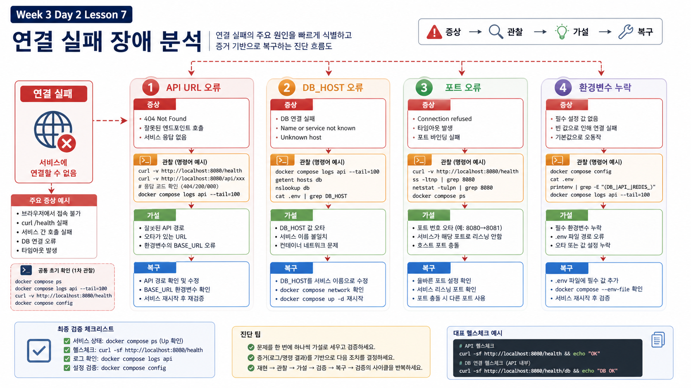

# 7교시: Incident Timeline과 현실형 Runbook



## 수업 목표
- 단일 장애 리포트가 아니라 사고 timeline을 작성한다.
- client, API, DB, queue, worker, audit evidence를 시간 순서로 묶는다.
- 사고 유형별 의사결정표를 만든다.
- 복구 명령보다 복구 기준을 먼저 정의한다.

## 왜 timeline인가
MSA 사고는 한 줄로 설명하기 어렵다.

나쁜 리포트:

```text
Redis 장애로 주문이 안 됐습니다.
```

좋은 timeline:

```text
T1 client가 주문 요청을 보냈다.
T2 order-api가 DB에 pending 주문을 만들었다.
T3 Redis publish가 실패했다.
T4 client는 503을 받았다.
T5 queue에는 event가 없다.
T6 audit에는 order_created만 있고 order_processed는 없다.
T7 이 주문은 자동 처리되지 않는 ghost pending order다.
```

## Timeline Template
| 단계 | Evidence | 해석 |
|---|---|---|
| Client | HTTP status/body | 사용자가 본 결과 |
| API | order-api log 또는 audit | API가 어느 단계까지 수행했는가 |
| DB | `orders` row | 업무 상태가 남았는가 |
| Queue | Redis `LLEN` | 처리 event가 존재하는가 |
| Worker | worker log | event를 소비/실패했는가 |
| Audit | `audit_logs` | 업무 event가 어느 단계까지 기록됐는가 |
| Decision | 조치 | 재처리/취소/대기/확대 판단 |

## 사고 유형별 Decision Table
| 사고 | 판단 기준 | 우선 조치 |
|---|---|---|
| Ghost pending order | DB pending row 있음, queue event 없음 | 재발행/취소 정책 확인 |
| Worker backlog | queue length 증가, pending 다수 | worker 복구 또는 scale out |
| Poison message | worker_error, audit 없음 | DLQ 격리, payload 검증 |
| Duplicate request | 같은 request id row 다수 | idempotency 설계 필요 |
| DB down | 여러 API readiness 실패 | DB 복구 후 dependent service 확인 |

## Runbook은 명령 모음이 아니다
명령만 있는 runbook은 부족하다.

나쁜 runbook:

```bash
docker compose restart order-worker
docker compose logs order-worker
```

좋은 runbook:

| 순서 | 확인 | 판단 | 다음 행동 |
|---|---|---|---|
| 1 | client status | 실패/성공 여부 | 내부 상태와 비교 |
| 2 | DB order row | pending/processed/duplicate | queue 또는 worker 확인 |
| 3 | Redis queue | event 있음/없음 | worker 복구 또는 재발행 판단 |
| 4 | worker log | processed/error/없음 | poison/backlog/down 구분 |
| 5 | audit log | created/processed 여부 | 업무 단계 확정 |
| 6 | recovery evidence | 상태 정상화 여부 | incident close |

## 실습
네 스크립트 중 하나를 다시 실행하고 timeline을 작성한다.

```bash
cd week3/day2/labs/incident-scenarios
./01_ghost_pending_order.sh
```

또는:

```bash
COUNT=8 ./02_backlog_drain.sh
./03_poison_message.sh
./04_duplicate_request.sh
```

## 운영 리포트 표
| 항목 | 작성 내용 |
|---|---|
| Incident title | |
| Scenario script | |
| Request id / prefix | |
| User-visible symptom | |
| Internal state mismatch | |
| Queue evidence | |
| DB evidence | |
| Worker evidence | |
| Audit evidence | |
| Immediate action | |
| Long-term fix | |

## 복구 기준 예시
| 사고 | 복구 기준 |
|---|---|
| Ghost pending order | pending 주문이 재발행/취소/처리 중 하나로 정리됨 |
| Backlog | queue length가 정상 범위로 감소하고 pending이 processed로 전환 |
| Poison message | 실패 message가 DLQ 또는 조사 대상으로 격리됨 |
| Duplicate request | 중복 row 영향이 정리되고 idempotency 보완 계획이 생김 |

## 핵심 포인트
현실적인 장애 대응은 "뭘 재시작할까"보다 "어떤 상태를 정상으로 볼까"를 먼저 정하는 일이다.

```text
recovery command
  < recovery evidence
  < recovery criteria
```

## Evidence Note
```markdown
# W3D2S7 Incident Timeline
- scenario:
- timeline:
- mismatch:
- decision:
- recovery criteria:
- immediate action:
- long-term fix:
```
