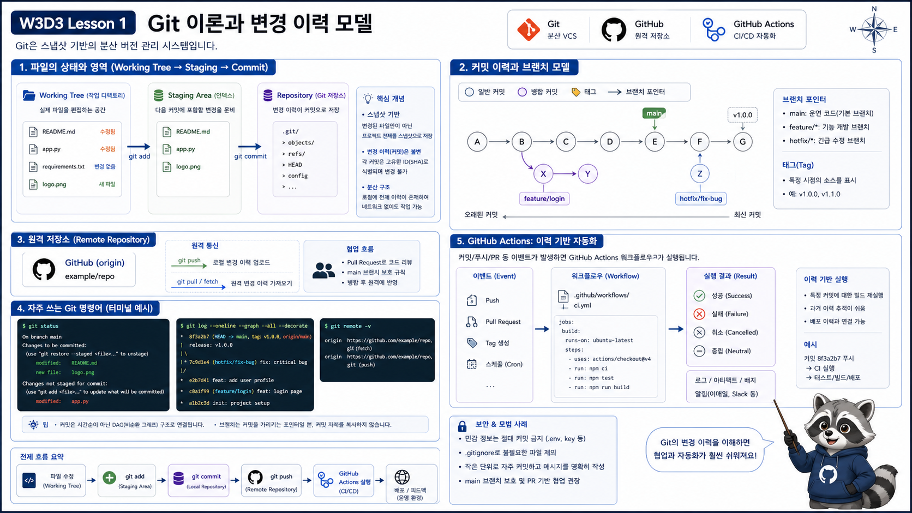

# 1교시: Git 이론과 변경 이력 모델



## 수업 목표
- Git이 파일 백업 도구가 아니라 변경 이력 그래프임을 이해한다.
- working tree, staging area, commit, branch, remote, tag를 구분한다.
- GitHub 협업과 GitHub Actions가 Git 이력 위에서 동작한다는 점을 설명한다.

## Git의 핵심 모델
```text
working tree -> staging area -> commit -> branch -> remote
```

| 개념 | 의미 |
|---|---|
| working tree | 현재 파일 상태 |
| staging area | 다음 commit에 포함할 변경 |
| commit | 변경 스냅샷과 메시지 |
| branch | commit을 가리키는 이름 |
| remote | GitHub 같은 원격 저장소 |
| tag | 특정 commit에 붙이는 고정 이름 |

## 실습
```bash
cd /mnt/d/paperclip
git status -sb
git branch --show-current
git log --oneline -5
git remote -v
```

## 해석 기준
| 출력 | 해석 |
|---|---|
| `M` | tracked file 수정 |
| `??` | untracked file |
| `main` | 현재 branch |
| `origin` | 기본 원격 저장소 |

## 왜 인프라 엔지니어에게 Git이 중요한가
인프라 변경도 코드 변경처럼 추적되어야 한다.

| 변경 | Git이 필요한 이유 |
|---|---|
| Terraform module 수정 | 누가 어떤 리소스를 바꿨는지 추적 |
| Kubernetes manifest 수정 | 배포된 설정과 commit 연결 |
| GitHub Actions workflow 수정 | CI/CD 동작 변경 추적 |
| Secret 참조 변경 | 민감정보 노출 없이 사용 이력 관리 |

## 핵심 포인트
Git 이력을 이해하지 못하면 GitHub Actions와 배포 자동화도 흔들린다.

```text
무엇을 바꿨는가
누가 바꿨는가
언제 바꿨는가
어떤 commit을 배포했는가
```

## Evidence Note
```markdown
# W3D3S1 Git Model
- current branch:
- modified files:
- remote:
- latest commit:
- tag use case:
```
