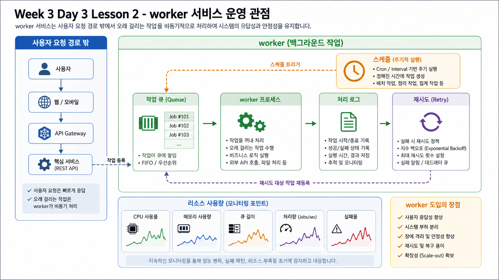

# 2교시: 개발자가 많이 쓰는 GitHub 흐름



## 수업 목표
- 개발자가 GitHub에서 issue, branch, PR, review를 어떻게 쓰는지 설명한다.
- 작은 PR과 code review가 왜 중요한지 이해한다.
- GitHub Flow를 기본 협업 모델로 설명한다.

## 개발자의 기본 흐름
```text
issue 확인
  -> branch 생성
  -> code 변경
  -> commit/push
  -> pull request
  -> review
  -> status check
  -> merge
```

## GitHub Flow
| 단계 | 설명 |
|---|---|
| main은 항상 배포 가능해야 한다 | 안정 branch |
| branch는 짧게 유지한다 | 충돌과 drift 감소 |
| PR은 작게 만든다 | review 가능성 증가 |
| CI를 통과해야 merge한다 | 자동 gate |

## PR에 들어갈 내용
```markdown
## What changed
-

## Why
-

## Verification
-

## Risk
-
```

## 개발자 관점의 GitHub 기능
| 기능 | 개발자 사용 |
|---|---|
| Issue | 작업 요구사항과 버그 기록 |
| Pull Request | 코드 리뷰와 토론 |
| Review comment | 코드 라인 단위 피드백 |
| Status check | test/lint/build 결과 |
| Code owner | 특정 파일 담당 reviewer 자동 지정 |

## 나쁜 PR과 좋은 PR
| 나쁜 PR | 좋은 PR |
|---|---|
| 여러 기능을 한 번에 수정 | 하나의 의도만 수정 |
| 테스트 없음 | 실행한 검증 명령 포함 |
| 제목이 `fix` | 변경 목적이 드러남 |
| 큰 binary와 코드가 섞임 | 산출물과 코드 변경 분리 |

## 핵심 포인트
개발자가 GitHub를 잘 쓴다는 것은 commit을 많이 한다는 뜻이 아니다. 변경을 reviewer와 CI가 이해할 수 있는 단위로 쪼갠다는 뜻이다.

## Evidence Note
```markdown
# W3D3S2 Developer GitHub Flow
- issue:
- branch:
- PR title:
- review point:
- status check:
```
