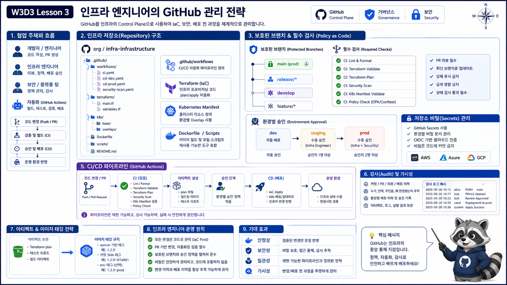

# 3교시: 인프라 엔지니어의 GitHub 관리 전략



## 수업 목표
- 인프라 엔지니어가 GitHub를 코드 저장소 이상으로 사용하는 방식을 설명한다.
- IaC, workflow, secret, protected branch, audit trail을 연결한다.
- GitHub 관리 전략이 배포 사고를 줄이는 방식을 이해한다.

## 개발자와 인프라 엔지니어의 관점 차이
| 관점 | 개발자 | 인프라 엔지니어 |
|---|---|---|
| 주요 변경 | application code | workflow, Dockerfile, IaC, manifest |
| 주요 위험 | 기능 버그 | 배포 실패, secret 노출, 잘못된 리소스 변경 |
| 주요 gate | test, review | plan, policy, approval, environment |
| 주요 evidence | test result | workflow log, artifact, image tag, audit |

## 인프라 GitHub 관리 대상
| 대상 | 관리 포인트 |
|---|---|
| `.github/workflows` | 누가 어떤 자동화를 실행하는가 |
| Dockerfile | build context, secret 포함 여부, image size |
| Terraform | plan/apply 승인, state 보호 |
| Kubernetes manifest | namespace, image tag, secret 참조 |
| branch protection | main/prod 직접 변경 차단 |
| repository secrets | token 권한과 노출 방지 |

## Protected branch 기준
| 설정 | 목적 |
|---|---|
| require pull request | 직접 push 방지 |
| require approvals | 사람 검토 |
| require status checks | CI 통과 강제 |
| restrict who can push | 운영 branch 보호 |
| require conversation resolved | 미해결 리뷰 방치 방지 |

## Secret 관리
Docker Hub push에 필요한 값:

| Secret | 설명 |
|---|---|
| `DOCKERHUB_USERNAME` | Docker Hub namespace |
| `DOCKERHUB_TOKEN` | password 대신 access token |

주의:

```text
workflow에서 echo로 secret 출력 금지
Dockerfile에 secret COPY 금지
.env commit 금지
```

## 핵심 포인트
인프라 엔지니어에게 GitHub는 배포 통제면이다. 누가 어떤 변경을 어떤 검증을 거쳐 어느 환경에 반영했는지 남겨야 한다.

## Evidence Note
```markdown
# W3D3S3 Infra GitHub Strategy
- protected branch:
- required checks:
- secrets:
- workflow owner:
- audit evidence:
```
