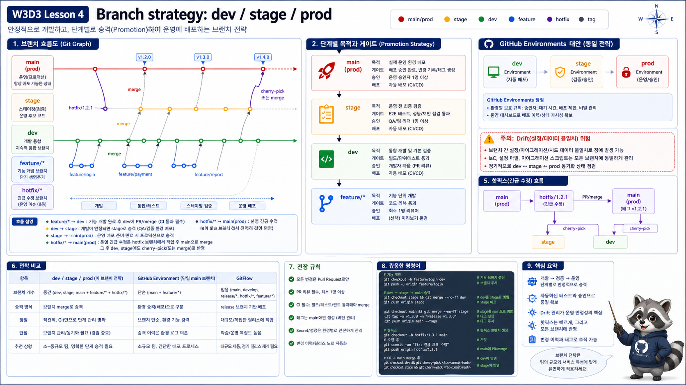

# 4교시: Branch 전략 - dev, stage, prod



## 수업 목표
- `dev`, `stage`, `prod` branch 전략의 장단점을 설명한다.
- branch와 environment를 분리해서 생각한다.
- promotion 방식과 drift 위험을 이해한다.

## 흔한 전략 1: dev/stage/prod branch
```text
feature/*
  -> dev
  -> stage
  -> prod
```

장점:

| 장점 | 설명 |
|---|---|
| 환경별 승인 명확 | stage/prod 승인을 branch로 표현 |
| 운영팀 이해 쉬움 | prod branch가 운영 기준 |
| hotfix 경로 분리 가능 | prod에서 긴급 수정 관리 |

단점:

| 단점 | 설명 |
|---|---|
| branch drift | dev/stage/prod가 서로 달라짐 |
| cherry-pick 증가 | 일부 변경만 올리려다 이력 복잡 |
| conflict 증가 | 오래 유지되는 branch는 충돌 가능성 큼 |

## 전략 2: main + GitHub Environment
```text
feature/*
  -> main
  -> deploy dev/stage/prod by environment gate
```

장점:

| 장점 | 설명 |
|---|---|
| 코드 이력 단순 | main 중심 |
| 환경 정책 분리 | GitHub Environment approval 사용 |
| CI/CD와 잘 맞음 | 같은 commit을 환경별로 promotion |

단점:

| 단점 | 설명 |
|---|---|
| 초기 설계 필요 | workflow와 environment 설정 필요 |
| 조직 이해 필요 | branch가 환경이라는 사고에서 전환 필요 |

## 선택 기준
| 상황 | 추천 |
|---|---|
| 초급 팀, 환경 승인 명확히 보여야 함 | dev/stage/prod branch |
| CI/CD 성숙, 배포 자동화 중심 | main + environment |
| 릴리스 주기 길고 hotfix 많음 | Git Flow 일부 |
| 빠른 웹 서비스 | GitHub Flow |

## 실습 질문
W3D2의 `order-worker` 변경을 운영에 반영한다고 가정한다.

| 질문 | 답 |
|---|---|
| dev에서 먼저 확인할 것은 무엇인가 | |
| stage에서 확인할 것은 무엇인가 | |
| prod에 바로 들어가면 안 되는 이유는 무엇인가 | |
| Docker image tag는 어느 단계에서 고정할 것인가 | |

## 핵심 포인트
branch는 환경을 표현할 수도 있지만, 항상 좋은 답은 아니다. 중요한 것은 같은 commit과 같은 image가 어떤 gate를 거쳐 dev/stage/prod로 올라가는지 추적하는 것이다.

## Evidence Note
```markdown
# W3D3S4 Branch Strategy
- selected model:
- dev gate:
- stage gate:
- prod gate:
- drift risk:
- image tag policy:
```
