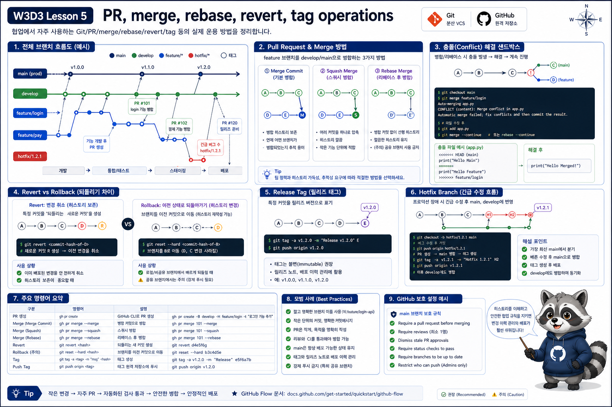

# 5교시: PR, Merge, Rebase, Revert, Tag 운영



## 수업 목표
- PR merge 방식과 history 운영 기준을 설명한다.
- rebase/conflict/revert/tag를 안전한 sandbox에서 실습한다.
- Git revert와 deployment rollback을 구분한다.

## Merge 방식 비교
| 방식 | 장점 | 주의 |
|---|---|---|
| merge commit | branch 이력 보존 | history가 복잡 |
| squash merge | PR 하나를 commit 하나로 정리 | 세부 commit 사라짐 |
| rebase merge | linear history | 공유 branch rebase 주의 |

## Sandbox 만들기
```bash
bash week3/day3/labs/git-sandbox/setup.sh
cd /tmp/w3d3-git-sandbox
git log --oneline --graph --decorate --all
```

## Conflict 재현
```bash
git switch feature/change-message
git rebase main
git status
cat app.txt
```

기대:

```text
CONFLICT
```

Abort:

```bash
git rebase --abort
```

## Revert
```bash
git switch main
git revert HEAD --no-edit
git log --oneline --graph --decorate -6
```

revert는 기존 commit을 지우지 않고, 반대 변경을 새 commit으로 남긴다.

## Tag
```bash
git tag v0.1.0
git tag --list
git show --stat v0.1.0
```

tag는 릴리스 지점을 고정한다. Docker image tag와 연결될 수 있다.

## Revert와 Rollback 구분
| 구분 | 의미 |
|---|---|
| Git revert | 코드 이력을 되돌리는 commit |
| Docker image rollback | 이전 image tag로 실행 |
| Kubernetes rollout undo | 이전 ReplicaSet으로 되돌림 |
| DB rollback | migration/data 복구 |

## 핵심 포인트
공유 branch에서 history를 지우는 방식은 위험하다. 이미 올라간 변경은 revert로 남기고, 배포된 artifact는 별도 rollback 기준으로 다룬다.

## Evidence Note
```markdown
# W3D3S5 PR Merge Operations
- merge method:
- conflict file:
- revert commit:
- tag:
- rollback target:
```
