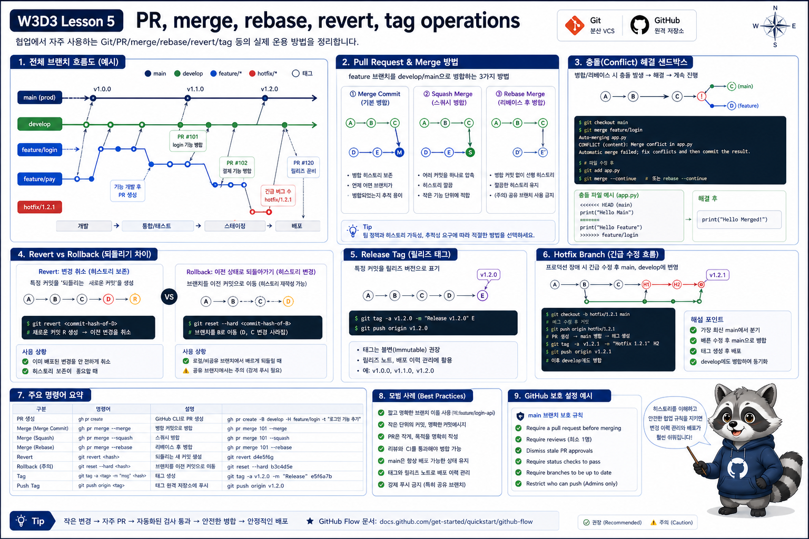

# 5교시: PR, Merge, Rebase, Revert, Tag 운영



## 수업 목표
- PR merge 방식과 history 운영 기준을 설명한다.
- rebase/conflict/revert/tag를 안전한 sandbox에서 실습한다.
- Git revert와 deployment rollback을 구분한다.

## Merge 방식 비교
| 방식 | 장점 | 주의 |
|---|---|---|
| merge commit | branch 이력 보존 | history가 복잡 |
| squash merge | PR 하나를 commit 하나로 정리 | 세부 commit 사라짐 |
| rebase merge | linear history | 공유 branch rebase 주의 |

## Sandbox 만들기
```bash
bash week3/day3/labs/git-sandbox/setup.sh
cd /tmp/w3d3-git-sandbox
git log --oneline --graph --decorate --all
```

macOS에서 다음 오류가 나오면 실행 권한 문제가 아니다.

```text
sed: 1: "app.txt
": command a expects \ followed by text
```

원인은 macOS 기본 BSD sed와 Linux GNU sed의 `sed -i` 문법 차이다. 수업용 `setup.sh`는 `sed -i`를 쓰지 않는 portable 방식으로 수정되어 있으므로 최신 파일로 다시 실행한다.

## Conflict 재현
```bash
git switch feature/change-message
git rebase main
git status
cat app.txt
```

기대:

```text
CONFLICT
```

Abort:

```bash
git rebase --abort
```

## Revert
```bash
git switch main
git revert HEAD --no-edit
git log --oneline --graph --decorate -6
```

revert는 기존 commit을 지우지 않고, 반대 변경을 새 commit으로 남긴다.

## Tag
```bash
git tag v0.1.0
git tag --list
git show --stat v0.1.0
```

tag는 릴리스 지점을 고정한다. Docker image tag와 연결될 수 있다.

## Revert와 Rollback 구분
| 구분 | 의미 |
|---|---|
| Git revert | 코드 이력을 되돌리는 commit |
| Docker image rollback | 이전 image tag로 실행 |
| Kubernetes rollout undo | 이전 ReplicaSet으로 되돌림 |
| DB rollback | migration/data 복구 |

## 핵심 포인트
공유 branch에서 history를 지우는 방식은 위험하다. 이미 올라간 변경은 revert로 남기고, 배포된 artifact는 별도 rollback 기준으로 다룬다.

## Evidence Note
```markdown
# W3D3S5 PR Merge Operations
- merge method:
- conflict file:
- revert commit:
- tag:
- rollback target:
```


## 학습 제어
### 시작 3분 회상
- 동일 commit/image promotion이 drift를 줄이는 이유는 무엇인가?
- merge, rebase, revert, tag는 이력/복구에서 어떤 책임을 갖는가?
### 오늘 반드시 가져갈 것
- Git 이력 rollback과 artifact/deployment rollback은 서로 다른 기준 상태를 되돌린다.
- 공유 branch rebase보다 재현 가능한 revert와 tag 증거가 운영 복구에 중요하다.
### 최소 복구 경로
- sandbox branch에서 충돌을 재현한다 → 실패/abort 증거를 남긴다 → revert와 tag 결과를 확인한다.
- 성공 판정은 Git·image·Kubernetes rollback을 구분하는 것이다. 첫 실패는 conflict output와 status에서 찾는다.
- 다음 lesson 진입 조건은 CI가 어떤 commit을 검증하는지 설명하는 것이다.

### W3D3 필수 흐름
`branch/PR → CI 실패 증거 → 로컬 수정 → 재실행 → 통과 기록`을 필수로 한다. rebase와 tag는 기본 흐름 뒤 선택 심화이며, Docker Hub push는 lesson-07에서 선택 심화로 다룬다.