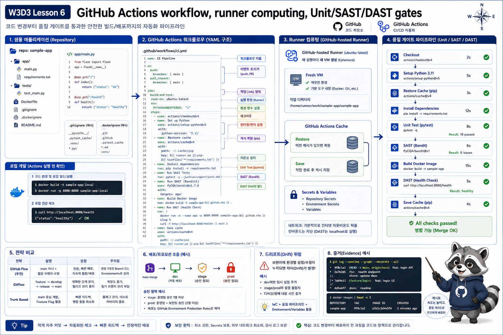

# 6교시: GitHub Actions 1 - 코드, Workflow, Unit/SAST/DAST Gate



## 수업 목표
- GitHub Actions로 빌드할 sample app 구조를 이해한다.
- `.gitignore`, `.dockerignore`가 왜 필요한지 확인한다.
- unit test, SAST, DAST가 서로 무엇을 검증하는지 구분한다.
- Docker image를 로컬에서 build/run하여 Actions 전에 검증한다.
- GitHub Actions workflow YAML을 직접 작성하는 기본 절차를 익힌다.

## Sample App 구조
```bash
find week3/day3/labs/dockerhub-app -maxdepth 2 -type f | sort
```

구성:

| 파일 | 역할 |
|---|---|
| `app.py` | `/health` JSON을 반환하는 작은 HTTP app |
| `Dockerfile` | Python alpine 기반 image build |
| `.dockerignore` | image build context에서 제외할 파일 |
| `README.md` | local build/run/pull 절차 |

## `.gitignore` 확인
```bash
cat .gitignore
```

확인할 것:

| 항목 | 이유 |
|---|---|
| `.env` | secret 노출 방지 |
| `node_modules` | dependency output 제외 |
| `private/` | 개인 자료 제외 |
| `out_lecture/**/*.md` | export 산출물 중 markdown 제외 |

## `.dockerignore` 확인
```bash
cat week3/day3/labs/dockerhub-app/.dockerignore
```

확인할 것:

| 항목 | 이유 |
|---|---|
| `.git/` | image에 Git history 포함 방지 |
| `.env` | secret 포함 방지 |
| cache/build output | image size와 build context 감소 |

## 로컬 Docker Build
```bash
cd /mnt/d/paperclip
bash week3/day3/labs/quality-gates/unit-test.sh
bash week3/day3/labs/quality-gates/sast-scan.sh

docker build \
  --build-arg APP_VERSION=0.1.0 \
  -t w3d3-dockerhub-app:0.1.0 \
  week3/day3/labs/dockerhub-app
```

## 로컬 실행 검증
```bash
docker rm -f w3d3-dockerhub-app 2>/dev/null || true
docker run -d --name w3d3-dockerhub-app -p 18088:8080 w3d3-dockerhub-app:0.1.0
curl -s http://localhost:18088/health
docker logs --tail=20 w3d3-dockerhub-app
docker rm -f w3d3-dockerhub-app
```

## Unit Test, SAST, DAST
| Gate | 실행 명령 | 확인하는 것 |
|---|---|---|
| unit test | `unit-test.sh` | app 함수/응답 구조 |
| SAST | `sast-scan.sh` | 위험 코드 패턴, hardcoded secret |
| DAST | `dast-health-check.sh` | container 실행 후 HTTP health |

한 번에 실행:

```bash
bash week3/day3/labs/quality-gates/run-all-local.sh
```

## Gate가 늘어나면 느려진다
| 추가 절차 | 늘어나는 시간 | 얻는 것 |
|---|---|---|
| unit test | 짧음 | 기본 회귀 방지 |
| SAST | 짧음~중간 | secret/위험 코드 조기 발견 |
| Docker build | 중간 | artifact 생성 검증 |
| cache restore/save | 짧음~중간 | 반복 build 시간 감소 |
| DAST | 짧음~중간 | 실행 후 health 확인 |

느려지는 것은 사실이다. 하지만 사람이 수동으로 매번 같은 검증을 기억해서 수행하는 것보다, 자동화된 gate가 더 재현 가능하다.

성공 기준:

| Evidence | 기준 |
|---|---|
| build | image 생성 성공 |
| curl | `status: ok`, `version: 0.1.0` |
| logs | `starting`, `http_access` |

## Workflow 파일 위치
GitHub Actions workflow는 repository 안의 정해진 경로에 둔다.

```text
.github/workflows/dockerhub-publish.yml
```

파일 이름은 자유롭게 정할 수 있지만, 확장자는 보통 `.yml` 또는 `.yaml`을 쓴다. GitHub는 이 경로에 있는 workflow 파일을 읽고 Actions 탭에 표시한다.

## Workflow 작성 순서
처음부터 Docker Hub push까지 한 번에 쓰려고 하면 헷갈린다. 다음 순서로 늘려간다.

| 순서 | 작성할 것 | 확인할 것 |
|---|---|---|
| 1 | `name` | Actions 화면에 보이는 workflow 이름 |
| 2 | `on` | 언제 실행할지 |
| 3 | `jobs` | 어떤 작업 묶음을 실행할지 |
| 4 | `runs-on` | 어떤 runner에서 실행할지 |
| 5 | `steps` | 실제 실행 단계 |
| 6 | `uses` | 이미 만들어진 action 사용 |
| 7 | `run` | shell 명령 직접 실행 |
| 8 | `env` | 반복해서 쓰는 값 정의 |
| 9 | `secrets` | token/password 같은 민감 값 참조 |

## 최소 Workflow
가장 작은 workflow부터 확인한다.

```yaml
name: w3d3-first-action

on:
  workflow_dispatch:

jobs:
  hello:
    runs-on: ubuntu-latest
    steps:
      - name: Print runner info
        run: |
          pwd
          uname -a
          echo "hello github actions"
```

이 workflow는 Docker build를 하지 않는다. 목적은 `on`, `jobs`, `runs-on`, `steps`, `run`의 위치를 눈에 익히는 것이다.

## Workflow 핵심 문법
| 문법 | 의미 | 예시 |
|---|---|---|
| `name` | workflow 이름 | `w3d3-dockerhub-publish` |
| `on.workflow_dispatch` | 수동 실행 버튼 제공 | Actions UI에서 Run workflow |
| `on.push.tags` | tag push 때 실행 | `v*.*.*` |
| `jobs.<job_id>` | job 식별자 | `build-and-push` |
| `runs-on` | runner image | `ubuntu-latest` |
| `steps[].name` | log에 보이는 step 이름 | `Run unit test` |
| `steps[].uses` | 외부 action 호출 | `actions/checkout@v4` |
| `steps[].run` | shell 명령 실행 | `docker build ...` |
| `env` | 환경 변수 | `IMAGE_NAME` |
| `${{ secrets.NAME }}` | GitHub Secret 참조 | `${{ secrets.DOCKERHUB_TOKEN }}` |
| `${{ steps.ID.outputs.KEY }}` | 이전 step 출력 참조 | `${{ steps.meta.outputs.version }}` |

## Runner Computing 이해
GitHub Actions에서 실제 명령을 실행하는 컴퓨팅 자원을 runner라고 부른다.

| 구분 | 설명 |
|---|---|
| GitHub-hosted runner | GitHub가 제공하는 실행 환경 |
| self-hosted runner | 회사나 개인이 직접 운영하는 실행 환경 |
| `runs-on` | job이 어떤 runner에서 실행될지 정하는 필드 |
| workspace | runner 안에서 repository가 checkout되는 작업 디렉터리 |

GitHub-hosted runner는 수업에서 가장 편하게 쓸 수 있다. 하지만 실행할 때마다 깨끗한 환경에서 시작한다고 생각해야 한다. 그래서 로컬 PC처럼 Docker layer cache, dependency cache, build output이 항상 남아 있다고 기대하면 안 된다.

| 느려지는 지점 | 이유 |
|---|---|
| `checkout` | runner가 매번 repository를 새로 가져온다 |
| dependency install | 이전 실행에서 설치한 패키지가 기본적으로 남아 있지 않다 |
| Docker build | base image pull, layer rebuild, cache miss가 발생한다 |
| Docker Hub push | image size와 network 상태에 영향을 받는다 |

## GHA Cache
반복 build가 느리면 cache를 명시적으로 사용한다. Docker BuildKit은 GitHub Actions cache backend인 `type=gha`를 사용할 수 있다.

```yaml
- name: Build local image for DAST
  uses: docker/build-push-action@v6
  with:
    context: ${{ env.APP_DIR }}
    load: true
    tags: ${{ env.IMAGE_NAME }}:${{ steps.meta.outputs.version }}
    cache-from: type=gha
    cache-to: type=gha,mode=max
```

의미:

| 설정 | 의미 |
|---|---|
| `cache-from: type=gha` | 이전 Actions cache에서 build layer를 읽는다 |
| `cache-to: type=gha,mode=max` | 다음 실행을 위해 layer cache를 저장한다 |
| `load: true` | build한 image를 runner의 local Docker engine에 적재한다 |
| `mode=max` | 중간 layer까지 더 적극적으로 저장한다 |

cache는 공짜 마법이 아니다. cache를 복원하고 저장하는 시간도 들고, cache key나 build context가 자주 바뀌면 효과가 작다. 그래도 Docker build가 반복되는 수업/팀에서는 cold build와 warm build 시간을 비교해볼 가치가 있다.

## Self-Hosted Runner
self-hosted runner는 회사 내부 서버, 클라우드 VM, 온프레미스 장비에 runner를 직접 설치해 사용하는 방식이다.

| 장점 | 단점 |
|---|---|
| Docker cache와 dependency cache를 더 오래 유지할 수 있음 | runner OS/패치/보안 관리 책임 |
| 사내망, private registry, 내부 DB 접근 가능 | secret 노출과 workspace 오염 위험 관리 필요 |
| 큰 CPU/RAM/Disk 장비 선택 가능 | 장애 대응과 capacity 관리 필요 |
| 특수 도구가 설치된 환경 유지 가능 | 여러 repo가 공유하면 권한 분리가 어려워질 수 있음 |

수업에서는 GitHub-hosted runner를 기본으로 사용한다. self-hosted runner는 속도가 필요하거나 내부망 접근이 필요한 회사 환경에서 검토한다.

## 작성 시 주의사항
| 주의사항 | 이유 |
|---|---|
| 들여쓰기 2칸 유지 | YAML은 들여쓰기가 문법이다 |
| `run: |` 아래 명령은 한 단계 더 들여쓰기 | multi-line shell block |
| secret 값을 `echo`하지 않기 | log 노출 위험 |
| step을 너무 크게 합치지 않기 | 실패 위치와 실행 시간 분석이 어려움 |
| local에서 먼저 같은 명령을 실행하기 | runner에서 실패하기 전에 문제 확인 |
| `.sh`는 `bash script.sh`로 실행 | executable bit가 없어도 GitHub Actions에서 실행 가능 |

## Permission denied가 나는 이유
GitHub Actions에서 다음처럼 실행하면 멈출 수 있다.

```yaml
run: |
  week3/day3/labs/quality-gates/unit-test.sh
```

대표 오류:
```text
Permission denied
Process completed with exit code 126
```

원인은 script 내용이 틀린 것이 아니라, Git repository에 executable bit가 `100755`가 아니라 `100644`로 저장되어 runner에서 직접 실행 권한이 없기 때문이다. 특히 Windows/macOS에서 파일을 만들고 복사하다 보면 권한 bit를 의식하지 못하는 경우가 많다.

수업 workflow는 권한 bit에 의존하지 않도록 다음처럼 실행한다.

```yaml
run: |
  bash week3/day3/labs/quality-gates/unit-test.sh
```

이 방식은 GitHub Actions runner와 학생 로컬 환경에서 모두 안정적이다.

## Docker Hub Push Workflow 읽기
```bash
cat week3/day3/labs/github-actions/dockerhub-publish.yml
```

핵심:

| YAML | 의미 |
|---|---|
| `workflow_dispatch` | 수동 실행 가능 |
| `push.tags` | tag push 시 실행 |
| `runs-on` | GitHub-hosted runner |
| `checkout` | repo 코드 가져오기 |
| `build-push-action` | Docker build/push |
| `cache-from: type=gha` | GitHub Actions cache에서 layer 복원 |
| `cache-to: type=gha` | 다음 실행을 위해 layer 저장 |
| unit test step | push 전 코드 검증 |
| SAST step | push 전 보안/secret scan |
| DAST step | image 실행 후 health 검증 |

workflow 안의 shell script 실행은 모두 `bash ...sh` 형태로 둔다. `chmod +x`로 해결할 수도 있지만, 학생 repository마다 권한 bit가 제대로 commit됐는지 확인해야 하므로 수업에서는 `bash` 명시를 표준으로 삼는다.

## Docker Hub Workflow 작성 흐름
최종 workflow는 다음 흐름으로 작성한다.

```text
checkout
-> version metadata 만들기
-> unit test
-> SAST/secret scan
-> Docker build with gha cache
-> DAST health check
-> Docker Hub login
-> Docker Hub push
-> pull/run command 출력
```

각 step을 나눠야 Actions 화면에서 어느 단계가 실패했는지, 어느 단계가 오래 걸렸는지 바로 확인할 수 있다.

## 핵심 포인트
Actions에서 바로 push하기 전에 local gate로 같은 절차를 먼저 검증해야 한다.

```text
unit test -> SAST -> docker build -> DAST -> push
```

## Evidence Note
```markdown
# W3D3S6 Actions Local Build
- .gitignore checked:
- .dockerignore checked:
- local image:
- curl result:
- unit test:
- SAST:
- DAST:
- workflow file:
```
