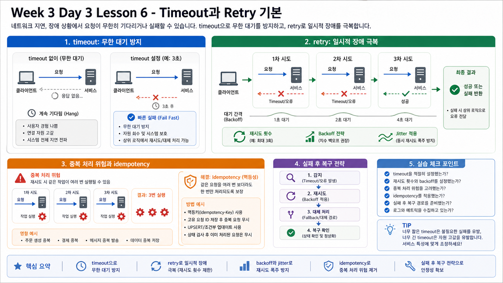

# 6교시: GitHub Actions 1 - 코드, Workflow, Unit/SAST/DAST Gate



## 수업 목표
- GitHub Actions로 빌드할 sample app 구조를 이해한다.
- `.gitignore`, `.dockerignore`가 왜 필요한지 확인한다.
- unit test, SAST, DAST가 서로 무엇을 검증하는지 구분한다.
- Docker image를 로컬에서 build/run하여 Actions 전에 검증한다.
- workflow YAML의 기본 구조를 읽는다.

## Sample App 구조
```bash
find week3/day3/labs/dockerhub-app -maxdepth 2 -type f | sort
```

구성:

| 파일 | 역할 |
|---|---|
| `app.py` | `/health` JSON을 반환하는 작은 HTTP app |
| `Dockerfile` | Python alpine 기반 image build |
| `.dockerignore` | image build context에서 제외할 파일 |
| `README.md` | local build/run/pull 절차 |

## `.gitignore` 확인
```bash
cat .gitignore
```

확인할 것:

| 항목 | 이유 |
|---|---|
| `.env` | secret 노출 방지 |
| `node_modules` | dependency output 제외 |
| `private/` | 개인 자료 제외 |
| `out_lecture/**/*.md` | export 산출물 중 markdown 제외 |

## `.dockerignore` 확인
```bash
cat week3/day3/labs/dockerhub-app/.dockerignore
```

확인할 것:

| 항목 | 이유 |
|---|---|
| `.git/` | image에 Git history 포함 방지 |
| `.env` | secret 포함 방지 |
| cache/build output | image size와 build context 감소 |

## 로컬 Docker Build
```bash
cd /mnt/d/paperclip
week3/day3/labs/quality-gates/unit-test.sh
week3/day3/labs/quality-gates/sast-scan.sh

docker build \
  --build-arg APP_VERSION=0.1.0 \
  -t w3d3-dockerhub-app:0.1.0 \
  week3/day3/labs/dockerhub-app
```

## 로컬 실행 검증
```bash
docker rm -f w3d3-dockerhub-app 2>/dev/null || true
docker run -d --name w3d3-dockerhub-app -p 18088:8080 w3d3-dockerhub-app:0.1.0
curl -s http://localhost:18088/health
docker logs --tail=20 w3d3-dockerhub-app
docker rm -f w3d3-dockerhub-app
```

## Unit Test, SAST, DAST
| Gate | 실행 명령 | 확인하는 것 |
|---|---|---|
| unit test | `unit-test.sh` | app 함수/응답 구조 |
| SAST | `sast-scan.sh` | 위험 코드 패턴, hardcoded secret |
| DAST | `dast-health-check.sh` | container 실행 후 HTTP health |

한 번에 실행:

```bash
week3/day3/labs/quality-gates/run-all-local.sh
```

## Gate가 늘어나면 느려진다
| 추가 절차 | 늘어나는 시간 | 얻는 것 |
|---|---|---|
| unit test | 짧음 | 기본 회귀 방지 |
| SAST | 짧음~중간 | secret/위험 코드 조기 발견 |
| Docker build | 중간 | artifact 생성 검증 |
| DAST | 짧음~중간 | 실행 후 health 확인 |

느려지는 것은 사실이다. 하지만 사람이 수동으로 매번 같은 검증을 기억해서 수행하는 것보다, 자동화된 gate가 더 재현 가능하다.

성공 기준:

| Evidence | 기준 |
|---|---|
| build | image 생성 성공 |
| curl | `status: ok`, `version: 0.1.0` |
| logs | `starting`, `http_access` |

## Workflow 초안 읽기
```bash
cat week3/day3/labs/github-actions/dockerhub-publish.yml
```

핵심:

| YAML | 의미 |
|---|---|
| `workflow_dispatch` | 수동 실행 가능 |
| `push.tags` | tag push 시 실행 |
| `runs-on` | GitHub-hosted runner |
| `checkout` | repo 코드 가져오기 |
| `build-push-action` | Docker build/push |
| unit test step | push 전 코드 검증 |
| SAST step | push 전 보안/secret scan |
| DAST step | image 실행 후 health 검증 |

## 핵심 포인트
Actions에서 바로 push하기 전에 local gate로 같은 절차를 먼저 검증해야 한다.

```text
unit test -> SAST -> docker build -> DAST -> push
```

## Evidence Note
```markdown
# W3D3S6 Actions Local Build
- .gitignore checked:
- .dockerignore checked:
- local image:
- curl result:
- unit test:
- SAST:
- DAST:
- workflow file:
```
