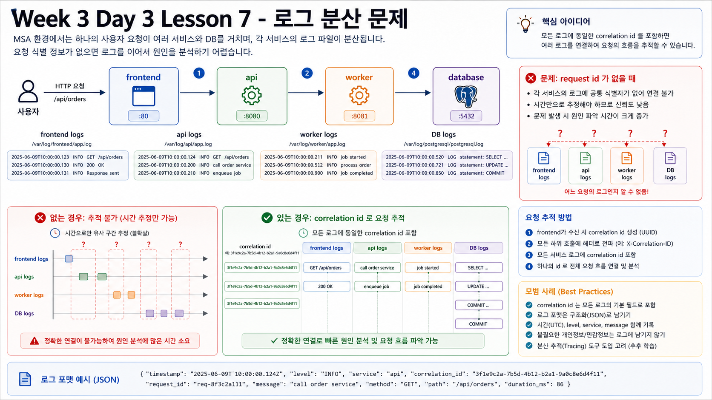

# 7교시: GitHub Actions 2 - Secrets, Docker Hub Push, 유사 도구



## 수업 목표
- GitHub Actions에서 Docker Hub에 image를 push하는 흐름을 설명한다.
- Docker Hub secrets, image tag, buildx, push 로그를 확인한다.
- Docker Hub에서 생성된 image를 확인하고 로컬에서 pull/run한다.
- GitHub Secrets의 장점과 단점을 설명한다.
- Jenkins, TeamCity, AWS CodePipeline과 GitHub Actions를 비교한다.

## Docker Hub 준비
필요한 것:

| 항목 | 설명 |
|---|---|
| Docker Hub 계정 | image repository owner |
| Access Token | GitHub Actions에서 login할 token |
| GitHub Secrets | token을 안전하게 저장 |
| repository name | `w3d3-dockerhub-app` |
| visibility | public/private 선택 |

수업에서는 Docker Hub password를 workflow나 문서에 쓰지 않고 access token을 사용한다.

GitHub repository secrets:

| Secret | 값 |
|---|---|
| `DOCKERHUB_USERNAME` | Docker Hub username |
| `DOCKERHUB_TOKEN` | Docker Hub access token |

## GitHub Secrets 장단점
| 장점 | 설명 |
|---|---|
| repo에 token을 저장하지 않음 | source code 노출 위험 감소 |
| Actions에서 쉽게 참조 | `${{ secrets.NAME }}` |
| log masking 지원 | 실수로 출력해도 일부 보호 |
| environment별 분리 가능 | dev/stage/prod secret 분리 |

| 단점 | 설명 |
|---|---|
| 값 재확인 불가 | 저장 후 UI에서 다시 볼 수 없음 |
| 권한 관리 필요 | 누가 secret을 수정할 수 있는지 통제 필요 |
| rotation 필요 | token 만료/교체 절차 필요 |
| 만능 보안 아님 | workflow가 악성으로 바뀌면 secret 사용 위험 |

## Workflow 핵심 구간
```yaml
- name: Login to Docker Hub
  uses: docker/login-action@v3
  with:
    username: ${{ secrets.DOCKERHUB_USERNAME }}
    password: ${{ secrets.DOCKERHUB_TOKEN }}

- name: Build and push image
  uses: docker/build-push-action@v6
  with:
    context: week3/day3/labs/dockerhub-app
    push: true
```

## 실행 방법
방법 1: Git tag push

```bash
git tag v0.1.0
git push origin v0.1.0
```

방법 2: GitHub UI에서 manual run

```text
Actions -> w3d3-dockerhub-publish -> Run workflow
```

## Actions에서 확인할 것
| 위치 | Evidence |
|---|---|
| workflow run | success/failure |
| Prepare image metadata | image name과 version |
| Login to Docker Hub | login 성공 |
| Build and push image | pushed digest, tag |
| Show pull command | pull/run 명령 |

## 수동 배포의 불편함
GitHub Actions가 없으면 사람이 다음을 직접 해야 한다.

```text
테스트 실행
Docker build
Docker login
Docker tag
Docker push
Docker Hub 확인
서버에서 pull
서버에서 run
검증 curl
```

문제:

| 문제 | 설명 |
|---|---|
| 누락 | test나 scan을 빼먹기 쉽다 |
| 불일치 | 사람마다 명령과 tag 기준이 다르다 |
| 증거 부족 | 누가 어떤 image를 push했는지 흐리다 |
| secret 위험 | 로컬 shell history나 화면에 token 노출 가능 |
| 재현 어려움 | 같은 절차를 반복하기 어렵다 |

Actions는 이 절차를 YAML로 고정하고 실행 로그를 남긴다.

## Docker Hub에서 확인
Docker Hub UI:

```text
Repositories -> DOCKERHUB_USERNAME/w3d3-dockerhub-app -> Tags
```

확인:

| 항목 | 기준 |
|---|---|
| `0.1.0` tag | version tag 생성 |
| `latest` tag | latest도 생성 |
| pushed time | workflow 실행 시각과 일치 |

## 로컬 pull/run 검증
Docker Hub repository가 public이면 바로 pull할 수 있다.

```bash
docker pull DOCKERHUB_USERNAME/w3d3-dockerhub-app:0.1.0
docker rm -f w3d3-dockerhub-app 2>/dev/null || true
docker run -d --name w3d3-dockerhub-app -p 18088:8080 DOCKERHUB_USERNAME/w3d3-dockerhub-app:0.1.0
curl -s http://localhost:18088/health
docker rm -f w3d3-dockerhub-app
```

주의:

`DOCKERHUB_USERNAME`은 실제 계정으로 바꾼다.

Docker Hub repository가 private이면 pull하는 환경에서도 인증이 필요하다.

```bash
docker login -u DOCKERHUB_USERNAME
docker pull DOCKERHUB_USERNAME/w3d3-dockerhub-app:0.1.0
docker rm -f w3d3-dockerhub-app 2>/dev/null || true
docker run -d --name w3d3-dockerhub-app -p 18088:8080 DOCKERHUB_USERNAME/w3d3-dockerhub-app:0.1.0
curl -s http://localhost:18088/health
docker rm -f w3d3-dockerhub-app
docker logout
```

`docker login`에서 password 대신 Docker Hub access token을 입력한다. private image는 registry에 push되어 있어도 인증하지 않은 PC, 서버, Kubernetes node에서는 pull할 수 없다.

## 실패 사례
| 실패 | 원인 후보 |
|---|---|
| login failed | secret 이름/토큰 오류 |
| denied requested access | Docker Hub repo 권한 문제 |
| pull access denied | private repo인데 `docker login`을 하지 않음 |
| build context not found | workflow path 오류 |
| tag가 안 보임 | push event/tag 조건 불일치 |

## 비슷한 도구
| 도구 | 특징 | 적합한 경우 |
|---|---|---|
| GitHub Actions | GitHub repo와 통합이 쉬움 | GitHub 중심 팀 |
| Jenkins | 오래된 표준, 플러그인 풍부 | 자체 운영/커스터마이징 필요 |
| TeamCity | JetBrains 계열, 엔터프라이즈 CI 기능 | 상용 CI 운영 조직 |
| AWS CodePipeline | AWS IAM/CodeBuild/ECR/ECS와 통합 | AWS 중심 배포 |

도구보다 중요한 것은 pipeline의 단계다.

```text
source -> test -> security scan -> build -> push -> deploy -> verify
```

## 핵심 포인트
CI가 image를 build했다는 것과 registry에 push되어 pull/run 가능하다는 것은 다르다. 마지막 검증은 항상 registry에서 받은 image를 실행하는 것이다.

## Evidence Note
```markdown
# W3D3S7 Docker Hub Push
- workflow run:
- image name:
- tag:
- Docker Hub tag visible:
- repository visibility:
- private pull auth:
- docker pull:
- local run result:
- failure evidence:
```
