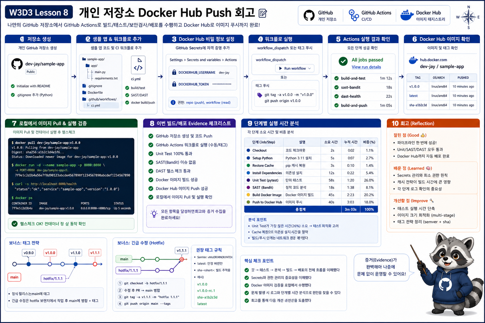

# 8교시: 개인 Repo Docker Hub Push 회고



## 수업 목표
- 학생 본인의 GitHub repository를 만들고 Docker Hub push workflow를 실행한다.
- workflow의 unit test, SAST, DAST, build, push step 실행 시간을 분석한다.
- 이미 GitHub Actions를 써본 학생은 어떤 부분을 보강했는지, 또는 보강하면 좋을지 정리한다.

## 오늘 요약
| 주제 | 핵심 |
|---|---|
| Git 이론 | commit/branch/tag는 변경 이력 모델 |
| 개발자 GitHub | issue, branch, PR, review, status check |
| 인프라 GitHub | workflow, secret, protected branch, audit |
| branch 전략 | dev/stage/prod와 main+environment 비교 |
| PR/merge/revert/tag | 협업 이력과 복구 기준 |
| Actions 1 | workflow 작성, unit test, SAST, DAST |
| Actions 2 | GitHub Secrets, Docker Hub push, image 확인, pull/run |

## 8교시 진행 방식
8교시는 강사가 다시 긴 설명을 하는 시간이 아니다. 학생이 본인 repository에서 실제로 workflow를 돌리고, 결과를 읽는 시간이다.

| 순서 | 활동 | 확인할 것 |
|---|---|
| 1 | 개인 GitHub repo 생성 | public/private 선택, 기본 branch |
| 2 | sample app과 workflow 추가 | `app.py`, `Dockerfile`, workflow YAML |
| 3 | GitHub Secrets 등록 | `DOCKERHUB_USERNAME`, `DOCKERHUB_TOKEN` |
| 4 | workflow 실행 | `workflow_dispatch` 또는 tag push |
| 5 | Docker Hub 확인 | image repository, tag, latest |
| 6 | 로컬 pull/run 검증 | public/private pull 인증, `/health` 응답 |
| 7 | step별 시간 분석 | 가장 느린 step과 이유 |
| 8 | 보강 포인트 작성 | 경험자/초심자 관점 회고 |

## 개인 Repo 생성
학생은 실습용 repository를 하나 만든다.

권장 이름:

```text
w3d3-github-actions-dockerhub
```

수업 workflow를 그대로 쓰려면 repository에는 최소한 다음 파일이 있어야 한다.

```text
.
├── week3/
│   └── day3/
│       └── labs/
│           ├── dockerhub-app/
│           │   ├── app.py
│           │   ├── Dockerfile
│           │   ├── .dockerignore
│           │   └── test_app.py
│           └── quality-gates/
│               ├── unit-test.sh
│               ├── sast-scan.sh
│               ├── dast-health-check.sh
│               └── run-all-local.sh
└── .github/
    └── workflows/
        └── dockerhub-publish.yml
```

이미 repository를 가진 학생은 새 repo를 만들지 않아도 된다. 다만 운영 repository가 아니라 실습용 branch나 sandbox repository에서 수행한다.

## 복사할 파일
8교시에서 기본으로 복사할 파일은 workflow YAML 하나다.

| 강의 repository 원본 | 개인 repository 대상 |
|---|---|
| `week3/day3/labs/github-actions/dockerhub-publish.yml` | `.github/workflows/dockerhub-publish.yml` |

WSL 또는 Mac 기준 복사 예시:

```bash
COURSE_REPO=/mnt/d/paperclip
MY_REPO=/path/to/my/w3d3-github-actions-dockerhub

cd "$MY_REPO"
mkdir -p .github/workflows

cp "$COURSE_REPO/week3/day3/labs/github-actions/dockerhub-publish.yml" .github/workflows/dockerhub-publish.yml
```

복사 후 확인:

```bash
ls -al .github/workflows
sed -n '1,220p' .github/workflows/dockerhub-publish.yml
```

전제 조건:

| 필요 파일 | 이유 |
|---|---|
| `week3/day3/labs/dockerhub-app/` | Docker build context |
| `week3/day3/labs/quality-gates/` | unit/SAST/DAST step 실행 |

앞 실습에서 위 파일을 이미 개인 repository에 넣었다면 workflow YAML만 복사하면 된다. 파일이 없다면 다음 보조 명령으로 샘플도 함께 가져온다.

```bash
mkdir -p week3/day3/labs
cp -R "$COURSE_REPO/week3/day3/labs/dockerhub-app" week3/day3/labs/
cp -R "$COURSE_REPO/week3/day3/labs/quality-gates" week3/day3/labs/
```

`dockerhub-publish.yml`의 `APP_DIR`가 `week3/day3/labs/dockerhub-app`로 되어 있으므로, app 경로를 다르게 만들었다면 workflow의 `APP_DIR`도 같이 수정한다.

`dockerhub-publish.yaml`을 실행하기 위해 다음과 같은 명령어를 실행해야 정상 동작한다.
```bash
git tag v0.1.0
git push origin v0.1.0
```

## Workflow 작성 체크
workflow에는 step이 한 덩어리로 뭉쳐 있으면 안 된다. 시간이 어디서 쓰였는지 보기 위해 step을 나눠야 한다.

| Step | 목적 |
|---|---|
| Checkout repository | GitHub runner가 코드를 가져온다 |
| Prepare image metadata | tag/version을 결정한다 |
| Run unit test | 코드 단위 동작을 빠르게 확인한다 |
| Run SAST and secret scan | 위험 코드와 hardcoded secret을 찾는다 |
| Set up Docker Buildx | Docker build 환경을 준비한다 |
| Build local image for DAST | push 전 실행 가능한 image를 만든다 |
| Run DAST health check | container 실행 후 HTTP health를 확인한다 |
| Login to Docker Hub | GitHub Secrets로 registry 인증한다 |
| Build and push image | Docker Hub에 image를 업로드한다 |

## 실행 시간 분석
Actions run detail 화면에서 각 step의 실행 시간을 적는다.

| Step | 내 실행 시간 | 시간이 늘어나는 이유 | 줄일 수 있는 방법 |
|---|---:|---|---|
| Checkout repository |  | repo 크기, submodule | 불필요한 파일 제외 |
| Unit test |  | test 수, fixture 준비 | 빠른 test/느린 test 분리 |
| SAST scan |  | scan rule, scan 범위 | 대상 경로 명확화 |
| Docker build |  | base image pull, cache miss | `.dockerignore`, `type=gha` cache |
| Cache restore/save |  | cache size, network | cache 대상 조정 |
| DAST health check |  | container boot, retry | health endpoint 단순화 |
| Docker Hub push |  | image size, network | image 최적화, layer 줄이기 |

예시 해석:

```text
Unit test는 2초였지만 Docker build가 48초였다.
빌드 시간이 긴 이유는 base image pull과 cache miss 때문이었다.
.dockerignore를 정리하고 alpine 기반 image를 쓰면 다음 실행에서 줄어들 수 있다.
GHA cache를 적용한 뒤 같은 workflow를 한 번 더 실행하면 cold build와 warm build 차이를 비교할 수 있다.
```

## GitHub Secrets 회고
GitHub Secrets를 등록한 뒤 다음 질문을 확인한다.

| 질문 | 답변 |
|---|---|
| secret 이름을 workflow와 정확히 맞췄는가 | `DOCKERHUB_USERNAME`, `DOCKERHUB_TOKEN` |
| token을 log에 출력하지 않았는가 | 출력 금지 |
| 개인 계정 password 대신 access token을 썼는가 | token 사용 |
| secret이 없는 경우 어느 step에서 실패했는가 | Login to Docker Hub |

Secrets는 편리하지만 만능은 아니다. repository 권한이 넓으면 workflow를 수정할 수 있는 사람도 secret을 악용할 수 있다. 따라서 protected branch, review, environment approval과 함께 써야 한다.

## Private Docker Hub Pull 확인
Docker Hub repository를 private으로 설정한 학생은 push 성공 뒤 pull할 때도 인증을 확인한다.

```bash
docker login -u DOCKERHUB_USERNAME
docker pull DOCKERHUB_USERNAME/w3d3-dockerhub-app:0.1.0
docker run -d --name w3d3-dockerhub-app -p 18088:8080 DOCKERHUB_USERNAME/w3d3-dockerhub-app:0.1.0
curl -s http://localhost:18088/health
docker rm -f w3d3-dockerhub-app
docker logout
```

정리할 포인트:

| 항목 | 확인 |
|---|---|
| public image | 인증 없이 pull 가능 |
| private image | `docker login` 후 pull 가능 |
| 인증 정보 | password 대신 Docker Hub access token |
| 운영 연결 | Kubernetes에서는 image pull secret이 필요해진다 |

## 경험자 보강 질문
이미 GitHub Actions를 써본 학생은 단순 성공 여부보다 보강 지점을 적는다.

| 영역 | 보강 질문 |
|---|---|
| Workflow 구조 | step 이름이 읽기 쉬운가 |
| Test | unit test만으로 충분한가 |
| SAST | secret scan이나 dependency scan이 필요한가 |
| DAST | `/health` 외에 API smoke test가 필요한가 |
| Tag | `latest` 외에 version tag가 있는가 |
| Cache | Docker build cache를 써야 하는가 |
| Runner | GitHub-hosted runner로 충분한가, self-hosted runner가 필요한가 |
| 권한 | protected branch, required check가 필요한가 |
| 배포 | Docker Hub push 뒤 Kubernetes 배포로 이어질 수 있는가 |

## 예시
```markdown
# W3D3 배움일기

오늘은 내 GitHub repository에서 GitHub Actions workflow를 작성하고 Docker Hub에 image를 push했다.

unit test는 2초, SAST는 1초, Docker build는 42초, DAST는 5초, Docker Hub push는 18초가 걸렸다.
가장 오래 걸린 단계는 Docker build였고, base image pull과 cache miss가 원인으로 보였다.
`type=gha` cache를 적용한 뒤 두 번째 실행에서는 build 시간이 줄어드는지 비교해보고 싶다.

GitHub Secrets를 쓰니 Docker Hub token을 workflow에 직접 쓰지 않아도 되어 편했다.
하지만 workflow 수정 권한이 넓으면 secret도 위험해질 수 있으므로 protected branch와 review가 필요하다고 느꼈다.

이미 Actions를 써본 입장에서 보강하고 싶은 점은 Docker build cache와 tag 전략이다.
`latest`만 쓰면 어떤 버전이 배포되었는지 추적하기 어렵기 때문에 앱 버전과 image tag를 맞추는 방식이 더 좋아 보인다.
```

## Kubernetes로 이어지는 질문
| GitHub/Actions | Kubernetes 연결 |
|---|---|
| Docker image tag | Deployment image |
| Docker Hub registry | imagePull |
| GitHub Environment | dev/stage/prod deploy gate |
| protected branch | production manifest 보호 |
| Actions workflow | kubectl/helm deploy |
| Secrets | GitHub Secrets, Kubernetes Secrets 구분 |

## 핵심 포인트
```text
branch -> PR -> CI -> image push -> registry 확인 -> deploy
```

이 흐름이 잡혀야 Kubernetes 배포 실습에서 어떤 image를 어떤 환경에 올리는지 흔들리지 않는다.

## 구름 EXP 배움일기 Template
```markdown
# W3D3S8 Learning Journal
- personal repo URL:
- workflow file path:
- Docker Hub image:
- Docker Hub visibility:
- image tag:
- private pull auth:
- pull/run result:

## Step Time
| Step | Time | Note |
|---|---:|---|
| Unit test |  |  |
| SAST |  |  |
| Docker build |  |  |
| Cache restore/save |  |  |
| DAST |  |  |
| Docker Hub push |  |  |

## Reflection
- 가장 오래 걸린 step:
- 그 이유:
- GitHub-hosted runner에서 느껴진 한계:
- cold build와 warm build 차이:
- self-hosted runner가 필요해 보이는 상황:
- 자동화가 수동 배포보다 나았던 점:
- GitHub Secrets를 쓰며 느낀 장점:
- GitHub Secrets에서 조심해야 할 점:
- 이미 해본 사람이라면 보강한 점:
- 아직 어렵다면 다음에 보강하고 싶은 점:
- Kubernetes question:
```
