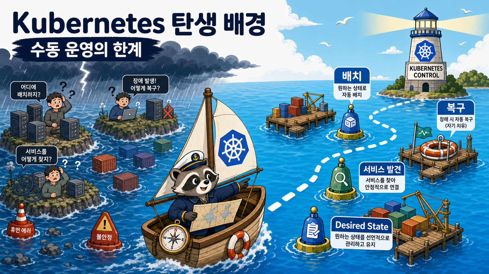

# 1교시: Kubernetes 탄생 배경과 Cluster 운영 문제



## 수업 목표
- Kubernetes가 단순히 Docker 다음 단계가 아니라, 대규모 cluster 운영 문제에서 등장한 플랫폼임을 이해한다.
- 사람이 서버마다 container를 직접 배치하던 방식이 왜 한계에 부딪히는지 설명한다.
- scheduler, desired state, reconciliation, control plane이라는 단어가 왜 필요한지 감을 잡는다.

## 출발점
Kubernetes는 "컨테이너 실행 명령어를 편하게 모아둔 도구"가 아니다. Kubernetes는 여러 대의 machine 위에서 수많은 workload를 계속 실행 상태로 유지하기 위한 cluster orchestration platform이다.

처음에는 이렇게 시작할 수 있다.

```text
서버 1대
  -> container 몇 개
  -> 사람이 docker run / docker compose up
```

하지만 운영 규모가 커지면 질문이 달라진다.

```text
서버가 100대라면?
서비스가 300개라면?
매일 배포가 수십 번이라면?
서버 하나가 죽으면 누가 옮겨 띄울까?
새 버전 배포 중 절반만 실패하면 어떻게 되돌릴까?
```

이 질문에 답하기 위해 cluster scheduler와 orchestrator가 필요해진다.

## Kubernetes 이전의 문제
컨테이너가 없어도 대규모 서비스 운영에는 오래전부터 같은 문제가 있었다.

| 운영 문제 | 설명 |
|---|---|
| 배치 | 어떤 workload를 어떤 machine에 올릴 것인가 |
| 용량 | CPU/memory가 남는 node를 어떻게 찾을 것인가 |
| 복구 | process나 machine이 죽으면 누가 다시 띄울 것인가 |
| 발견 | IP가 바뀌는 workload를 다른 서비스가 어떻게 찾을 것인가 |
| 배포 | 새 버전을 전체 서비스에 어떻게 안전하게 반영할 것인가 |
| 격리 | 팀/환경/권한을 어떻게 나눌 것인가 |
| 관찰 | 수많은 workload 상태를 어디서 볼 것인가 |

Google 내부의 Borg/Omega 같은 cluster management 경험이 Kubernetes의 배경으로 자주 언급된다. Kubernetes는 그 문제의식을 open source 생태계에서 다룰 수 있게 만든 프로젝트다.

## Container가 문제를 다 해결하지 못한 이유
container는 실행 패키징을 표준화했다.

```text
image
container
port
env
volume
network
```

하지만 container 자체는 다음 질문에 답하지 않는다.

| 질문 | container 단독으로 부족한 이유 |
|---|---|
| 어디에 배치할까 | host 선택 로직이 필요 |
| 몇 개를 유지할까 | 복제본 관리자가 필요 |
| 죽으면 어떻게 알까 | 상태 감시와 복구 loop가 필요 |
| traffic을 어디로 보낼까 | 안정적인 service discovery가 필요 |
| rollout을 어떻게 제어할까 | 배포 controller가 필요 |
| 전체 상태를 어디에 저장할까 | cluster state store가 필요 |

즉 Docker는 container 실행의 표준을 만들었고, Kubernetes는 containerized workload 운영의 표준 API를 만든다.

## Kubernetes의 핵심 발상
Kubernetes의 핵심은 desired state다.

```text
사용자: nginx Pod가 3개 있어야 한다.
Kubernetes: 현재 2개뿐이네. 1개 더 만든다.

사용자: 새 image로 바꿔야 한다.
Kubernetes: 기존 Pod를 점진적으로 교체한다.

사용자: 이 Pod는 Ready가 아니다.
Kubernetes: Service traffic에서 제외한다.
```

이것을 가능하게 하는 것이 control plane과 controller loop다.

## 오늘 가장 중요한 문장
```text
Kubernetes는 cluster의 desired state를 저장하고,
current state를 관찰하며,
둘의 차이를 줄이기 위해 계속 조정하는 시스템이다.
```

이 문장이 잡혀야 API Server, etcd, Scheduler, Controller Manager, kubelet이 따로 놀지 않는다.

## Compose와의 연결은 여기까지만
Compose는 로컬에서 여러 container를 이해하는 데 충분히 좋은 도구다. 우리는 이미 Compose로 network, volume, env, service name을 충분히 봤다.

오늘부터의 중심은 Compose가 아니다. 중심은 다음이다.

```text
cluster
control plane
API object
desired state
scheduler
controller
kubelet
Pod
Service
```

## Evidence Note
```markdown
# W3D4S1 Kubernetes Background
- Kubernetes가 등장한 운영 문제:
- container만으로 부족한 점:
- desired state 설명:
- control plane이 필요한 이유:
- 오늘 가장 중요한 문장:
```
