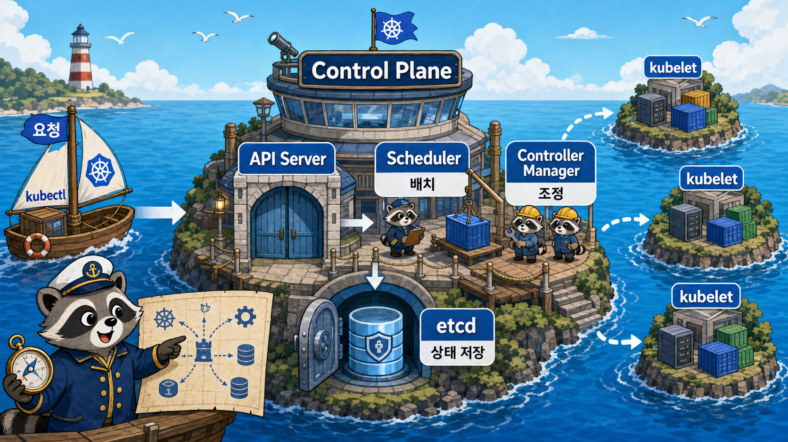
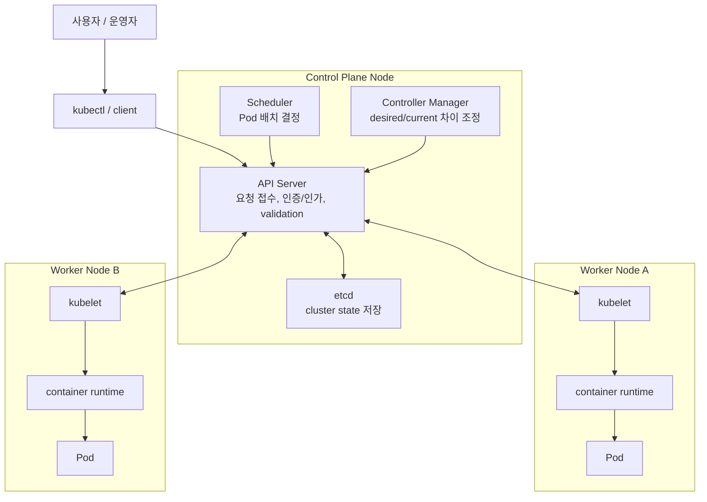
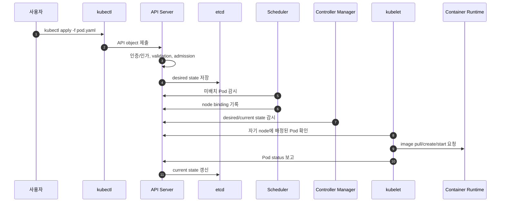

# 2교시: Control Plane 밑바닥 - API Server, etcd, Scheduler, Controller



## 수업 목표
- Kubernetes control plane을 구성하는 핵심 컴포넌트를 역할별로 설명한다.
- `kubectl apply`가 실제로 container를 바로 실행하는 명령이 아니라 API object를 저장하는 요청임을 이해한다.
- API Server, etcd, Scheduler, Controller Manager가 서로 어떻게 이어지는지 설명한다.

## Control Plane이란
control plane은 cluster의 두뇌라기보다 "상태 저장, 요청 접수, 배치 결정, 조정 loop"를 담당하는 관리 계층이다.

```text
kubectl
  -> API Server
    -> etcd에 desired state 저장
    -> Scheduler가 Pod 배치 결정
    -> Controller가 상태 차이 감시
    -> kubelet이 node에서 Pod 실행
```

예전 자료에서는 control plane node를 "master node"라고 부르는 경우가 많다. 지금은 master/slave 표현을 피하고, 공식 문서와 실무 문서에서도 보통 `control plane node`라는 표현을 사용한다. 수업에서는 "master node"라는 말을 들으면 "control plane 역할을 수행하는 node"로 해석한다.

## 기본 구성요소 먼저 잡기
Kubernetes를 처음 볼 때는 이름이 많아서 헷갈린다. 먼저 각 요소가 "명령 도구인지, 관리 계층인지, 저장소인지, node agent인지, 실제 workload인지"를 구분해야 한다.

| 구성요소 | 어디에 있는가 | 기본 역할 | 직접 실행하는가 |
|---|---|---|---|
| `kubectl` | 사용자 PC, 운영자 터미널, CI runner | Kubernetes API를 호출하는 command line client | container를 직접 실행하지 않음 |
| API Server | control plane | 모든 요청의 입구, 인증/인가, validation, object 읽기/쓰기 | container를 직접 실행하지 않음 |
| Control Plane | control plane node | cluster 상태 저장, 배치 판단, 상태 조정 loop를 담당하는 관리 계층 | workload 실행 주체가 아님 |
| etcd | control plane | cluster object와 상태를 저장하는 key-value store | 실행/배치 판단을 하지 않음 |
| Scheduler | control plane | 아직 node가 정해지지 않은 Pod를 어느 node에 둘지 결정 | container를 직접 실행하지 않음 |
| Controller Manager | control plane | desired state와 current state 차이를 계속 줄이는 controller 묶음 | 필요한 object를 만들거나 수정함 |
| kubelet | 각 worker/control-plane node | 자기 node에 배정된 Pod spec을 보고 runtime에 실행을 요청 | 직접 process를 만들기보다 runtime에 요청 |
| Container Runtime | 각 node | image pull, container create/start를 실제 수행 | container process 실행 |
| Pod | 각 node | Kubernetes가 배치하는 최소 workload 단위 | 하나 이상의 container를 품는 실행 단위 |

이 표에서 가장 중요한 연결은 다음이다.

```text
kubectl은 API Server에 요청한다.
API Server는 etcd에 상태를 저장한다.
Scheduler는 Pod가 올라갈 node를 결정한다.
Controller Manager는 원하는 상태가 유지되는지 계속 본다.
kubelet은 자기 node에 배정된 Pod를 실행 상태로 맞춘다.
Pod 안에서 실제 application container가 돈다.
```

헷갈리기 쉬운 구분:

| 헷갈리는 지점 | 정확한 구분 |
|---|---|
| `kubectl` vs API Server | `kubectl`은 client, API Server는 server다 |
| API Server vs etcd | API Server는 요청 입구, etcd는 상태 저장소다 |
| Scheduler vs kubelet | Scheduler는 node를 고르고, kubelet은 그 node에서 실행을 맞춘다 |
| Controller Manager vs Scheduler | Controller는 상태 차이를 줄이고, Scheduler는 배치되지 않은 Pod의 node를 정한다 |
| Pod vs container | Pod는 Kubernetes 배포 단위, container는 Pod 안에서 실행되는 process 단위다 |
| Control Plane vs Worker Node | control plane은 관리/판단, worker node는 workload 실행이 중심이다 |

장애를 볼 때도 이 구분을 그대로 사용한다.

| 증상 | 먼저 의심할 구성요소 |
|---|---|
| `kubectl` 연결 실패 | kubeconfig, context, API Server 접근 |
| object 조회/저장 이상 | API Server, RBAC, admission, etcd |
| Pod가 계속 Pending | Scheduler, node resource, taint/toleration, volume |
| Pod는 배치됐지만 실행 안 됨 | kubelet, container runtime, image pull, volume mount |
| replica 수가 맞지 않음 | Controller Manager, Deployment/ReplicaSet 상태 |
| 앱은 떴지만 traffic이 안 감 | Pod readiness, Service selector, endpoint |

## Control Plane Node를 고르는 기준
운영 cluster에서 아무 node나 control plane으로 고르면 안 된다. control plane node는 app workload를 많이 올리는 worker node와 성격이 다르다. API Server, etcd, Scheduler, Controller Manager가 안정적으로 돌아가야 하므로 "서비스 트래픽을 많이 처리하는 서버"보다 "cluster 운영 상태를 안정적으로 관리할 서버"를 기준으로 선택한다.

| 기준 | 왜 중요한가 |
|---|---|
| 안정적인 CPU/memory | API 요청, controller loop, scheduler 판단이 밀리면 cluster 전체 반응이 느려짐 |
| 빠르고 안정적인 disk | etcd가 cluster state를 저장하므로 disk latency와 손상이 직접 장애로 이어짐 |
| 안정적인 network | worker node의 kubelet, admin의 kubectl, component 간 통신이 모두 API Server를 거침 |
| 시간 동기화 | 인증서, lease, event, etcd consensus에서 시간 차이가 문제를 만들 수 있음 |
| 장애 도메인 분산 | 여러 control plane node를 둘 때 같은 host/rack/AZ에 몰아두면 동시에 죽을 수 있음 |
| 운영 접근 통제 | cluster 권한의 중심이므로 SSH, kubeconfig, certificate, firewall을 엄격히 관리해야 함 |
| app workload 격리 | control plane 자원을 app Pod가 잡아먹으면 cluster 운영 자체가 흔들림 |

실무 기준으로는 다음처럼 나눈다.

| 환경 | control plane 구성 기준 |
|---|---|
| 학습용 local cluster | 단일 control plane으로 충분. kind에서는 Docker container 하나가 control plane node 역할 |
| 소규모 내부 실습/lab | 1대 또는 3대. 장애 복구보다 단순성이 더 중요할 수 있음 |
| 운영 self-managed cluster | 보통 3대 이상의 홀수 개 control plane. etcd quorum과 장애 도메인 분산 고려 |
| managed Kubernetes | cloud provider가 control plane을 운영. 사용자는 worker node, IAM/RBAC, workload 정책에 집중 |

중요한 오해:

```text
control plane node = 가장 성능 좋은 app server가 아니다.
control plane node = cluster 상태를 안정적으로 저장하고 조정하는 운영 중심 node다.
```

kind 실습에서는 `paperclip-week3-control-plane` container 하나가 control plane node이자 worker node처럼 동작한다. 이것은 학습을 단순화하기 위한 구조다. 운영 cluster에서는 control plane node와 worker node를 분리하거나, control plane node에 일반 app Pod가 스케줄링되지 않도록 taint를 두는 구성이 흔하다.

## 핵심 구성요소 구조도
아래 도식은 "누가 상태를 저장하고, 누가 판단하고, 누가 실행하는가"를 보기 위한 구조도다.



## 연결 흐름 구조도
아래 도식은 `kubectl apply` 이후 실제로 어떤 연결이 이어지는지를 보여준다. 핵심은 `kubectl`이 worker node에 직접 접속하지 않는다는 점이다.



## API Server
API Server는 Kubernetes의 정문이다.

| 역할 | 설명 |
|---|---|
| 요청 접수 | `kubectl`, controller, scheduler 요청을 받음 |
| 인증/인가 | 누가 어떤 API를 호출할 수 있는지 확인 |
| validation | object schema와 정책 확인 |
| admission | 저장 전후 정책 hook 적용 |
| state 접근 | etcd에 저장된 object를 읽고 씀 |

중요한 점:

```text
kubectl은 node에 직접 명령하지 않는다.
kubectl은 API Server에 요청한다.
```

## etcd
etcd는 Kubernetes cluster state의 저장소다.

| 저장되는 것 | 예 |
|---|---|
| desired state | Deployment spec, Pod spec, Service spec |
| current state | Pod status, node status |
| metadata | labels, annotations, resourceVersion |
| config object | ConfigMap, Secret metadata 등 |

etcd는 단순 로그 저장소가 아니다. cluster가 "무엇이 있어야 하는지" 기억하는 핵심 저장소다. 그래서 운영 cluster에서 etcd 백업은 매우 중요하다.

## Scheduler
Scheduler는 새로 만들어져야 하는 Pod가 어느 node에 올라갈지 결정한다.

판단 재료:

| 판단 재료 | 의미 |
|---|---|
| node resource | CPU/memory 여유 |
| node 상태 | Ready 여부 |
| taint/toleration | 특정 Pod만 들어갈 수 있는 node |
| affinity | 특정 node/Pod 근처 또는 반대 |
| constraints | zone, label, policy |

Scheduler는 container를 직접 실행하지 않는다. "이 Pod는 이 node에 배치한다"는 binding 결정을 API Server에 기록한다.

## Controller Manager
Controller는 desired state와 current state의 차이를 계속 본다.

예:

```text
Deployment desired replicas = 3
현재 Ready Pod = 2
ReplicaSet controller가 Pod 1개 추가 생성
```

대표 controller:

| Controller | 하는 일 |
|---|---|
| Deployment controller | rollout과 ReplicaSet 관리 |
| ReplicaSet controller | Pod replica 수 유지 |
| Node controller | node 상태 감시 |
| Job controller | 완료되어야 하는 batch workload 관리 |
| EndpointSlice controller | Service 뒤의 Pod endpoint 갱신 |

## kubelet과의 경계
control plane은 node 바깥에서 상태를 결정하고 조정한다. kubelet은 node 안에서 Pod를 실제 상태로 맞춘다.

```text
control plane: 이 Pod가 node A에 있어야 한다.
kubelet on node A: Pod spec을 보고 container runtime에 실행 요청한다.
```

이 경계를 헷갈리면 Kubernetes 장애 분석이 어려워진다.

## 요청 흐름 예시
`kubectl apply -f pod.yaml`의 실제 흐름:

```text
1. kubectl이 kubeconfig에서 current-context 확인
2. API Server에 Pod object 제출
3. API Server가 validation/admission 수행
4. etcd에 Pod desired state 저장
5. Scheduler가 node 선택
6. kubelet이 자기 node에 배정된 Pod 확인
7. container runtime이 image pull/create/start 수행
8. kubelet이 Pod status를 API Server에 보고
```

## 한 줄 요약
```text
API Server는 입구, etcd는 기억, Scheduler는 배치, Controller는 조정, kubelet은 node 실행 담당이다.
```

## Evidence Note
```markdown
# W3D4S2 Control Plane
- API Server 역할:
- etcd 역할:
- Scheduler 역할:
- Controller Manager 역할:
- kubelet과 control plane의 경계:
- kubectl apply 흐름:
```
