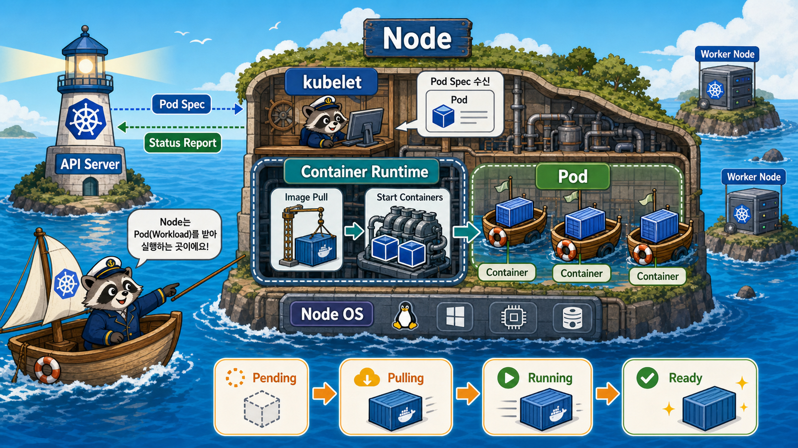

# 3교시: Node와 Workload 실행 구조 - kubelet, Runtime, Pod



## 수업 목표
- control plane이 결정을 내린 뒤 node에서 실제 workload가 어떻게 실행되는지 설명한다.
- kubelet, container runtime, Pod, container의 경계를 구분한다.
- Pod가 왜 Kubernetes의 최소 배포 단위인지 이해한다.

## Control Plane 이후의 세계
2교시에서 본 control plane은 상태를 저장하고, 요청을 받고, 배치 결정을 내린다. 하지만 실제 process는 node에서 실행된다.

```text
API Server에 Pod desired state 저장
  -> Scheduler가 node 선택
  -> kubelet이 자기 node에 배정된 Pod 확인
  -> container runtime이 image pull/create/start
  -> kubelet이 Pod status 보고
```

## Node
Node는 workload가 실제로 실행되는 machine이다. cloud 환경에서는 보통 VM이고, bare metal 환경에서는 물리 서버일 수 있다. kind에서는 Docker container가 node처럼 동작한다.

| Node에서 중요한 것 | 이유 |
|---|---|
| CPU/memory | Pod를 배치할 capacity |
| disk | image pull, emptyDir, log 저장 |
| network | Pod/Service 통신 |
| kubelet | Kubernetes와 node를 연결하는 agent |
| container runtime | container 실제 실행 |

## kubelet
kubelet은 node 안의 Kubernetes agent다.

| kubelet 역할 | 설명 |
|---|---|
| Pod spec 확인 | API Server에서 자기 node에 배정된 Pod 확인 |
| container runtime 호출 | image pull, container 생성/시작 요청 |
| health 확인 | liveness/readiness/startup probe 실행 |
| status 보고 | Pod 상태를 API Server에 보고 |
| volume mount 준비 | Pod에 필요한 volume 준비 |

kubelet은 scheduler가 아니다. 어느 node에 올릴지는 scheduler가 결정하고, kubelet은 자기 node에 배정된 것을 실행 상태로 맞춘다.

## Container Runtime
container runtime은 container를 실제로 실행한다.

```text
kubelet
  -> CRI
    -> containerd
      -> runc
        -> container process
```

Docker 명령을 배웠다고 해서 Kubernetes가 반드시 Docker daemon으로 container를 실행한다고 생각하면 안 된다. 현대 Kubernetes에서는 containerd 같은 runtime이 일반적이다.

## Pod
Pod는 Kubernetes에서 스케줄링되는 가장 작은 workload 단위다.

| Pod가 포함하는 것 | 설명 |
|---|---|
| container spec | 어떤 image를 실행할지 |
| shared network namespace | Pod 안 container들은 localhost 공유 |
| volume | Pod 내부 container들이 공유 가능 |
| labels | Service/selector/운영 분류에 사용 |
| restart policy | 실패 시 재시작 기준 |
| status | Pending, Running, Succeeded, Failed 등 |

처음에는 Pod 하나에 container 하나로 시작한다. 하지만 sidecar pattern에서는 Pod 하나에 app container와 log/sidecar container가 함께 들어갈 수 있다.

## Pod Lifecycle 감각
```text
Pending
  -> image pulling
  -> container creating
  -> Running
  -> Ready
```

문제가 생기면 다음 상태를 본다.

| 상태/증상 | 의미 |
|---|---|
| Pending | 스케줄링/리소스/volume 문제 가능 |
| ContainerCreating | image pull, volume mount, runtime 준비 중 |
| ImagePullBackOff | image 이름/tag/registry auth 문제 |
| CrashLoopBackOff | container가 실행 후 반복 종료 |
| Running but NotReady | process는 떠 있지만 traffic 받을 준비가 안 됨 |

## kind에서 볼 수 있는 것
kind cluster를 만들면 node 자체가 Docker container다.

```bash
docker ps --filter name=paperclip-week3
kubectl get nodes -o wide
```

이때 Docker에서 보이는 `paperclip-week3-control-plane`은 Kubernetes node 역할을 하는 container다. Day5에 만들 app Pod는 그 node 안에서 Kubernetes workload로 실행된다.

## 한 줄 요약
```text
Scheduler는 어느 node인지 결정하고,
kubelet은 그 node에서 Pod를 실제 상태로 맞추며,
container runtime은 container process를 실행한다.
```

## Evidence Note
```markdown
# W3D4S3 Node and Workload
- node 역할:
- kubelet 역할:
- container runtime 역할:
- Pod가 container와 다른 점:
- Pod lifecycle 상태:
- kind node 확인 명령:
```
