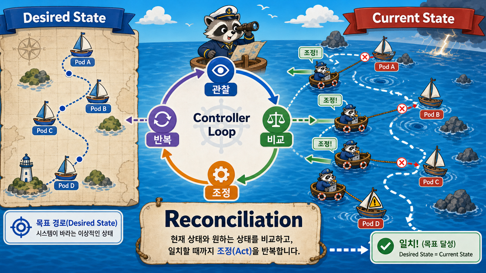

# 4교시: 선언적 API와 Reconciliation



## 수업 목표
- desired state와 current state를 구분한다.
- controller reconciliation loop가 Kubernetes 운영의 핵심임을 이해한다.
- self-healing, rollout, scaling이 같은 원리 위에 있다는 점을 설명한다.

## 명령형 운영과 선언형 운영
명령형 운영:

```text
이 container를 지금 실행해.
죽었으면 다시 실행해.
3개로 늘려.
```

선언형 운영:

```text
이 workload는 항상 3개 replica로 유지되어야 한다.
image는 이 버전이어야 한다.
Ready가 아닌 Pod에는 traffic을 보내지 않아야 한다.
```

Kubernetes는 선언형 API를 중심으로 동작한다. 사용자는 원하는 상태를 API object로 제출하고, controller는 실제 상태가 그 선언에 가까워지도록 계속 조정한다.

## Desired State와 Current State
| 상태 | 의미 |
|---|---|
| desired state | 사용자가 API object로 선언한 원하는 상태 |
| current state | cluster에서 실제 관찰되는 현재 상태 |
| reconciliation | 둘의 차이를 줄이는 controller loop |

예:

```text
desired: Deployment replicas=3
current: Ready Pod=2
action: Pod 1개 추가 생성
```

## Controller Loop
Controller는 한 번 실행되고 끝나는 script가 아니다. 계속 본다.

```text
watch desired state
watch current state
compare
act
repeat
```

대표 controller:

| Controller | Reconciliation 대상 |
|---|---|
| Deployment controller | rollout과 ReplicaSet |
| ReplicaSet controller | Pod replica 수 |
| Job controller | 완료되어야 하는 batch task |
| Node controller | node health |
| EndpointSlice controller | Service endpoint |

## Self-Healing
Pod가 죽으면 Kubernetes가 다시 만든다는 말은 사실 "controller가 desired state와 current state 차이를 발견하고 조정한다"는 뜻이다.

```text
desired: Pod 3개
current: Pod 2개
controller: Pod 1개 생성
```

이것이 self-healing의 기본 원리다. 단, application bug, 잘못된 설정, DB transaction 불일치까지 자동으로 해결하는 것은 아니다.

## Rollout과 Scaling도 같은 원리
| 기능 | 내부적으로 보는 것 |
|---|---|
| scale | desired replicas 변경 |
| rollout | desired image/template 변경 |
| rollback | 이전 desired template으로 되돌림 |
| readiness | current Pod가 traffic 받을 수 있는지 |

Kubernetes 기능 이름을 외우기보다 desired/current/reconcile 구조를 먼저 잡아야 한다.

## 장점과 단점은 여기서 나온다
장점:

| 장점 | 이유 |
|---|---|
| 자동 복구 | controller loop가 상태 차이를 줄임 |
| 표준화 | API object로 상태를 표현 |
| GitOps 가능 | YAML desired state를 Git으로 관리 |
| 반복 배포 | rollout/rollback이 API로 표현됨 |

단점:

| 단점 | 이유 |
|---|---|
| YAML 복잡도 | desired state를 정확히 써야 함 |
| 디버깅 난도 | current state가 왜 다른지 추적 필요 |
| 운영 비용 | controller, node, network, storage 상태를 함께 봐야 함 |

## 한 줄 요약
```text
Kubernetes는 명령을 한 번 실행하는 시스템이 아니라,
원하는 상태와 실제 상태의 차이를 계속 줄이는 시스템이다.
```

## Evidence Note
```markdown
# W3D4S4 Declarative API
- desired state example:
- current state example:
- reconciliation explanation:
- self-healing explanation:
- rollout/scale connection:
```
