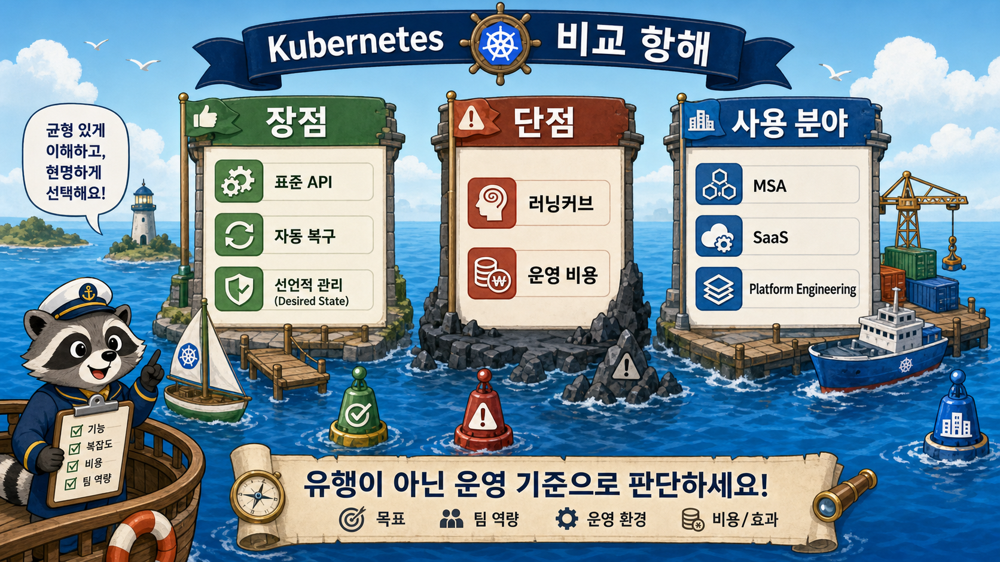

# 5교시: 장점, 단점, 많이 쓰이는 분야



## 수업 목표
- Kubernetes의 장점과 단점을 운영 관점에서 정리한다.
- Kubernetes가 자주 쓰이는 분야를 서비스 성격과 연결한다.
- managed Kubernetes와 자체 운영 Kubernetes의 차이를 설명한다.
- 모든 workload를 Kubernetes에 올리는 것이 정답이 아님을 이해한다.

## 장점과 단점
Kubernetes의 장점은 control plane과 reconciliation에서 나온다. 단점도 같은 지점에서 나온다.

| 장점 | 운영 효과 |
|---|---|
| 표준 API | workload/network/config/secret을 공통 방식으로 표현 |
| 자동 복구 | controller가 desired state를 유지하려고 함 |
| 배포 전략 | rollout/rollback을 API로 다룸 |
| 확장성 | replica와 autoscaling 모델 |
| 생태계 | Helm, Argo CD, Prometheus, Ingress controller 등 |

| 단점 | 운영 부담 |
|---|---|
| 러닝커브 | object와 controller 개념이 많음 |
| YAML 복잡도 | 선언이 틀리면 상태도 틀어짐 |
| 디버깅 난도 | API object, event, log, node를 함께 봐야 함 |
| 비용 | node idle resource와 observability 비용 |
| 보안 | RBAC, Secret, image policy, network policy 필요 |

## 많이 쓰이는 분야
| 분야 | 왜 Kubernetes를 쓰는가 |
|---|---|
| MSA | 서비스 수가 많고 독립 배포가 필요 |
| SaaS | tenant/region/environment별 배포 표준화 |
| Platform Engineering | 개발팀에게 공통 배포 플랫폼 제공 |
| CI/CD Runner/Preview | PR별 preview environment, ephemeral workload |
| Data/ML Serving | batch/job, model serving, GPU scheduling 연결 |
| Edge/On-prem | cloud 밖에서도 유사한 운영 API 사용 |
| Hybrid/Multi-cloud | vendor별 차이를 줄이는 공통 계층 |

## Managed Kubernetes
운영에서는 직접 control plane을 설치하기보다 managed Kubernetes를 많이 쓴다.

| 서비스 | 설명 |
|---|---|
| Amazon EKS | AWS managed Kubernetes |
| Google GKE | Google Cloud managed Kubernetes |
| Azure AKS | Azure managed Kubernetes |

managed Kubernetes를 쓰면 control plane 운영 부담 일부가 줄어든다. 하지만 workload, node capacity, network, IAM/RBAC, 비용, 배포 정책은 여전히 팀의 책임이다.

## 회사에서 자주 나오는 구조
```text
GitHub Actions
  -> Docker image push
  -> GitOps repository manifest update
  -> Argo CD/Flux sync
  -> Kubernetes Deployment rollout
  -> Prometheus/Grafana/Log 확인
```

Day3의 GitHub Actions가 Day4~5 Kubernetes와 이어지는 이유다.

## Kubernetes에 올리지 않을 수도 있는 것
| 대상 | 대안 |
|---|---|
| 운영 DB | RDS, Cloud SQL 같은 managed DB |
| Redis/cache | ElastiCache, Memorystore 등 managed cache |
| Object storage | S3/GCS/Azure Blob |
| 단순 static site | CDN/static hosting |
| 매우 작은 내부 도구 | VM, Compose, PaaS |

Kubernetes를 배운다는 것은 "무조건 전부 Kubernetes에 올린다"가 아니다. 어떤 것을 cluster에 올리고, 어떤 것은 managed service로 뺄지 판단하는 능력이 중요하다.

## 참고 사례를 볼 때의 기준
회사 기술 블로그나 발표를 볼 때는 도구 이름만 보지 않는다.

| 볼 것 | 질문 |
|---|---|
| 팀 규모 | 몇 개 팀/서비스가 사용하는가 |
| 배포 빈도 | 하루 몇 번 배포하는가 |
| 장애 대응 | 복구 기준과 관찰 체계가 있는가 |
| 플랫폼 팀 | 누가 cluster와 공통 도구를 운영하는가 |
| 비용 | node/resource 효율을 어떻게 보는가 |
| 보안 | RBAC/Secret/image policy를 어떻게 관리하는가 |

## Day5 연결 질문
Day5에서 sample app을 실행할 때 다음 질문을 계속 붙인다.

```text
이 app은 Kubernetes에 올릴 가치가 있는가?
어떤 설정이 ConfigMap/Secret이 되어야 하는가?
Service가 필요한 이유는 무엇인가?
이 Pod가 실패하면 어떤 evidence를 볼 것인가?
```

## Evidence Note
```markdown
# W3D4S5 Use Cases
- Kubernetes use case:
- managed service alternative:
- what should run in cluster:
- what should stay managed/external:
- reference question:
```
