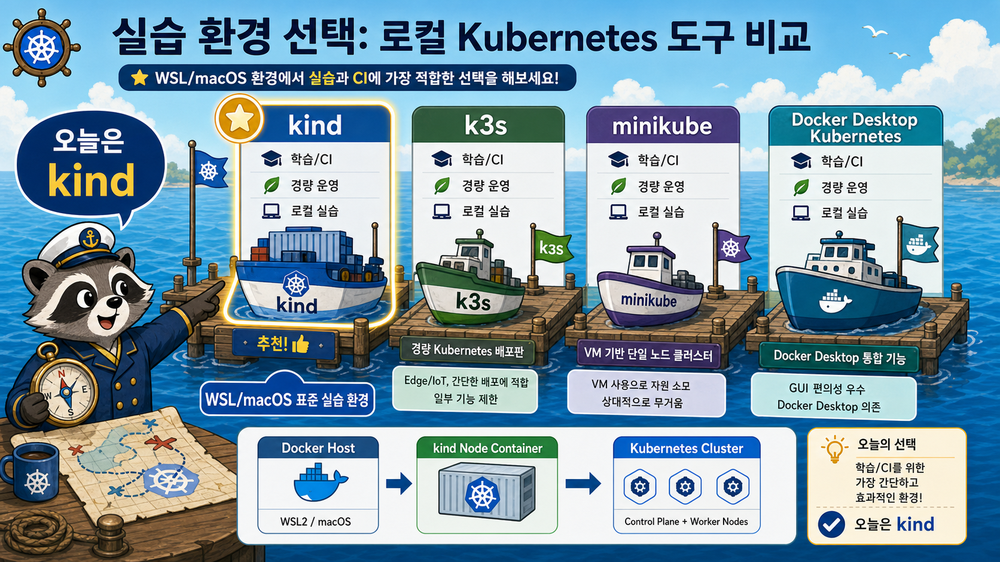

# 6교시: 실습 도구 선택 - kind 기준



## 수업 목표
- kind, k3s, minikube, Docker Desktop Kubernetes의 차이를 설명한다.
- 이번 과정에서 kind를 선택하는 이유를 이해한다.
- kind cluster가 실제 운영 cluster와 다르다는 한계를 설명한다.

## 후보 도구 비교
| 도구 | 적합한 경우 | 장점 | 주의 |
|---|---|---|---|
| kind | 교육, CI, 빠른 local cluster | Docker만 있으면 cluster 생성/삭제가 빠름 | node가 Docker container라 운영 환경과 차이 |
| k3s | 경량 서버, edge, lab 운영 | 설치가 가볍고 실제 운영 배포판 성격 | host에 오래 남고 정리 책임이 큼 |
| minikube | 로컬 학습 | driver/옵션이 풍부 | 환경별 차이가 커질 수 있음 |
| Docker Desktop Kubernetes | Docker Desktop 사용자 | GUI에서 켜기 쉬움 | WSL/macOS 상태 차이, reset 이슈 |

## 왜 kind인가
이번 과정은 학생 환경이 섞여 있다.

```text
Windows + WSL + Docker Desktop
macOS + Docker Desktop
일부 Linux CLI 경험 부족
```

kind는 Docker 위에 Kubernetes node container를 만들기 때문에 수업 표준화가 쉽다.

| 선택 이유 | 설명 |
|---|---|
| 생성/삭제 쉬움 | `kind create/delete cluster` |
| CI 친화적 | GitHub Actions에서도 자주 사용 |
| config file 가능 | 수업용 cluster 이름/port 등을 파일로 고정 |
| host 오염 적음 | k3s처럼 system service를 많이 남기지 않음 |
| Day5 실습 충분 | Pod/Deployment/Service 기본 학습 가능 |

## kind의 한계
| 한계 | 의미 |
|---|---|
| node가 Docker container | 실제 cloud VM node와 네트워크/스토리지 차이 |
| LoadBalancer 제한 | cloud LB가 자동 생성되지 않음 |
| production용 아님 | 운영 cluster simulation이 아니라 학습/테스트용 |
| Docker resource 의존 | Docker Desktop 메모리/CPU 부족 시 불안정 |

## 수업용 kind config
```bash
cat week3/day4/labs/kind-cluster/kind-config.yaml
```

핵심:

| 필드 | 의미 |
|---|---|
| `kind: Cluster` | kind cluster 설정 파일 |
| `name: paperclip-week3` | cluster 이름 |
| `role: control-plane` | 단일 node가 control plane 역할 |

수업 config에서는 node image를 고정하지 않는다. 학생별 kind version이 다를 수 있으므로 kind 기본 node image를 사용해 호환성 문제를 줄인다. 특정 Kubernetes version을 고정해야 하는 운영/CI 상황에서는 공식 kind release note와 호환되는 `kindest/node` image를 확인한 뒤 pinning한다.

여기서 `role: control-plane`은 "이 Docker container가 Kubernetes control plane node 역할을 한다"는 뜻이다. 운영 환경에서는 control plane node를 CPU/memory, disk, network, 장애 도메인, 접근 통제 기준으로 신중하게 고르지만, 오늘 수업에서는 설치와 개념 이해를 우선하기 위해 단일 control plane으로 단순화한다.

## 오늘은 multi-node를 하지 않는 이유
처음부터 multi-node로 가면 node scheduling, taint, network를 설명할 수는 있다. 하지만 Day4 목표는 cluster 개념과 설치 안정화다.

```text
Day4: single-node kind cluster
Day5: Pod/Deployment/Service
Week4: Kubernetes object와 운영 패턴 확장
```

## Evidence Note
```markdown
# W3D4S6 Tool Choice
- selected tool:
- why kind:
- why not k3s today:
- kind limitation:
- config file path:
```
