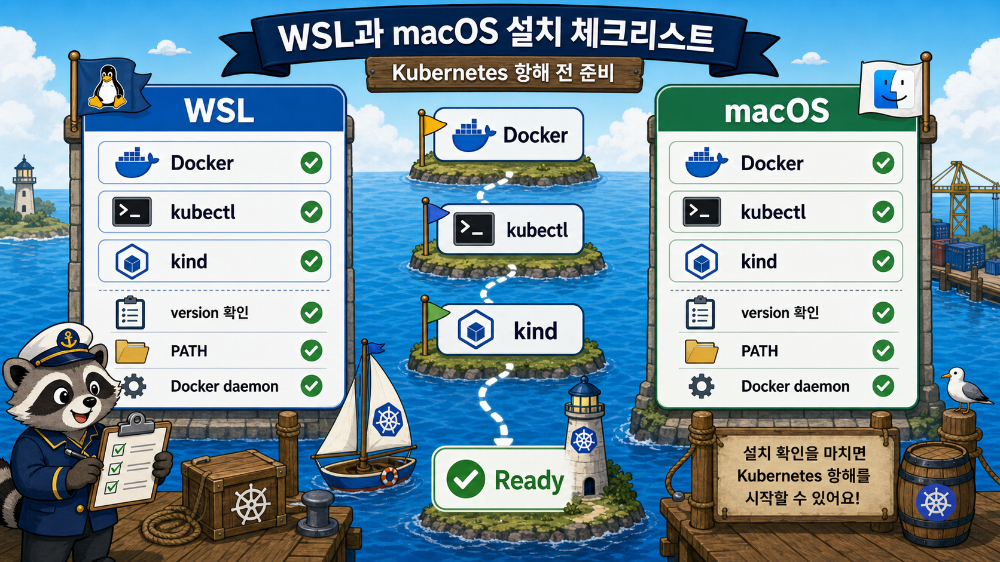

# 7교시: WSL/macOS kubectl, kind 설치



## 수업 목표
- WSL/macOS별 설치 경로를 구분한다.
- Docker, kubectl, kind가 각각 어떤 역할인지 설명한다.
- 설치 성공을 version 출력과 실제 cluster 생성 가능성으로 판단한다.

## 역할 구분
| 도구 | 역할 |
|---|---|
| Docker | kind node container를 실행하는 기반 |
| kubectl | Kubernetes API server에 요청하는 CLI |
| kind | Docker 위에 local Kubernetes cluster를 만드는 도구 |

셋 중 하나라도 빠지면 오늘 실습이 막힌다.

## 공통 확인
```bash
docker version
docker ps
kubectl version --client=true
kind version
```

## WSL 기준
WSL에서는 먼저 Docker Desktop과 WSL integration을 확인한다.

```bash
docker version
docker ps
```

`kubectl` Linux amd64 설치 예시:

```bash
curl -LO "https://dl.k8s.io/release/$(curl -L -s https://dl.k8s.io/release/stable.txt)/bin/linux/amd64/kubectl"
chmod +x kubectl
sudo mv kubectl /usr/local/bin/kubectl
kubectl version --client=true
```

kind Linux amd64 설치 예시:

```bash
curl -Lo ./kind https://kind.sigs.k8s.io/dl/latest/kind-linux-amd64
chmod +x ./kind
sudo mv ./kind /usr/local/bin/kind
kind version
```

ARM64 Linux라면 binary URL이 달라진다. 공식 문서에서 architecture를 확인한다.

## macOS 기준
Homebrew 기준:

```bash
brew install kubectl kind
kubectl version --client=true
kind version
docker version
```

Apple Silicon/Intel 차이는 Homebrew가 보통 처리하지만, `which kubectl`, `which kind`로 PATH를 확인한다.

## 설치 실패 대응
| 증상 | 원인 후보 | 첫 확인 |
|---|---|---|
| `docker ps` 실패 | Docker daemon 미실행 | Docker Desktop 실행 |
| `kubectl: command not found` | 설치 안 됨/PATH 문제 | `which kubectl` |
| `kind: command not found` | 설치 안 됨/PATH 문제 | `which kind` |
| `permission denied` | 실행 권한 없음 | `chmod +x` |
| curl 다운로드 실패 | 네트워크/프록시 | browser로 URL 확인 |

## 설치 Evidence
학생은 긴 전체 출력이 아니라 핵심 line을 기록한다.

```markdown
- OS: WSL Ubuntu / macOS
- Docker server: reachable / not reachable
- kubectl client version:
- kind version:
- blocker:
```

## 공식 문서 기준
수업 자료의 명령이 실패하면 공식 문서를 우선한다. 특히 `kubectl`과 `kind`의 최신 버전/URL은 시간이 지나며 바뀔 수 있다.

## Evidence Note
```markdown
# W3D4S7 Install Evidence
- OS:
- docker version:
- docker ps:
- kubectl version:
- kind version:
- install issue:
- resolved by:
```
