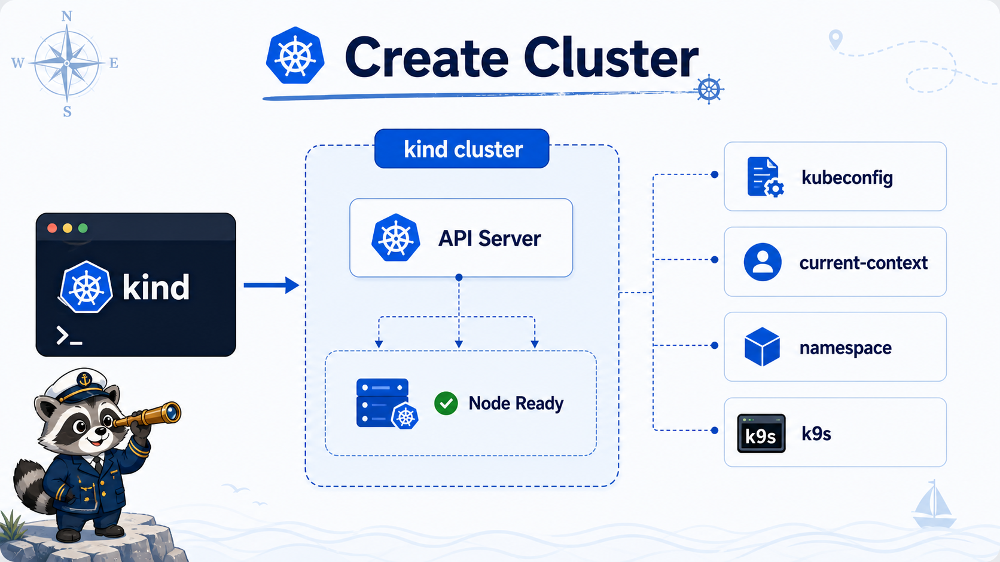

# 8교시: kind Cluster 생성과 확인



## 수업 목표
- kind cluster를 생성하고 `kubectl` context를 확인한다.
- node, cluster-info, namespace를 확인해 Day5 실습 준비를 끝낸다.
- 선택 도구 k9s로 현재 cluster 상태를 TUI에서 훑어본다.
- cluster를 유지할지 삭제할지 판단한다.
- 구름 EXP 배움일기를 설치 evidence 중심으로 작성한다.

## Cluster 생성
```bash
cd /mnt/d/paperclip
kind create cluster --config week3/day4/labs/kind-cluster/kind-config.yaml
```

이미 cluster가 있으면:

```bash
kind get clusters
kind delete cluster --name paperclip-week3
kind create cluster --config week3/day4/labs/kind-cluster/kind-config.yaml
```

## kubectl Context 확인
```bash
kubectl config current-context
kubectl config get-contexts
```

정상 기준:

```text
kind-paperclip-week3
```

context는 매우 중요하다. context를 확인하지 않고 명령을 실행하면 다른 cluster에 리소스를 만들거나 지울 수 있다.

## Cluster 상태 확인
```bash
kubectl cluster-info
kubectl get nodes -o wide
docker ps --filter name=paperclip-week3
```

확인할 것:

| Evidence | 정상 기준 |
|---|---|
| cluster-info | control plane URL 출력 |
| node | `Ready` |
| docker ps | kind node container 실행 중 |

## Namespace 준비
Day5 첫 Pod 실습에서 사용할 namespace를 만든다.

```bash
kubectl apply -f week3/day4/labs/k8s-first-pod/namespace.yaml
kubectl get namespaces
kubectl get all -n week3
```

`kubectl get all -n week3`에 리소스가 거의 없어도 정상이다. namespace만 만든 상태다.

## k9s 상태 보기 Preview
k9s가 설치되어 있다면 현재 context를 확인한 뒤 실행한다.

```bash
kubectl config current-context
k9s
```

처음에는 다음 화면만 본다.

| k9s 입력 | 확인 |
|---|---|
| `:nodes` | kind node가 Ready인지 |
| `:ns` | `week3` namespace가 있는지 |
| `:pods` | 아직 Pod가 거의 없거나 비어 있는지 |
| `0` | all namespaces 보기 |
| `q` | 종료 |

k9s는 편한 상태 탐색 도구다. 하지만 수업 evidence는 재현 가능한 명령으로 남긴다.

```bash
kubectl get nodes
kubectl get ns week3
kubectl get all -n week3
```

즉 k9s는 "어디를 볼지 빠르게 찾는 도구"이고, `kubectl`은 "무엇을 확인했는지 기록하는 언어"다.

## 삭제 기준
Day5를 같은 PC에서 바로 이어갈 수 있다면 유지한다.

유지할 때:

```bash
kind get clusters
kubectl get nodes
```

삭제할 때:

```bash
kind delete cluster --name paperclip-week3
kind get clusters
```

## Troubleshooting Table
| 증상 | 원인 후보 | 첫 확인 |
|---|---|---|
| `failed to create cluster` | Docker 미실행, resource 부족 | `docker version`, Docker Desktop resource |
| `node NotReady` | node 초기화 지연 | 1~2분 대기 후 `kubectl describe node` |
| `connection refused` | cluster 삭제/중지 | `kind get clusters`, `docker ps` |
| `no context exists` | kubeconfig context 없음 | `kubectl config get-contexts` |
| `image pull` 지연 | 네트워크 또는 registry 접근 | Docker network, proxy |
| `Reached target ...` log line을 찾지 못함 | kind node 부팅 실패, WSL/Docker/cgroup 문제 가능 | Docker Desktop/WSL 재시작, kind 업데이트, node container logs |

이 오류가 나오면 `kubectl` 명령을 계속 실행해도 보통 `localhost:8080 connection refused`가 이어진다. 먼저 cluster 생성 실패 원인을 해결해야 한다.

## 오늘 요약
```text
Kubernetes는 container를 많이 실행하는 명령 묶음이 아니다.
원하는 상태를 API object로 선언하고,
control plane과 node가 그 상태에 가까워지도록 조정하는 platform이다.
```

## 구름 EXP 배움일기 Template
```markdown
# W3D4 Learning Journal
- Kubernetes가 필요한 이유:
- Compose와 다른 점:
- control plane 역할:
- node/kubelet 역할:
- kind를 선택한 이유:
- 내 OS:
- Docker evidence:
- kubectl evidence:
- kind evidence:
- k9s evidence 또는 미설치:
- current context:
- node status:
- 오늘 막힌 점:
- Day5에서 확인할 질문:
```
