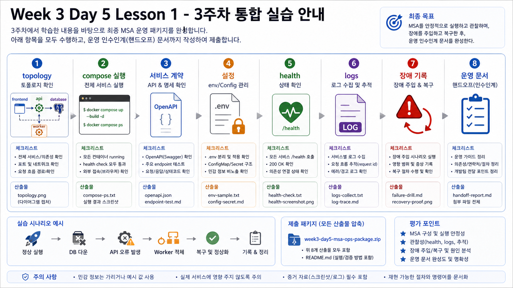
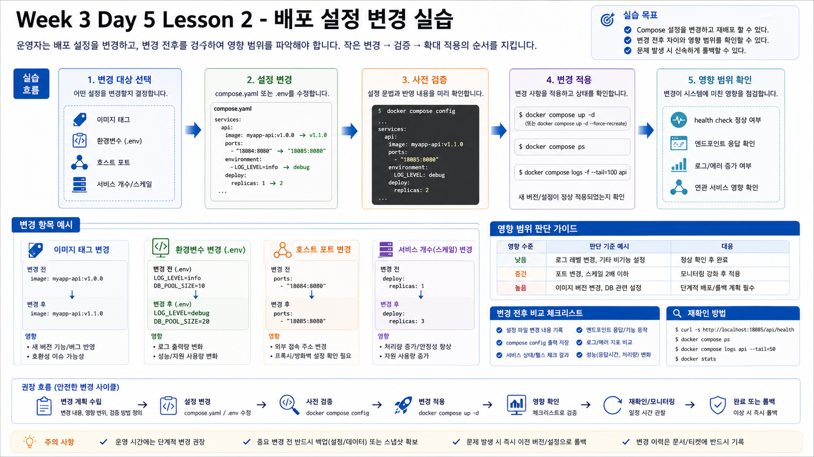
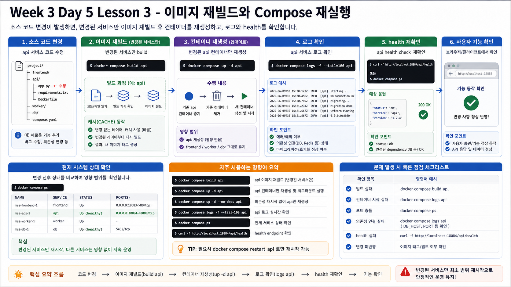
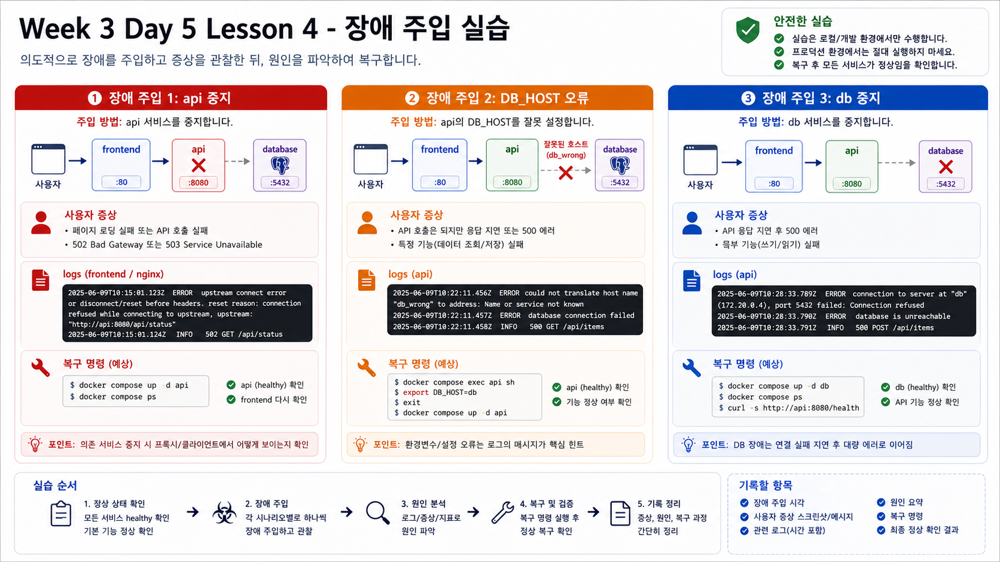
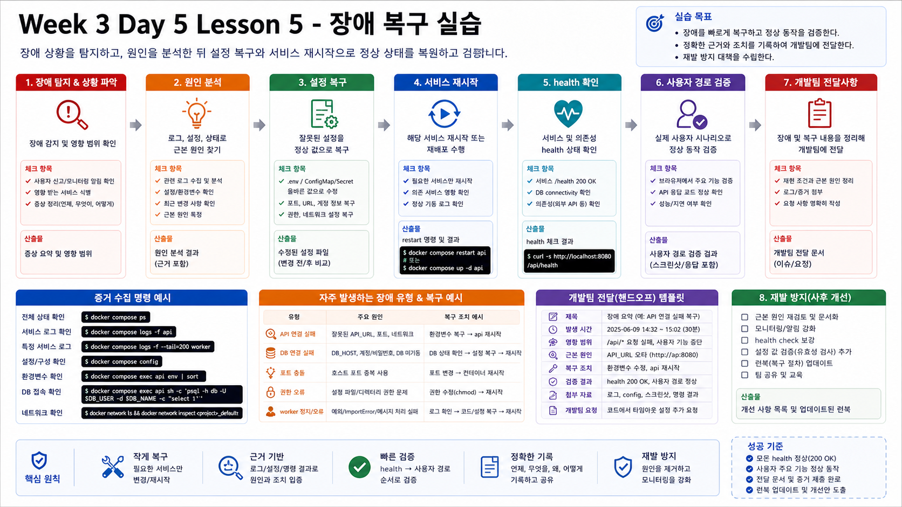
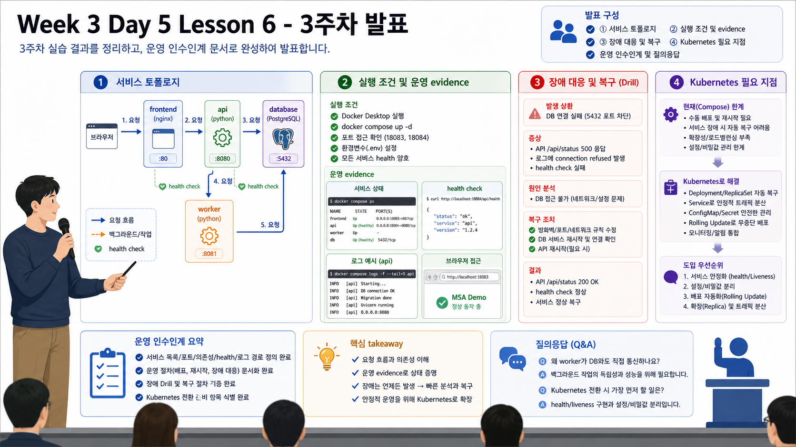
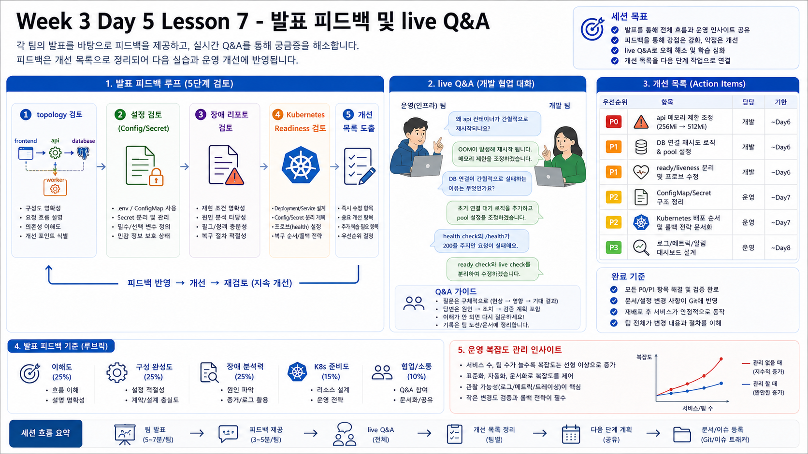
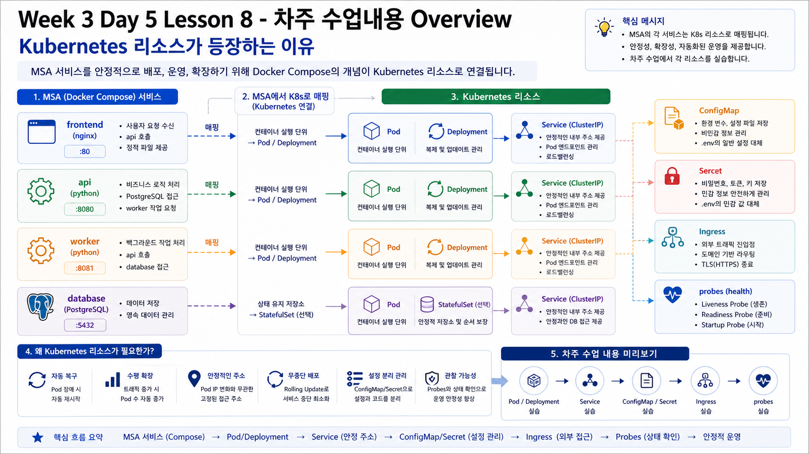

# Week 3 Day 5: 통합 실습, 장애 주입, 발표, Kubernetes 연결

## Overview
Day 5는 3주차 MSA 학습 흐름 중 `통합 실습, 장애 주입, 발표, Kubernetes 연결`를 다룬다. 오늘의 초점은 개발 코드 내부가 아니라 서비스를 실행하고 연결하고 관찰하고 복구하기 위해 인프라가 알아야 하는 정보다.

## Learning Goals
- 오늘 다루는 서비스 경계와 의존성을 운영 관점으로 설명한다.
- Docker Compose 상태, 로그, health, HTTP 응답 중 하나 이상으로 정상/비정상을 판단한다.
- 장애 증상을 숨기지 않고 재현 조건, 관찰 결과, 수정 또는 요청사항으로 기록한다.
- Week 4 Kubernetes에서 필요한 리소스와 설정으로 연결한다.

## Lesson Index
| 교시 | 주제 | 핵심 산출물 |
|---|---|---|
| 1교시 | 3주차 통합 실습 안내 | MSA 실습 앱을 인프라 운영 문서 기준으로 점검 evidence |
| 2교시 | 배포 설정 변경 실습 | 이미지 태그, 환경변수, 포트, 서비스 개수 조정 evidence |
| 3교시 | 이미지 재빌드와 Compose 재실행 | 변경된 서비스만 build, up, logs로 확인 evidence |
| 4교시 | 장애 주입 실습 | 일부 서비스 중지, 잘못된 환경변수, DB 연결 실패 만들기 evidence |
| 5교시 | 장애 복구 실습 | 원인 분석, 설정 복구, 서비스 재시작, 개발팀 전달사항 evidence |
| 6교시 | 3주차 발표 | 서비스 토폴로지, 실행 조건, 장애, 운영 대응, Kubernetes 필요 지점 evidence |
| 7교시 | 발표 피드백 및 live Q&A | 인프라/개발 협업 요청사항, 운영 복잡도, 다음 주차 연결 evidence |
| 8교시 | 차주 수업내용 Overview | Pod, Deployment, Service, ConfigMap, Secret이 등장하는 이유 evidence |

## Practice Files And Assets
| 자료 | 용도 |
|---|---|
| `../day1/labs/msa-demo/compose.yaml` | 표준 MSA 실습 앱 실행 |
| `../day1/labs/msa-demo/README.md` | run/check/failure/cleanup 기준 |
| `hands-on-lab.md` | 오늘 실습 흐름이 있는 경우 실행 가이드 |
| `academic-foundations.md` | 공식/학술/현업 기준 mapping |
| `assets/` | 각 교시 보조 시각 자료 위치 |

## Session Visual Index
| 교시 | 주제 | 세션별 이미지 |
|---|---|---|
| 1교시 | 3주차 통합 실습 안내 |  |
| 2교시 | 배포 설정 변경 실습 |  |
| 3교시 | 이미지 재빌드와 Compose 재실행 |  |
| 4교시 | 장애 주입 실습 |  |
| 5교시 | 장애 복구 실습 |  |
| 6교시 | 3주차 발표 |  |
| 7교시 | 발표 피드백 및 live Q&A |  |
| 8교시 | 차주 수업내용 Overview |  |

## Today Evidence
| Evidence | 제출 기준 |
|---|---|
| topology note | 서비스별 역할과 의존성 설명 |
| command evidence | 실행/확인/로그/정리 명령 |
| failure note | 장애 재현, 관찰, 복구, 예방 |
| handoff note | 개발팀 또는 다음 운영자에게 전달할 정보 |

## Official References
| Topic | Reference | 확인할 키워드 |
|---|---|---|
| Microservices on AWS | https://docs.aws.amazon.com/whitepapers/latest/microservices-on-aws/microservices.html | service, API, database, deployment |
| AWS Microservices | https://aws.amazon.com/microservices/ | independent component, business capability |
| Martin Fowler Microservices Guide | https://martinfowler.com/microservices/ | independently deployable, lightweight communication |
| Docker Compose | https://docs.docker.com/compose/ | services, networks, depends_on, healthcheck |
| Compose services reference | https://docs.docker.com/reference/compose-file/services/ | healthcheck, depends_on, environment |
| Google SRE Cascading Failures | https://sre.google/sre-book/addressing-cascading-failures/ | failure propagation, overload, mitigation |
| OpenTelemetry Concepts | https://opentelemetry.io/docs/concepts/ | traces, metrics, logs, observability |
| Twelve-Factor App | https://12factor.net/ | config, backing services, logs |

## End-Of-Day Checklist
- [ ] 오늘 다룬 서비스와 의존성을 다이어그램으로 설명했다.
- [ ] `docker compose ps`와 `docker compose logs`를 사용했다.
- [ ] 정상 상태와 장애 상태를 증거로 구분했다.
- [ ] 설정, health, logs, cleanup 기준을 문서에 남겼다.
- [ ] Kubernetes로 넘어갈 때 필요한 리소스 후보를 적었다.
